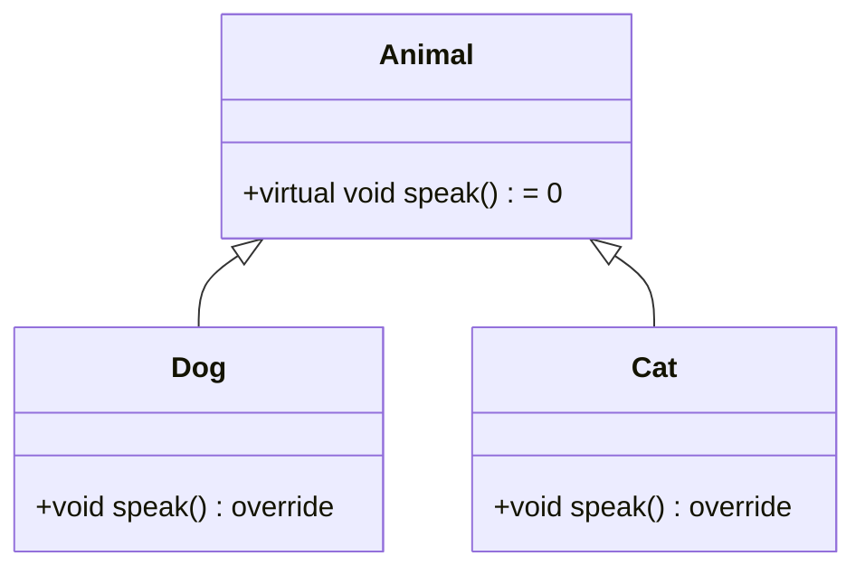

# C++多态机制深度解析：从编译时到运行时

## 一、多态核心概念
**多态（Polymorphism）** 是面向对象编程三大支柱之一，其核心价值在于：
1. **接口统一**：通过基类接口操作不同派生类对象
2. **行为定制**：相同方法调用产生不同行为（Duck Typing）
3. **开闭原则**：扩展新类型无需修改现有代码

## 二、静态多态（编译时多态）
### 1. 技术实现
| 实现方式      | 典型场景                  | 时间复杂度   |
|---------------|--------------------------|-------------|
| 函数重载      | 参数类型/数量不同         | O(1)        |
| 模板特化      | 泛型编程                  | 编译期展开  |

```cpp
// 函数重载示例
void serialize(int data) { /* 整型序列化 */ }  // O(1)
void serialize(vector<float> data) { /* 向量序列化 */ }  // O(n)

// 模板示例
template <typename T>
T pow(T base, int exp) {  // O(log n)快速幂实现
    T result = 1;
    while(exp) {
        if(exp & 1) result *= base;
        base *= base;
        exp >>= 1;
    }
    return result;
}
```

### 2. 关键特性
- **编译期决议**：通过名称修饰（Name Mangling）实现
- **零运行时开销**：无虚函数表查找过程
- **类型安全**：模板实例化时进行类型检查

## 三、动态多态（运行时多态）
### 1. 实现机制


### 2. 虚函数表原理
1. **内存结构**：
   - 每个含虚函数的类拥有独立vTable
   - 对象头部包含vPtr（通常8字节）
2. **调用过程**：
   ```cpp
   animal->speak();  // 实际执行：
   // 1. 通过vPtr找到vTable（内存访问）
   // 2. 通过vTable偏移量获取函数指针
   // 3. 间接调用（比直接调用多2-3个时钟周期）
   ```

### 3. 性能优化建议
- **final关键字**：禁止进一步重写，允许编译器优化
  ```cpp
  class Dog final : public Animal {
      void speak() override { ... }
  };
  ```
- **接口设计原则**：
  - 虚函数不宜超过10个（避免vTable过大）
  - 高频调用函数建议非虚化

## 四、对比决策矩阵
| 考量维度       | 静态多态                      | 动态多态                      |
|----------------|------------------------------|------------------------------|
| **类型系统**   | 强类型，编译期检查            | 弱类型，运行时可能dynamic_cast|
| **二进制兼容** | 模板实例化导致代码膨胀        | 接口稳定，ABI兼容性好         |
| **典型应用**   | STL算法、数值计算             | GUI框架、游戏实体系统         |
| **调试难度**   | 模板错误信息复杂              | RTTI可辅助调试               |

## 五、进阶话题
### 1. CRTP模式（静态多态高级用法）
```cpp
template <typename Derived>
class Base {
public:
    void interface() {
        static_cast<Derived*>(this)->implementation();
    }
};

class Derived : public Base<Derived> {
public:
    void implementation() {
        cout << "CRTP实现" << endl;
    }
};
```

### 2. 性能基准测试数据
- 虚函数调用 vs 普通函数调用：约多出 **15-20%** 时间开销（x86-64基准测试）
- 模板元编程：编译时间增加 **30-50%**，但运行时性能与硬编码相当

## 六、最佳实践建议
1. **混合使用策略**：
   - 基础框架使用动态多态保证扩展性
   - 性能关键路径使用静态多态
2. **现代C++特性**：
   ```cpp
   // C++17的if constexpr优化
   template <typename T>
   void process(T val) {
       if constexpr (is_arithmetic_v<T>) {
           // 编译期分支消除
       }
   }
   ```

## 参考文献
[1] Stroustrup B. The C++ programming language[M]. 4th ed. Addison-Wesley, 2013.  
[2] ISO/IEC 14882:2020. Programming languages — C++[S]. 2020.

