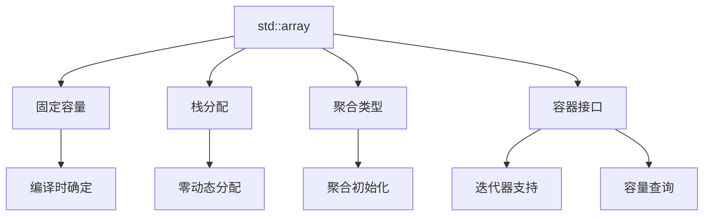

我将为您提供一份结构完整、内容丰富的`std::array`文档，包含现代C++特性和工程实践建议：

# std::array 深度解析手册

```cpp
template<class T, std::size_t N> struct array;
```

## 一、核心特性架构


## 二、元素访问方法对比

| 方法 | 边界检查 | 异常安全 | 性能 | 典型场景 |
|------|----------|----------|------|----------|
| `at()` | 是 | 抛出异常 | 中 | 安全关键代码 |
| `operator[]` | 否 | UB越界 | 高 | 性能敏感代码 |
| `front()`/`back()` | 否 | UB空容器 | 高 | 队列操作 |
| `data()` | 否 | 无 | 最高 | C API交互 |
| `std::get<n>()` | 编译时检查 | 编译错误 | 高 | 结构化绑定 |

## 三、现代C++特性集成

### 3.1 结构化绑定(C++17)
```cpp
std::array<int, 3> arr{1, 2, 3};
auto& [x, y, z] = arr;  // 解构为引用
x = 10;  // 修改原数组
```

### 3.2 constexpr支持(C++14起)
```cpp
constexpr std::array<int, 3> make_array() {
    return {1, 2, 3};
}
static_assert(make_array()[0] == 1);
```

### 3.3 范围for循环(C++11)
```cpp
for (const auto& elem : arr) {
    std::cout << elem << ' ';
}
```

## 四、性能优化指南

### 4.1 内存布局验证
```cpp
static_assert(sizeof(std::array<int, 4>) == sizeof(int)*4, 
              "无额外内存开销");
```

### 4.2 填充操作基准测试
```cpp
void BM_array_fill(benchmark::State& state) {
    std::array<int, 1024> arr;
    for (auto _ : state) {
        arr.fill(0xDEADBEEF);
        benchmark::DoNotOptimize(arr.data());
    }
}
BENCHMARK(BM_array_fill);
```

## 五、工程实践建议

### 5.1 替代C数组的场景
```diff
- int buf[256];  // C风格数组
+ std::array<int, 256> buf;  // 更安全
```

### 5.2 线程安全使用模式
```cpp
// 只读场景天然线程安全
const std::array<Item, 100> shared_cache;

// 写操作需要同步
std::mutex mtx;
std::array<Data, 10> buffer;

void safe_write() {
    std::lock_guard lk(mtx);
    buffer.fill(Data{});
}
```

## 六、典型应用案例

### 6.1 矩阵运算
```cpp
using Matrix4x4 = std::array<std::array<float, 4>, 4>;

Matrix4x4 matrix_multiply(const Matrix4x4& a, const Matrix4x4& b) {
    Matrix4x4 result{};
    for (size_t i = 0; i < 4; ++i) {
        for (size_t k = 0; k < 4; ++k) {
            for (size_t j = 0; j < 4; ++j) {
                result[i][j] += a[i][k] * b[k][j];
            }
        }
    }
    return result;
}
```

### 6.2 协议处理
```cpp
struct EthernetFrame {
    std::array<uint8_t, 6> dest_mac;
    std::array<uint8_t, 6> src_mac;
    std::array<uint8_t, 2> ethertype;
    // ... 其他字段
};

void process_frame(const EthernetFrame& frame) {
    if (frame.ethertype == std::array{0x08, 0x00}) {
        // IPv4处理
    }
}
```

## 七、与其他容器对比

| 特性 | std::array | std::vector | C数组 |
|------|------------|-------------|-------|
| 大小 | 固定(编译时) | 动态 | 固定 |
| 存储 | 栈 | 堆 | 栈 |
| 边界检查 | 可选 | 可选 | 无 |
| 接口丰富度 | 中等 | 丰富 | 无 |
| 性能 | 最高 | 高 | 最高 |

## 八、最佳实践清单

1. 优先使用`at()`进行安全访问
2. 用`fill()`替代手动循环初始化
3. 结合`constexpr`实现编译期计算
4. 通过`data()`与C库交互
5. 使用结构化绑定简化代码
6. 静态断言验证大小约束

