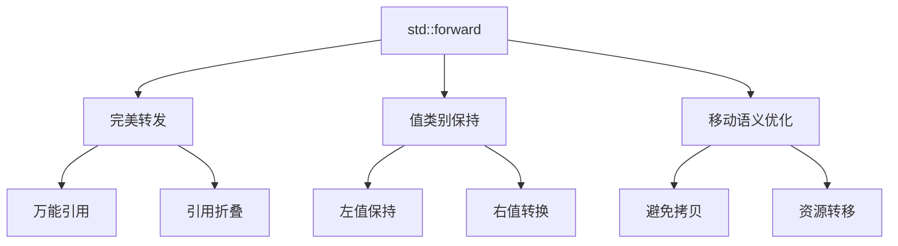
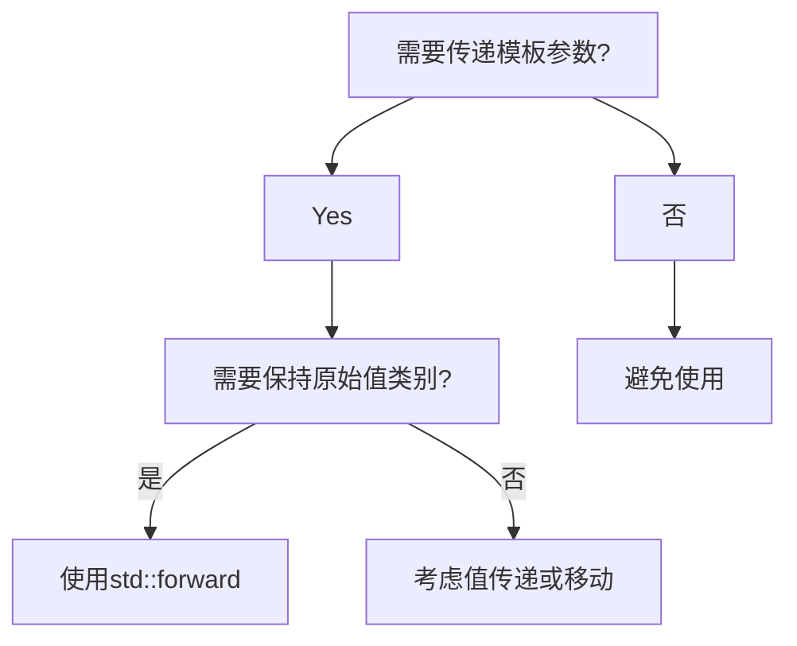

# C++完美转发深度解析：std::forward完全指南

## 一、核心概念图谱


## 二、标准库定义与语法规范
### 2.1 函数原型
```cpp
// C++11 基础版本
template< class T >
T&& forward( typename std::remove_reference<T>::type& t ) noexcept;

// C++14 改进版本（constexpr支持）
template< class T >
constexpr T&& forward( std::remove_reference_t<T>& t ) noexcept;
    
// 右值引用重载版本
template< class T >
T&& forward( typename std::remove_reference<T>::type&& t ) noexcept;

// C++14 constexpr右值版本
template< class T >
constexpr T&& forward( std::remove_reference_t<T>&& t ) noexcept;
```

### 2.2 模板参数要求
| 参数类型 | 推导场景 | 典型用例 |
|---------|---------|---------|
| `T&&` (万能引用) | 模板参数推导 | 转发函数参数 |
| `Args&&...` (可变参数) | 参数包展开 | 工厂函数构造 |

## 三、核心机制解析
### 3.1 工作原理
```cpp
// 实现原理伪代码
template <typename T>
T&& forward(remove_reference_t<T>& arg) {
    return static_cast<T&&>(arg);  // 引用折叠发生在这里
}
```

### 3.2 引用折叠规则
| 原始类型 | 折叠结果 | 应用场景 |
|---------|---------|---------|
| `T& &` | `T&` | 左值引用传递 |
| `T& &&` | `T&` | 万能引用接收左值 |
| `T&& &` | `T&` | 右值引用作为左值 |
| `T&& &&` | `T&&` | 万能引用接收右值 |

## 四、典型应用场景
### 4.1 工厂函数实现
```cpp
template <typename T, typename... Args>
std::unique_ptr<T> make_unique(Args&&... args) {
    return std::unique_ptr<T>(new T(std::forward<Args>(args)...));
}
```

### 4.2 包装器模式
```cpp
template <typename Callable, typename... Args>
auto wrapper(Callable&& func, Args&&... args) {
    std::cout << "Calling function..." << std::endl;
    return std::forward<Callable>(func)(std::forward<Args>(args)...);
}
```

## 五、关键对比分析
### 5.1 std::forward vs std::move
| 特性 | std::forward | std::move |
|------|-------------|-----------|
| 转换类型 | 条件性转换 | 无条件转换 |
| 使用场景 | 完美转发 | 所有权转移 |
| 模板依赖 | 必须依赖模板参数 | 可独立使用 |
| 返回值 | T&& (根据T决定) | X&& (固定右值) |

### 5.2 不同转发方式性能对比
| 方式 | 拷贝次数 | 适用场景 | 代码示例 |
|------|---------|---------|---------|
| 值传递 | 1-2次 | 小型对象 | `func(T val)` |
| 移动语义 | 0-1次 | 可移动对象 | `func(T&& val)` |
| 完美转发 | 0次 | 泛型代码 | `func(forward<T>(val))` |

## 六、最佳实践指南
### 6.1 使用时机判断流程


## 七、进阶应用示例
### 7.1 线程安全队列实现
```cpp
template <typename T>
class ConcurrentQueue {
public:
    template <typename U>
    void push(U&& item) {
        std::lock_guard<std::mutex> lock(mutex_);
        queue_.push(std::forward<U>(item));
    }
    
    bool pop(T& item) {
        std::lock_guard<std::mutex> lock(mutex_);
        if(queue_.empty()) return false;
        item = std::move(queue_.front());
        queue_.pop();
        return true;
    }
private:
    std::queue<T> queue_;
    std::mutex mutex_;
};
```

### 7.2 性能敏感场景优化
```cpp
template <typename... Args>
void log(Args&&... args) {
    if(!logging_enabled) return;
    write_to_buffer(std::forward<Args>(args)...);
}

// 对比传统实现（额外拷贝）
void old_log(const std::string& msg) {
    if(!logging_enabled) return;
    buffer_.push_back(msg);  // 可能发生拷贝
}
```

## 八、编译期检查技巧
### 8.1 静态断言验证
```cpp
template <typename T>
void forward_only(T&& arg) {
    static_assert(!std::is_lvalue_reference<T>::value, 
                 "This function only accepts rvalues");
    process(std::forward<T>(arg));
}
```

### 8.2 Concept约束（C++20）
```cpp
template <typename F, typename... Args>
requires std::invocable<F, Args...>
auto safe_invoke(F&& f, Args&&... args) {
    return std::forward<F>(f)(std::forward<Args>(args)...);
}
```

