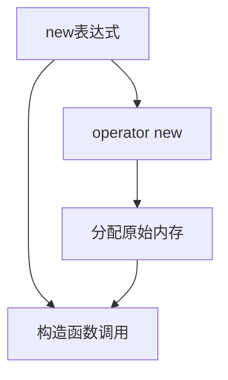
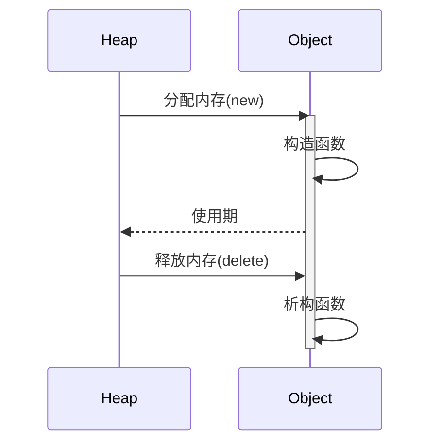

# C++内存管理深度解析

## 一、内存分配机制对比

### 1.1 C风格内存管理函数
| 函数 | 原型 | 特点 | 适用场景 | 风险点 |
|------|------|------|----------|--------|
| malloc | `void* malloc(size_t size)` | 分配原始内存不初始化 | 需要精确控制内存大小的场景 | 内存泄漏、未初始化 |
| calloc | `void* calloc(size_t num, size_t size)` | 分配并清零内存 | 需要初始化**零值**的数组 | 性能略低于malloc |
| realloc | `void* realloc(void* ptr, size_t new_size)` | 调整已分配内存大小 | 动态扩容场景 | 可能触发内存拷贝 |

**关键差异**：
- **malloc不初始化，calloc会初始化为0**
- **realloc扩展内存时保留原内容**（可能移动内存位置）
- 三者都需要手动计算字节大小

### 1.2 C++运算符new


**操作类型**：
1. 简单new：`Type* p = new Type(args)`
2. 数组new：`Type* p = new Type[N]`
3. 不抛出版本：`new(nothrow) Type`
4. 定位new：`new(address) Type(args)`

## 二、new运算符深度解析

### 2.1 底层执行流程
1. 调用`operator new`分配内存（可能被重载）
2. 在分配的内存上调用构造函数
3. 返回类型化指针

**数组分配特殊处理**：
```cpp
int* arr = new int[5]{1,2,3,4,5};
// 实际执行：
// 1. 计算总大小 = 5 * sizeof(int) + 数组头信息
// 2. 分配内存块
// 3. 初始化数组元素
// 4. 返回第一个元素地址
```

### 2.2 定位new(placement new)
**核心特征**：
```cpp
void* operator new(size_t, void* p) { return p; }
// 不分配内存，仅在指定位置构造对象
```

**典型应用场景**：
1. 内存池实现
2. 对象重用
3. 特殊内存位置构造（如共享内存）

```cpp
class Complex {
    int real, imag;
public:
    Complex(int r, int i) : real(r), imag(i) {}
    ~Complex() {}
};

int main() {
    void* buf = malloc(sizeof(Complex));  // 预分配内存
    Complex* pc = new(buf) Complex(1,2);  // 定位构造
    pc->~Complex();  // 必须显式析构
    free(buf);       // 释放原始内存
}
```

## 三、内存管理最佳实践

### 3.1 配对使用原则
| 分配方式 | 释放方式 | 错误示例后果 |
|----------|----------|--------------|
| new | delete | 内存泄漏 |
| new[] | delete[] | 部分内存泄漏 |
| malloc/calloc/realloc | free | 未调用析构函数 |

### 3.2 对象生命周期管理


### 3.3 高级技巧
1. **内存池优化**：通过placement new减少系统调用
2. **异常安全**：使用RAII包装内存资源
3. **调试支持**：重载operator new/delete加入追踪信息

```cpp
// 内存追踪示例
void* operator new(size_t size) {
    void* p = malloc(size);
    cout << "Allocated " << size << " bytes at " << p << endl;
    return p;
}

void operator delete(void* p) noexcept {
    cout << "Deallocating memory at " << p << endl;
    free(p);
}
```

## 四、现代C++改进方案

### 4.1 智能指针替代方案
| 原始指针 | 智能指针 | 优势 |
|----------|----------|------|
| new/delete | unique_ptr | 自动释放、独占所有权 |
| new[]/delete[] | vector/array | 边界检查、自动扩容 |
| 裸指针传递 | shared_ptr | 引用计数安全 |

### 4.2 容器类推荐
```cpp
// 替代动态数组
std::vector<int> v = {1,2,3,4,5}; 

// 替代多维数组
std::array<std::array<int,3>,2> md = {{{1,2,3}, {4,5,6}}};
```

## 五、常见陷阱检测表

| 问题类型 | 示例代码 | 修正方案 |
|----------|----------|----------|
| 内存泄漏 | `int* p = new int; return;` | 使用智能指针 |
| 双重释放 | `delete p; delete p;` | 释放后置空 |
| 悬垂指针 | `int* p = new int(5); delete p; *p=10;` | 使用智能指针或置空 |
| 不匹配释放 | `int* p = new int[5]; delete p;` | 使用delete[] |

