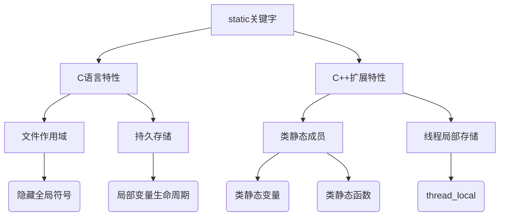
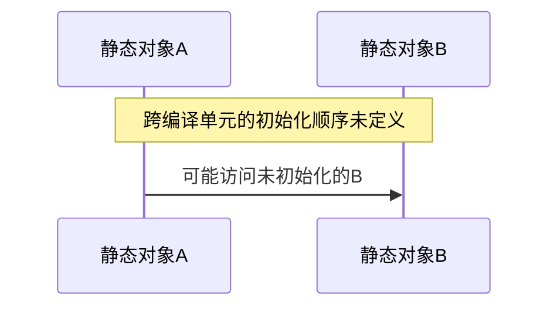

# C++ static关键字深度解析与工程实践指南

## 一、核心概念架构


## 二、C语言中的static特性
### 2.1 作用域控制（隐藏性）
| 修饰目标 | 作用域限制 | 跨文件访问 | 典型应用场景 |
|----------|------------|------------|--------------|
| 全局变量 | 文件作用域 | 仅间接访问 | 模块内部状态 |
| 函数 | 文件作用域 | 仅间接访问 | 工具函数封装 |

### 2.2 生命周期管理
```cpp
// 静态局部变量示例
void counter() {
    static int count = 0; // 初始化仅一次
    count++;
    printf("%d\n", count);
}

// 多次调用输出：1, 2, 3...
```

**关键特性**：
- 存储位置：静态存储区（非栈区）
- 初始化时机：编译期（C）/首次使用时（C++）
- 线程安全性：非线程安全（需额外同步）

## 三、C++中的static扩展
### 3.1 类静态成员
```cpp
class SystemConfig {
public:
    static std::string getVersion() { 
        return version_; 
    }
    
    static void initConfig(const std::string& config) {
        std::call_once(flag_, [&](){ 
            config_ = config; 
        });
    }

private:
    static std::string version_;
    static std::string config_;
    static std::once_flag flag_;
};

// 类外初始化（必须）
std::string SystemConfig::version_ = "1.0.0";
```

**工程约束**：
1. **初始化必须在类外完成（除const整型）**
2. 线程安全需手动保证（如用std::call_once）
3. 头文件中声明，cpp文件中定义

### 3.2 静态成员函数特性
| 特性 | 常规成员函数 | 静态成员函数 |
|------|--------------|--------------|
| this指针 | 有 | 无 |
| 虚函数 | 可声明 | 不可声明 |
| 访问权限 | 所有成员 | 仅静态成员 |
| 调用方式 | 对象实例/指针 | 类作用域运算符 |

## 四、高级应用与陷阱
### 4.1 静态初始化顺序问题


**解决方案**：
1. 使用"Construct On First Use"惯用法
2. 替换为局部静态变量（C++11线程安全）

### 4.2 危险操作警示
```cpp
class NetworkManager {
public:
    NetworkManager() {
        // 危险操作：破坏虚函数表和成员对象
        memset(this, 0, sizeof(*this));
    }
    
    virtual ~NetworkManager() {}
    
private:
    std::vector<Connection> connections_;
};
```

**安全替代方案**：
```cpp
// 方案1：值初始化
NetworkManager() : connections_{} {}

// 方案2：成员逐个初始化
NetworkManager() : connections_(), refCount(0) {}
```

## 五、现代C++演进
### 5.1 thread_local扩展
```cpp
class ThreadLogger {
public:
    static thread_local std::ostringstream stream;
    
    template<typename T>
    static void log(const T& msg) {
        stream << msg << std::endl;
    }
};

// 每个线程独立实例
thread_local std::ostringstream ThreadLogger::stream;
```

### 5.2 constexpr与static结合
```cpp
class MathConstants {
public:
    static constexpr double PI = 3.1415926;
    static constexpr int MAX_ITER = 1000;
};

// 编译期常量优化
static_assert(MathConstants::PI > 3.0, "PI check");
```

## 六、工程最佳实践
### 6.1 静态分析工具检测
| 工具 | 检测能力 | 典型警告 |
|------|----------|----------|
| Clang-Tidy | 静态初始化顺序 | "initialization order fiasco" |
| PVS-Studio | memset滥用 | "V598 memset on class with virtual" |
| Coverity | 线程安全 | "MISSING_LOCK" |

### 6.2 性能影响评估
| 使用场景 | 内存开销 | 访问速度 | 线程安全成本 |
|----------|----------|----------|--------------|
| 静态局部变量 | 单实例 | 等同全局变量 | 首次调用同步 |
| 类静态成员 | 类共享 | 间接访问 | 需手动管理 |
| thread_local | 每线程实例 | 快速访问 | 无竞争 |

## 七、跨语言对比
| 特性 | C | C++ | Java | Python |
|------|---|-----|------|--------|
| 文件作用域 | ✔️ | ✔️ | ❌ | ✔️(模块级) |
| 类静态成员 | ❌ | ✔️ | ✔️ | ✔️(@classmethod) |
| 线程局部 | ❌ | ✔️(C++11) | ✔️ | ✔️ |

