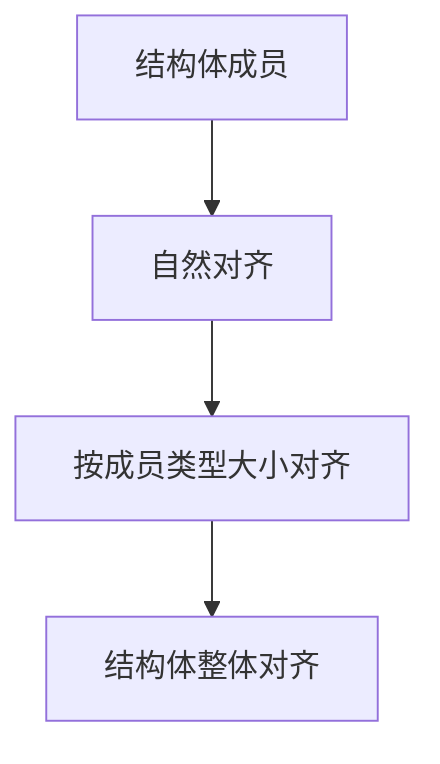

# C++内存对齐控制综合指南

## 一、内存对齐基础概念
### 1. 什么是内存对齐
- **数据存储规则**：变量在内存中的起始地址通常是其类型大小的整数倍
- **填充字节(Padding)**：编译器自动插入的空白字节，用于满足对齐要求
- **性能影响**：对齐访问可提高CPU内存访问效率

### 2. 对齐计算原理


## 二、对齐控制方法

### 1. `#pragma pack`指令
#### 基本语法
```cpp
#pragma pack(push, n)  // 压栈当前对齐值并设置新值
// 结构体定义
#pragma pack(pop)      // 恢复之前对齐值
```

#### 关键特性
- **编译器扩展**：非标准但广泛支持
- **紧凑布局**：消除填充字节
- **典型应用**：
  - 网络协议数据包
  - 硬件寄存器映射
  - 跨平台数据结构

#### 示例代码
```cpp
#pragma pack(push, 1)
struct NetworkPacket {
    uint8_t header;    // 1字节
    uint32_t data;     // 4字节
    uint16_t checksum; // 2字节
};  // 总大小=7字节
#pragma pack(pop)
```

### 2. `alignas`说明符(C++11)
#### 基本语法
```cpp
struct alignas(16) Vec4 {
    float x, y, z, w;
};
```

#### 关键特性
- **标准支持**：C++11语言特性
- **精细控制**：可应用于变量或类型
- **典型应用**：
  - SIMD指令数据
  - 缓存行优化
  - 自定义内存池

#### 相关工具
```cpp
alignof(T)  // 获取对齐要求
std::alignment_of<T>::value  // 编译期获取
```

### 3. `__attribute__((packed))`(GCC扩展)
#### 基本语法
```cpp
struct __attribute__((packed)) Example {
    char a;
    int b;
    short c;
};  // 总大小=7字节
```

#### 关键特性
- **GCC/Clang专用**：非标准扩展
- **紧密排列**：强制1字节对齐
- **典型应用**：
  - 协议解析
  - 二进制文件处理
  - 嵌入式寄存器访问

## 三、方法对比分析

| 特性                | `#pragma pack`         | `alignas`              | `__attribute__((packed))` |
|---------------------|-----------------------|------------------------|--------------------------|
| 标准化              | 编译器扩展             | C++11标准              | GCC扩展                  |
| 控制方向            | 减小对齐               | 增大对齐               | 减小对齐                 |
| 作用范围            | 作用域内所有定义       | 单个成员/类型          | 单个结构体               |
| 主要用途            | 内存紧凑布局           | 高性能数据对齐         | 紧密内存布局             |
| 跨平台性            | 中等(主流编译器支持)   | 高                     | 低(仅GCC系)              |

## 四、工程实践建议

### 1. 网络编程
```cpp
#pragma pack(push, 1)
struct IPHeader {
    uint8_t ver_ihl;
    uint8_t tos;
    uint16_t total_length;
    // ...其他字段
};
#pragma pack(pop)
```

### 2. 高性能计算
```cpp
// 缓存行对齐优化
alignas(64) float matrix[16][16];

// SIMD数据对齐
struct alignas(16) SIMDData {
    float v[4];
};
```

### 3. 嵌入式开发
```cpp
// 混合使用示例
#pragma pack(push, 1)
struct DeviceRegister {
    alignas(4) uint8_t control;
    uint32_t data;
};
#pragma pack(pop)
```

## 五、高级话题

### 1. C++17增强特性
```cpp
// 避免伪共享
struct ThreadData {
    alignas(std::hardware_destructive_interference_size) int counter1;
    alignas(std::hardware_destructive_interference_size) int counter2;
};

// 对齐内存分配
void* p = std::aligned_alloc(64, 1024);  // 64字节对齐
```

### 2. 类型特征检查
```cpp
static_assert(std::alignment_of_v<Vec4> == 16, 
             "Alignment requirement failed");
```

### 3. 性能与安全考量
- **非对齐访问风险**：ARM架构可能触发硬件异常
- **原子操作限制**：某些CPU要求对齐访问才能原子操作
- **移植性方案**：
  ```cpp
  #if defined(_MSC_VER)
  #pragma pack(push, 1)
  #elif defined(__GNUC__)
  #define PACKED __attribute__((packed))
  #endif
  ```

## 六、调试与验证技巧

### 1. 内存布局检查
```cpp
template<typename T>
void print_layout() {
    std::cout << "Size: " << sizeof(T) 
              << " Alignment: " << alignof(T) << "\n";
}
```

### 2. 偏移量验证
```cpp
static_assert(offsetof(NetworkPacket, data) == 1,
             "Unexpected field offset");
```

### 3. 编译器诊断
- GCC: `-Wpacked`/`-Wattributes`
- Clang: `-Wpadded`
- MSVC: `/d1reportAllClassLayout`

通过合理应用这些对齐控制技术，开发者可以在内存效率、访问性能和跨平台兼容性之间取得最佳平衡。