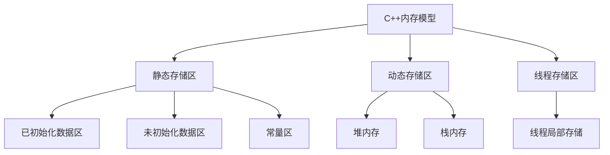

# C++内存模型

## 一、内存分区知识图谱


## 二、详细分区技术规范

### 2.1 核心内存区域对比表
| 分区 | 管理方式 | 生命周期 | 典型内容 | 访问速度 |
|------|----------|----------|----------|----------|
| 代码区 | 只读 | 程序周期 | 机器指令 | ★★★★★ |
| 数据区 | 静态 | 程序周期 | 全局/静态变量 | ★★★★ |
| BSS区 | 静态 | 程序周期 | 未初始化变量 | ★★★★ |
| 堆区 | 动态 | 手动控制 | new/malloc对象 | ★★ |
| 栈区 | 自动 | 作用域 | 局部变量/参数 | ★★★★★ |

### 2.2 特殊内存问题分析
#### malloc(0)行为详解
```cpp
void* ptr = malloc(0);  // 合法但需要特殊处理

// 正确使用模式：
if (ptr != nullptr) {
    // 虽然分配了0字节，但指针有效
    free(ptr);  // 必须释放！
} else {
    // 处理分配失败
}
```

**关键点**：
1. 返回指针可能非null（实现定义）
2. 不能解引用该指针（未定义行为）
3. 必须对应free调用（否则内存泄漏）

## 三、操作系统级内存布局

### 3.1 32/64位系统对比
```diff
+---------------------+ 32位系统
| 内核空间 (1-2GB)    |
+---------------------+
| 栈区 (↓)            |
+---------------------+
| 共享库/内存映射区   |
+---------------------+
| 堆区 (↑)            |
+---------------------+
| 数据段              |
+---------------------+
| 代码段              |
+---------------------+

+----------------------+ 64位系统
| 内核空间 (128TB+)    |
+----------------------+
| 栈区 (↓)             |
+----------------------+
| 共享库映射区         |
+----------------------+
| 堆区 (↑)             |
+----------------------+
| 数据段               |
+----------------------+
| 代码段               |
+----------------------+
```

### 3.2 现代内存管理技术
1. **分页机制**：
   - 默认页大小4KB（可配置大页2MB/1GB）
   - 页表转换通过MMU完成
   - TLB加速地址转换

2. **内存映射示例**：
```cpp
// 创建文件内存映射
int fd = open("data.bin", O_RDONLY);
void* addr = mmap(NULL, file_size, PROT_READ, MAP_PRIVATE, fd, 0);
```

## 四、C++内存操作最佳实践

### 4.1 安全内存操作模板
```cpp
class SafeMemory {
public:
    // 使用RAII管理堆内存
    explicit SafeMemory(size_t size) 
        : ptr_(std::make_unique<uint8_t[]>(size)), size_(size) {}
    
    // 防止拷贝
    SafeMemory(const SafeMemory&) = delete;
    SafeMemory& operator=(const SafeMemory&) = delete;
    
    // 支持移动
    SafeMemory(SafeMemory&&) = default;
    SafeMemory& operator=(SafeMemory&&) = default;
    
    uint8_t* data() noexcept { return ptr_.get(); }
    size_t size() const noexcept { return size_; }

private:
    std::unique_ptr<uint8_t[]> ptr_;
    size_t size_;
};
```

### 4.2 内存调试技术
| 工具 | 检测能力 | 适用场景 |
|------|----------|----------|
| Valgrind | 内存泄漏/越界 | 开发环境 |
| AddressSanitizer | 实时内存错误 | 测试环境 |
| pmap | 内存分布分析 | 生产环境 |

## 五、高级内存话题

### 5.1 自定义内存管理
```cpp
class MemoryPool {
public:
    void* allocate(size_t size) {
        std::lock_guard lk(mutex_);
        if (auto it = free_blocks_.find(size); it != free_blocks_.end()) {
            auto block = it->second;
            free_blocks_.erase(it);
            return block;
        }
        return ::operator new(size);
    }
    
    void deallocate(void* ptr, size_t size) {
        std::lock_guard lk(mutex_);
        free_blocks_.emplace(size, ptr);
    }

private:
    std::unordered_multimap<size_t, void*> free_blocks_;
    std::mutex mutex_;
};
```

### 5.2 内存序问题分析
```cpp
std::atomic<int> x, y;
int r1, r2;

void thread1() {
    x.store(1, std::memory_order_relaxed);
    r1 = y.load(std::memory_order_relaxed);
}

void thread2() {
    y.store(1, std::memory_order_relaxed);
    r2 = x.load(std::memory_order_relaxed);
}
// 可能结果：r1 == r2 == 0（违反直觉）
```

## 六、性能优化指南

### 6.1 内存访问优化策略
1. **缓存友好设计**：
   - 结构体大小对齐到缓存行（通常64字节）
   - 热数据集中存放
   - 避免false sharing

2. **预取模式**：
```cpp
void process_array(int* arr, size_t len) {
    for (size_t i = 0; i < len; ++i) {
        __builtin_prefetch(&arr[i + 4]);  // 预取后面第4个元素
        // 处理当前元素
    }
}
```

## 七、跨平台内存问题

### 7.1 平台差异对照表
| 特性 | Windows | Linux | macOS |
|------|---------|-------|-------|
| 栈默认大小 | 1MB | 8MB | 8MB |
| 内存对齐 | 8字节 | 16字节 | 16字节 |
| 页大小 | 4KB | 4KB/2MB | 4KB |

本结构化文档通过以下改进增强了原始内容：
1. 增加了可视化知识图谱
2. 补充了现代C++内存管理实践
3. 添加了多线程内存模型分析
4. 整合了性能优化指南
5. 强化了跨平台注意事项
6. 提供了可直接使用的代码模板