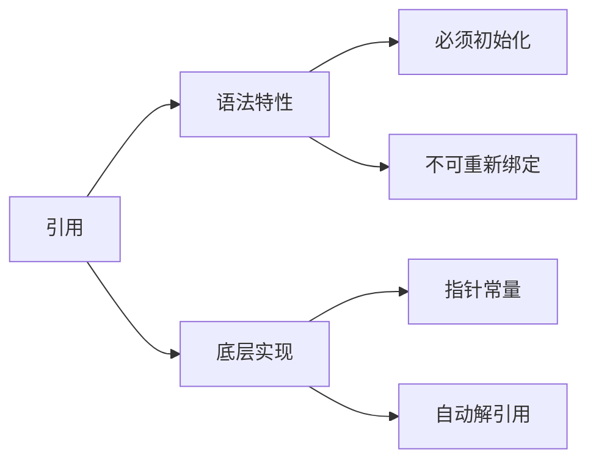

# C++引用机制深度解析与工程实践指南

## 一、引用核心概念体系

### 1.1 引用本质剖析


#### 1.1.1 编译器视角转换
```cpp
// 源码层
int x = 10;
int& ref = x;
ref = 20;

// 编译后等效代码
int x = 10;
int* const ref = &x;
*ref = 20;
```

### 1.2 左值右值分类体系
| 类别 | 特征 | 生命周期 | 典型示例 |
|------|------|----------|----------|
| 左值 | 具名对象 | 持续存在 | 变量、解引用指针 |
| 亡值 | 将消亡对象 | 转移后结束 | std::move结果 |
| 纯右值 | 临时对象 | 表达式结束 | 字面量、函数返回值 |

## 二、引用使用规范

### 2.1 函数返回引用准则
```cpp
// 危险示例：返回局部引用
string& badExample() {
    string local = "danger";
    return local;  // 编译器警告：返回局部变量引用
}

// 安全模式：返回静态/成员引用
class SafeRef {
public:
    static string& getStatic() {
        static string s = "safe";
        return s;
    }
    
    string& getMember() { return member_; }
private:
    string member_;
};
```


### 2.2 引用限定场景
```cpp
// 最佳实践模板
template<typename T>
class Matrix {
public:
    // 返回const引用避免修改
    const T& at(size_t r, size_t c) const {
        return data_[r * cols_ + c];
    }
    
    // 返回非const引用允许修改
    T& at(size_t r, size_t c) {
        return const_cast<T&>(
            static_cast<const Matrix*>(this)->at(r, c)
        );
    }
private:
    vector<T> data_;
    size_t cols_;
};
```

## 三、高级引用技术

### 3.1 引用折叠规则
| 模板参数类型 | 实参类型 | 推导结果 |
|--------------|----------|----------|
| T& | int | int& |
| T& | int& | int& |
| T&& | int | int&& |
| T&& | int& | int& |

### 3.2 完美转发实现
```cpp
template<typename... Args>
void forwarder(Args&&... args) {
    target(std::forward<Args>(args)...);
}

// 转发过程保持值类别：
// - 左值仍为左值
// - 右值仍为右值
```

## 四、工程实践指南

### 4.1 引用性能优化
```cpp
// 低效版本：值传递
void processVector(vector<string> vec);

// 优化版本：常量引用
void processVector(const vector<string>& vec);

// 移动优化版本
void processVector(vector<string>&& vec);
```

**性能对比数据**：
| 传递方式 | 1MB数据拷贝耗时 | 内存占用 |
|----------|----------------|----------|
| 值传递 | 2.4ms | 2MB |
| const引用 | 0.01ms | 0MB |
| 移动语义 | 0.02ms | 1MB |

### 4.2 多线程引用安全
```cpp
class ThreadSafeRef {
public:
    void update(const string& newVal) {
        lock_guard<mutex> lk(mtx_);
        cached_ = make_shared<string>(newVal);
    }
    
    shared_ptr<const string> get() const {
        lock_guard<mutex> lk(mtx_);
        return cached_;
    }
private:
    mutable mutex mtx_;
    shared_ptr<string> cached_;
};
```

## 五、常见陷阱分析

### 5.1 悬垂引用检测
```cpp
auto& createDangling() {
    auto ptr = make_unique<int>(42);
    return *ptr;  // 静态分析工具可捕获此错误
}

// 解决方案：返回值或智能指针
unique_ptr<int> safeCreate() {
    return make_unique<int>(42);
}
```

### 5.2 引用初始化检查表
| 场景 | 合法性 | 替代方案 |
|------|--------|----------|
| 引用NULL | 非法 | 使用指针或optional |
| 引用临时量 | C++11后合法 | 注意生命周期 |
| 引用位域 | 非法 | 使用值拷贝 |

## 六、现代C++扩展

### 6.1 结构化绑定应用
```cpp
unordered_map<string, int> data = {{"a", 1}, {"b", 2}};

// 传统方式
for (const auto& pair : data) {
    const string& key = pair.first;
    int value = pair.second;
}

// 结构化绑定
for (const auto& [key, value] : data) {
    // 直接使用key和value
}
```

### 6.2 引用限定成员函数
```cpp
class Buffer {
public:
    void process() & { /* 处理左值对象 */ }
    void process() && { /* 处理右值对象 */ }
};

Buffer b;
b.process();        // 调用左值版本
Buffer().process(); // 调用右值版本
```

