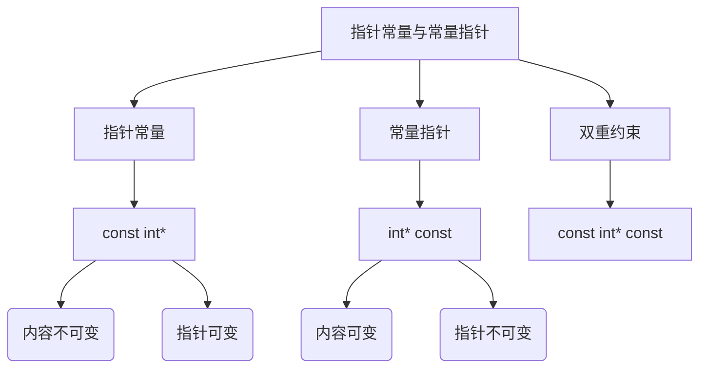
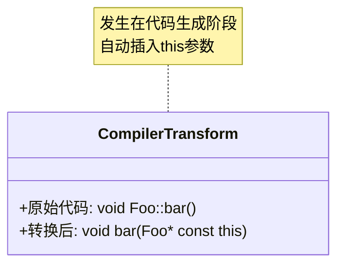

# C++核心概念深度解析系统

## 一、指针与常量关系图谱


### 1.1 指针常量（Pointer to Constant）
**内存模型分析**：
```cpp
const int* ptr = &var;
```
- 栈内存存储指针地址（可修改）
- 指向的堆/栈内存区域被标记为只读（通过类型系统保证）
- 编译期检查写操作

**典型应用场景**：
- API接口中保护传入参数
- 跨模块边界的数据传递
- 只读数据访问（如配置信息）

### 1.2 常量指针（Constant Pointer）
**生命周期管理**：
```cpp
int* const ptr = new int(42);
```
- 指针地址初始化后固化
- 必须显式初始化（编译错误否则）
- 常与RAII模式配合使用

**工程实践**：
```cpp
class ResourceHolder {
    Resource* const handle_;  // 初始化后不可更改
public:
    explicit ResourceHolder(Resource* res) : handle_(res) {}
    ~ResourceHolder() { delete handle_; }
};
```

## 二、this指针机制详解

### 2.1 编译器实现原理


### 2.2 类型系统规则
| 上下文 | this类型 | 可修改性 |
|--------|----------|----------|
| 普通成员函数 | `ClassName* const` | 可修改成员 |
| const成员函数 | `const ClassName* const` | 只读访问 |
| volatile成员函数 | `volatile ClassName* const` | 特殊内存访问 |

### 2.3 高级应用模式
**链式调用实现**：
```cpp
class Builder {
    int value_;
public:
    Builder& set(int v) { 
        value_ = v; 
        return *this;  // 关键实现
    }
};

// 使用示例
Builder().set(1).set(2);
```

**CRTP模式中的this使用**：
```cpp
template<typename Derived>
class Base {
protected:
    Derived* self() { 
        return static_cast<Derived*>(this); 
    }
};
```

## 三、综合对比矩阵

### 3.1 指针相关概念对比
| 特性 | 指针常量 | 常量指针 | this指针 |
|------|----------|----------|----------|
| 语法形式 | `const T*` | `T* const` | 隐式参数 |
| 内存保护 | 内容保护 | 地址保护 | 对象保护 |
| 典型用途 | 接口约束 | 资源持有 | 对象自引用 |

### 3.2 类型转换规则表
| 转换方向 | 合法性 | 注意事项 |
|----------|--------|----------|
| `T*` → `const T*` | 隐式允许 | 类型系统保证安全 |
| `const T*` → `T*` | 需const_cast | 潜在风险 |
| `Derived*` → `Base*` | 隐式允许 | 多态基础 |

## 四、工程实践指南

### 4.1 防御性编程检查清单
- [ ] 所有const方法标记为noexcept（除非可能抛出）
- [ ] 指针参数按需添加const修饰（Google Style推荐）
- [ ] 避免在构造函数中使用this传递（对象未完全构造）

### 4.2 性能优化建议
1. **this指针优化**：
   - 小对象优先传值而非this引用
   - 高频访问成员变量缓存到局部变量

2. **常量传播优化**：
```cpp
void process(const BigObject& obj) {
    // 编译器可利用const信息优化
    auto v = obj.expensiveGet(); 
    // ...多次使用v...
}
```

## 五、调试与问题排查

### 5.1 常见错误模式
```cpp
// 错误示例：悬垂this指针
struct Problem {
    std::function<void()> callback;
    void setup() {
        callback = [this](){ /* 可能访问已销毁对象 */ };
    }
};

// 正确做法：使用weak_ptr管理生命周期
struct Solution {
    std::shared_ptr<ControlBlock> ctrl;
    void safe_setup() {
        auto wp = std::weak_ptr(ctrl);
        callback = [wp](){
            if (auto sp = wp.lock()) { /* 安全访问 */ }
        };
    }
};
```

### 5.2 调试技巧
1. **打印this指针**：
```cpp
void Class::method() {
    std::cout << "Object at: " << this << std::endl;
}
```

2. **GDB命令**：
```bash
(gdb) p *this          # 查看当前对象
(gdb) p this->member   # 查看具体成员
```

## 六、现代C++演进

### 6.1 C++17扩展特性
- *this 捕获（Lambda表达式）：
```cpp
[=, *this]{}  // 拷贝当前对象
```

### 五、联合使用（双重约束）
可以同时约束指针和内容：  
```cpp
const int* const ptr;  // 指针和内容都不可变
```  
- 指针不能指向其他地址。  
- 不能通过指针修改内容。  


# this指针

## this指针的用处：
1. 一个对象的this指针并不是对象本身的一部分，不会影响sizeof(对象)的结果。
2. this作用域是在类内部，当在类的非静态成员函数中访问类的非静态成员的时候，编译器会自动将对象本身的地址作为一个隐含参数传递给函数。也就是说，即使你没有写上this指针，编译器在编译的时候也是加上this的，它作为非静态成员函数的隐含形参，对各成员的访问均通过this进行。


## this指针的使用：
1. 在类的非静态成员函数中返回类对象本身的时候，直接使用 return *this。
2. 当参数与成员变量名相同时，如this->n = n （不能写成n = n)。

编译器把this，变为const A* const，这个大家也能想到，因为这个函数是const函数，那么针对const函数，它只能访问const变量与const函数，不能修改其他变量的值，所以需要一个this指向不能修改的变量，那就是const A*,又由于本身this是const指针，所以就为const A* const!