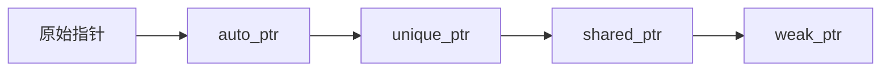
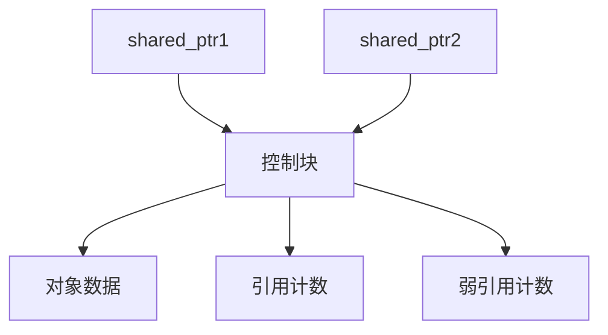

# 现代C++智能指针全面解析与最佳实践

## 一、智能指针演进与设计哲学

### 1.1 内存管理的发展历程


### 1.2 设计哲学对比
| 类型 | 所有权模型 | 线程安全 | 适用场景 | 性能开销 |
|------|------------|----------|----------|----------|
| 原始指针 | 无明确所有权 | 不安全 | 底层操作 | 无 |
| auto_ptr | 转移所有权 | 不安全 | 单线程独占 | 低 |
| unique_ptr | 独占所有权 | 不安全 | 资源独占 | 0% |
| shared_ptr | 共享所有权 | 引用计数原子操作 | 资源共享 | 10-15% |
| weak_ptr | 无所有权 | 依赖shared_ptr | 观察资源 | 5% |

## 二、核心智能指针详解

### 2.1 unique_ptr：独占所有权指针
#### 2.1.1 基本特性
- 不可复制，只支持移动语义
- 零额外开销（与裸指针大小相同）
- 支持自定义删除器

```cpp
// 工厂模式示例
template<typename T, typename... Args>
std::unique_ptr<T> make_unique(Args&&... args) {
    return std::unique_ptr<T>(new T(std::forward<Args>(args)...));
}

// 数组特化版本
auto arr = std::make_unique<int[]>(10);
```

#### 2.1.2 移动语义实现
```cpp
std::unique_ptr<Resource> createResource() {
    auto res = std::make_unique<Resource>();
    res->initialize();
    return res;  // 触发移动构造
}

void consumeResource(std::unique_ptr<Resource> res) {
    // 资源在此作用域结束后自动释放
}
```

### 2.2 shared_ptr：共享所有权指针
#### 2.2.1 引用计数机制


#### 2.2.2 循环引用问题
```cpp
class Node {
public:
    std::shared_ptr<Node> next;
    std::shared_ptr<Node> prev;
};

auto node1 = std::make_shared<Node>();
auto node2 = std::make_shared<Node>();
node1->next = node2;  // 引用计数=2
node2->prev = node1;  // 引用计数=2
// 离开作用域后引用计数降为1，内存泄漏
```

### 2.3 weak_ptr：弱引用指针
#### 2.3.1 典型应用场景
1. 打破shared_ptr循环引用
2. 缓存系统
3. 观察者模式

```cpp
class Observer {
    std::weak_ptr<Subject> subject_;
    
    void observe(std::shared_ptr<Subject> s) {
        subject_ = s;
    }
    
    void notify() {
        if (auto s = subject_.lock()) {
            s->update();
        }
    }
};
```

#### 2.3.2 性能优化技巧
```cpp
// 错误用法：频繁lock检查
if (!wp.expired()) {
    auto sp = wp.lock();
    // 可能此时已经过期
}

// 正确用法：直接lock
if (auto sp = wp.lock()) {
    // 安全使用sp
}
```

## 三、高级应用与陷阱规避

### 3.1 enable_shared_from_this模式
```cpp
class Session : public std::enable_shared_from_this<Session> {
public:
    void start() {
        // 错误：直接从this构造shared_ptr
        // auto self = std::shared_ptr<Session>(this);
        
        // 正确：使用shared_from_this
        auto self = shared_from_this();
        async_op([self](){ /*...*/ });
    }
};

// 必须通过shared_ptr构造
auto session = std::make_shared<Session>();
session->start();
```

### 3.2 自定义删除器实践
```cpp
// 文件句柄管理
auto file_deleter = [](FILE* f) { 
    if (f) {
        fclose(f); 
        log("File closed");
    }
};
std::unique_ptr<FILE, decltype(file_deleter)> 
    fp(fopen("data.txt", "r"), file_deleter);

// 内存池释放
struct MemPool {
    static void deallocate(void* p) {
        pool_free(p);
    }
};
std::shared_ptr<int> sp(static_cast<int*>(pool_alloc()), 
                       &MemPool::deallocate);
```

### 3.3 多线程安全准则
1. shared_ptr控制块线程安全，但指向对象需要额外保护
2. 避免多个shared_ptr实例同时修改引用对象
3. 使用atomic_compare_exchange进行安全更新

```cpp
std::shared_ptr<Config> global_config;

void update_config() {
    auto new_config = load_new_config();
    std::atomic_store(&global_config, new_config);
}

void read_config() {
    auto local_config = std::atomic_load(&global_config);
    // 安全读取
}
```

## 四、性能分析与优化

### 4.1 内存布局对比
| 指针类型 | 典型大小(64位) | 内存结构 |
|----------|----------------|----------|
| unique_ptr | 8字节 | [原始指针] |
| shared_ptr | 16字节 | [原始指针][控制块指针] |
| weak_ptr | 16字节 | [原始指针][控制块指针] |

### 4.2 性能优化策略
1. 优先使用make_shared/make_unique
   - 减少内存分配次数
   - 提高缓存局部性

2. 避免shared_ptr不必要的拷贝
   ```cpp
   // 错误：参数传递产生额外引用计数
   void process(shared_ptr<Data> data);
   
   // 正确：const引用传递
   void process(const shared_ptr<Data>& data);
   
   // 最优：原始指针或引用传递
   void process(const Data* data);
   ```

3. 高频场景考虑使用unique_ptr+观察者模式

## 五、现代C++最佳实践

### 5.1 典型错误案例
```cpp
// 错误1：跨模块内存管理
void create() {
    auto obj = new Resource;
    external_register(obj);  // 可能泄漏
}

// 错误2：误用get()管理生命周期
void process(Resource* r) {
    unique_ptr<Resource> up(r);
    // ...
    external_save(up.get());  // 危险！
}

// 错误3：栈对象智能指针
Resource res;
auto up = unique_ptr<Resource>(&res);  // 双重释放
```
