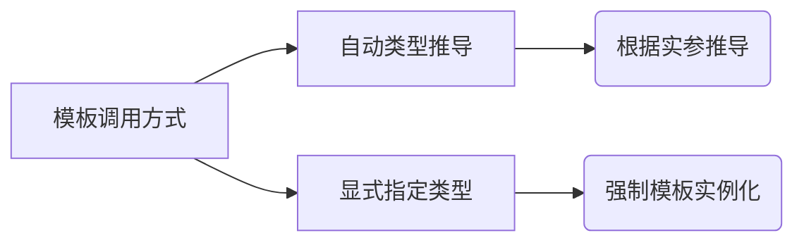
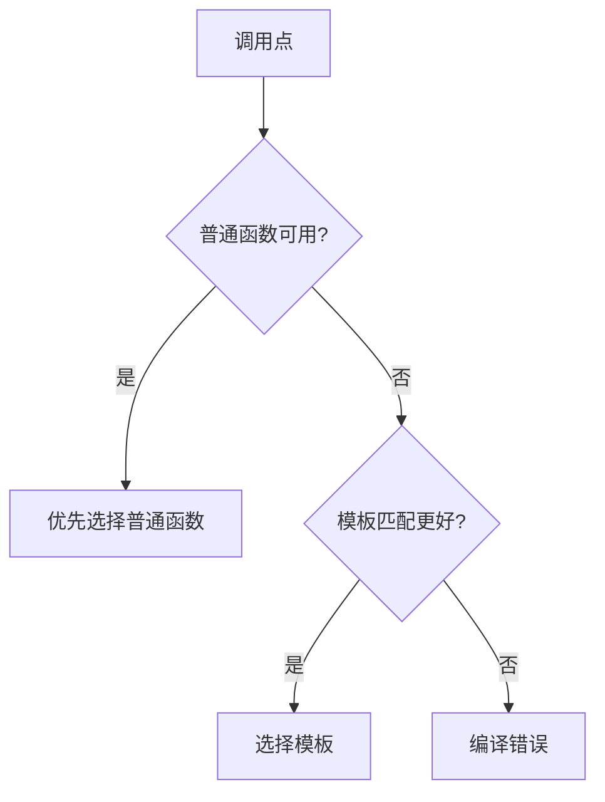

# C++模板编程知识体系

## 一、函数模板核心机制
### 1.1 模板类型推导机制


### 1.2 类型推导对照表
| 调用方式 | 语法示例 | 隐式转换支持 | 适用场景 |
|----------|----------|--------------|----------|
| 自动推导 | `mySwap(a, b)` | 不支持 | 类型明确场景 |
| 显式指定 | `mySwap<int>(a, b)` | 支持 | 需要类型转换场景 |

### 1.3 代码示例增强版
```cpp
// 增强版模板函数示例
template<typename T>
void safeSwap(T& a, T& b) noexcept(is_nothrow_copy_constructible_v<T> && 
                                   is_nothrow_copy_assignable_v<T>) {
    T temp = a;
    a = b;
    b = temp;
}

// 使用示例
void demo() {
    int x = 1, y = 2;
    safeSwap(x, y);  // 自动推导
    
    double z = 3.14;
    safeSwap<int>(x, static_cast<int>(z));  // 显式指定+强制转换
}
```

## 二、模板与函数重载
### 2.1 重载决策规则


### 2.2 重载场景分析
```cpp
// 案例扩展：完美转发模板
template<typename T>
void process(T&& arg) {  // 通用引用版本
    cout << "Template: " << arg << endl;
}

void process(int arg) {  // 普通函数版本
    cout << "Function: " << arg << endl;
}

void test() {
    process(42);    // 输出 Function: 42
    process(3.14);  // 输出 Template: 3.14
    process<int>(42);  // 强制模板调用
}
```

## 三、类模板深度解析
### 3.1 类模板特性矩阵
| 特性 | 函数模板 | 类模板 | 说明 |
|------|----------|--------|------|
| 类型推导 | 支持 | 不支持 | 类模板必须显式指定 |
| 默认参数 | 不支持 | 支持 | 类模板参数可设置默认值 |
| 成员实例化 | 立即实例化 | 延迟实例化 | 类模板成员使用时才实例化 |

### 3.2 类模板继承体系
```mermaid
classDiagram
    class Base<T> {
        +T value
    }
    
    class DerivedA {
        -int spec
    }
    
    class DerivedB<T2> {
        -T2 extra
    }
    
    Base <|-- DerivedA : 固定基类类型
    Base <|-- DerivedB : 保持模板特性
```

### 3.3 生产级类模板示例
```cpp
/**
 * @brief 线程安全模板栈
 * @tparam T 元素类型（需满足可拷贝构造）
 * @warning 拷贝构造函数可能抛异常时需要额外处理
 */
template<typename T>
class ConcurrentStack {
public:
    void push(const T& item) {
        std::lock_guard<std::mutex> lock(mutex_);
        data_.push_back(item);
    }
    
    bool try_pop(T& out) noexcept(is_nothrow_move_constructible_v<T>) {
        std::lock_guard<std::mutex> lock(mutex_);
        if(data_.empty()) return false;
        out = std::move(data_.back());
        data_.pop_back();
        return true;
    }

private:
    std::vector<T> data_;
    mutable std::mutex mutex_;
};
```

## 四、模板元编程进阶
### 4.1 SFINAE应用示例
```cpp
template<typename T>
auto print(const T& value) -> decltype(cout << value, void()) {
    cout << value << endl;
}

template<typename T>
void print(...) {
    static_assert(false, "Type not printable");
}

void demo() {
    print(42);  // OK
    // print(std::vector<int>{});  // 编译错误
}
```

### 4.2 现代C++模板特性
| 特性 | 版本 | 应用场景 | 示例 |
|------|------|----------|------|
| 变量模板 | C++14 | 编译期常量 | `template<typename T> constexpr T pi = T(3.1415926);` |
| 折叠表达式 | C++17 | 参数包处理 | `(args + ...)` |
| 概念约束 | C++20 | 模板限制 | `template<integral T>` |

## 五、模板最佳实践
### 5.1 错误处理规范
```cpp
template<typename Container>
auto safeAccess(Container&& c, size_t index) -> decltype(c[index]) {
    if(index >= c.size()) {
        throw std::out_of_range("Index out of bounds");
    }
    return c[index];
}

// 使用示例
void demo() {
    std::vector<int> v{1,2,3};
    try {
        cout << safeAccess(v, 5);
    } catch(const std::exception& e) {
        cerr << "Error: " << e.what();
    }
}
```

### 5.2 性能优化指南
| 场景 | 传统方案 | 优化方案 | 收益 |
|------|----------|----------|------|
| 类型擦除 | 虚函数 | std::function+模板 | 减少动态分配 |
| 小型对象 | 堆分配 | 模板+栈存储 | 提升缓存命中 |
| 数学运算 | 运行时计算 | 模板元编程 | 编译期计算 |

## 六、模板调试技术
### 6.1 静态断言检查
```cpp
template<typename T>
void process(T value) {
    static_assert(is_arithmetic_v<T>, 
                 "Only arithmetic types are supported");
    // ...
}
```

### 6.2 类型特征打印
```cpp
template<typename T>
void printTypeInfo() {
    cout << "Type: " << typeid(T).name() << "\n"
         << "Size: " << sizeof(T) << " bytes\n"
         << "Is trivial: " << is_trivial_v<T> << "\n"
         << "Is copyable: " << is_copy_constructible_v<T> << endl;
}
```
