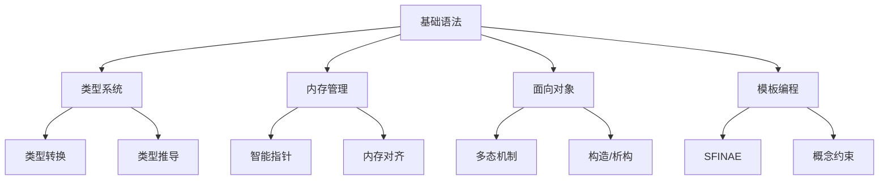
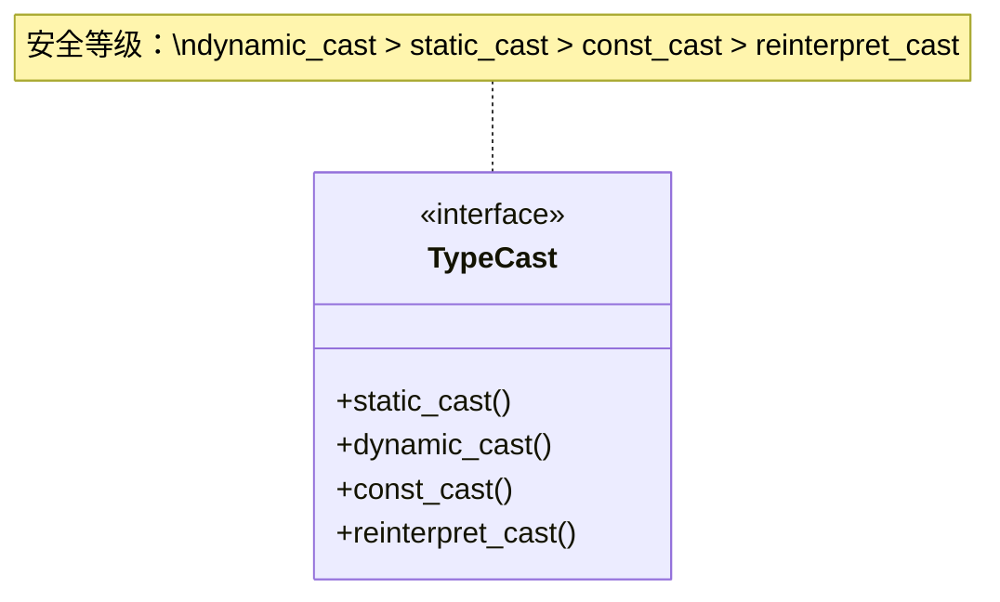
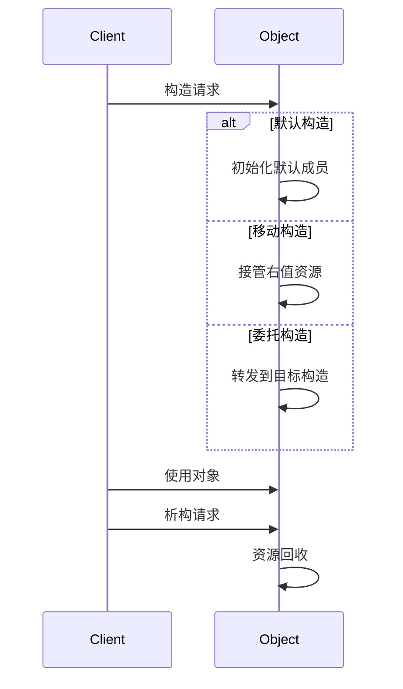

# 现代C++核心知识体系



## 一、类型系统增强

### 1.1 类型定义机制对比
| 特性        | #define宏定义       | typedef           | using (C++11)     |
|------------|--------------------|-------------------|-------------------|
| 作用阶段    | 预处理阶段          | 编译阶段          | 编译阶段          |
| 类型检查    | 无                 | 有                | 有                |
| 模板支持    | 不支持             | 部分支持          | 完全支持          |
| 作用域      | 文件作用域          | 遵循常规作用域    | 遵循常规作用域    |

```cpp
// 现代C++推荐用法
using IntVector = std::vector<int>;  // 替代typedef
template<typename T>
using Matrix = std::vector<std::vector<T>>;  // 模板别名
```

### 1.2 类型转换系统（扩展安全规范）


**转换场景指南**：
1. `static_cast`：基类与派生类间安全转换（编译期检查）
2. `dynamic_cast`：跨继承层次类型检查（运行时RTTI）
3. `const_cast`：移除CV限定符（慎用）
4. `reinterpret_cast`：位模式重解释（高风险操作）

## 二、内存管理深度解析

### 2.1 智能指针演进史
```cpp
// 现代C++智能指针最佳实践
auto p = std::make_unique<Resource>();  // 工厂模式创建
std::shared_ptr<Resource> sp = std::move(p);  // 所有权转移
std::weak_ptr<Resource> wp = sp;  // 观察者模式
```

**生命周期对比**：
| 指针类型   | 所有权语义 | 线程安全成本 | 循环引用风险 | 推荐场景         |
|-----------|------------|--------------|--------------|------------------|
| unique_ptr | 独占       | 无           | 无           | 工厂返回值       |
| shared_ptr | 共享       | 原子计数开销 | 有           | 共享资源         |
| weak_ptr   | 观察       | 依赖shared   | 无           | 缓存/观察者      |

### 2.2 内存对齐优化
```cpp
// 跨平台对齐方案（C++11后标准写法）
struct alignas(8) PackedData {
    uint32_t a;
    char b;
    double c;
};

static_assert(alignof(PackedData) == 8, "Alignment error");
static_assert(sizeof(PackedData) == 16, "Size mismatch");
```

**对齐规则**：
1. 基本类型对齐值=自身大小
2. 结构体对齐值=成员最大对齐值
3. 最终大小必须是对齐值的整数倍

## 三、面向对象高级特性

### 3.1 多态实现机制
```cpp
class Shape {
public:
    virtual ~Shape() = default;  // 关键：虚析构
    virtual void draw() const = 0;
    
    // C++11新增
    virtual void serialize() const final;  // 禁止派生类重写
};

class Circle : public Shape {
public:
    void draw() const override;  // 显式声明重写
};
```

**多态必要条件**：
1. 通过基类指针/引用调用
2. 虚函数表存在（虚函数声明）
3. 运行时类型识别（RTTI启用）

### 3.2 构造/析构体系


**构造函数类型**：
1. 移动构造（C++11引入）
```cpp
Matrix(Matrix&& other) noexcept 
    : data_(other.data_), size_(other.size_) {
    other.data_ = nullptr;  // 重要：置空源指针
}
```
2. 委托构造（C++11）
```cpp
explicit Widget(int x) : Widget(x, defaultY) {}
```

## 四、高级编程技巧

### 4.1 类型萃取技术
```cpp
template<typename T>
void process(T val) {
    if constexpr (std::is_pointer_v<T>) {  // C++17编译期if
        std::cout << *val;
    } else {
        std::cout << val;
    }
}
```

### 4.2 安全delete规范
```cpp
class SelfDeletable {
public:
    void destroy() {
        static_assert(!std::is_base_of_v<SelfDeletable, T>,
                     "Incomplete type detected");
        delete this;  // 必须确保：
                      // 1. 对象是堆分配的
                      // 2. 之后不再访问任何成员
    }
private:
    ~SelfDeletable() = default;  // 限制删除方式
};
```

## 五、跨语言交互规范

### 5.1 C/C++互操作
```cpp
// 现代C++封装方案
#ifdef __cplusplus
extern "C" {
#endif

// C兼容接口声明区
void* create_engine();
void release_engine(void* engine);

#ifdef __cplusplus
}  // extern "C"
#endif

// C++实现侧
class EngineWrapper {  // RAII包装器
public:
    EngineWrapper() : handle_(create_engine()) {}
    ~EngineWrapper() { release_engine(handle_); }
private:
    void* handle_;
};
```
