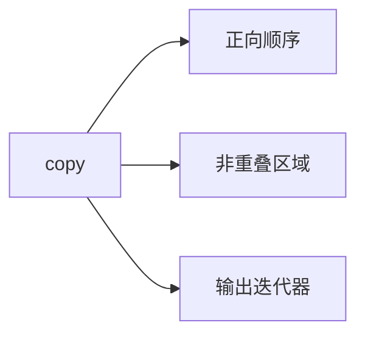
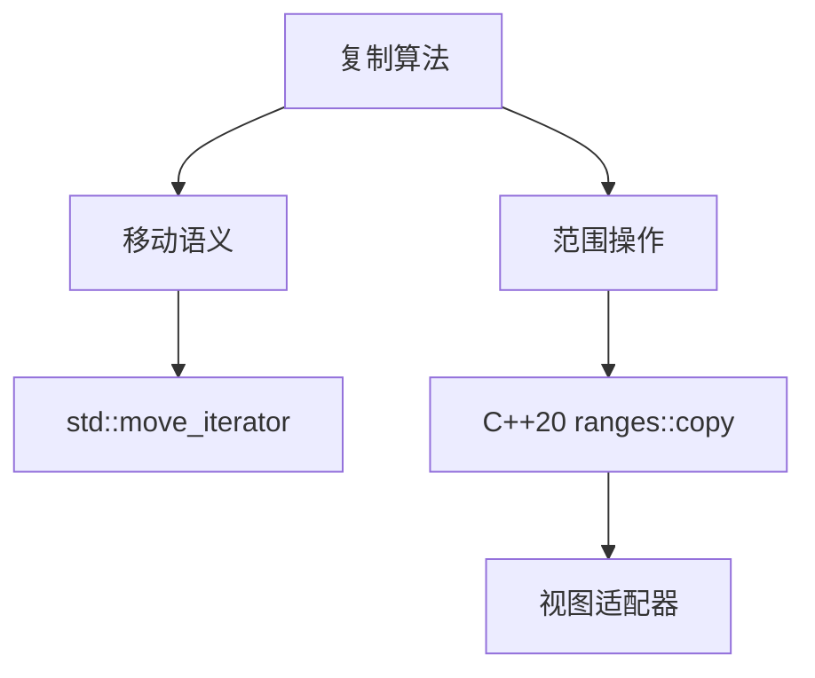

# 标准库元素复制算法详解
## `<algorithm>`头文件复制函数族

### 1. `copy()`基础复制


**核心特性**：
- **时间复杂度**：O(n)线性复杂度
- **迭代器要求**：
  - 输入：InputIterator
  - 输出：OutputIterator
- **安全边界**：
  - 目标容器需预分配空间
  - 或使用`std::back_inserter`

**增强示例**：
```cpp
// 安全复制到未预分配容器
std::vector<int> src = {1, 2, 3};
std::vector<int> dest;
dest.reserve(src.size());  // 最佳实践：预分配
std::copy(src.begin(), src.end(), std::back_inserter(dest));
```

### 2. `copy_backward()`反向复制
**关键改进**：
```diff
- 仅说明反向特性
+ 新增内存重叠处理原理：
  * 从尾部开始复制避免源数据被覆盖
  * 要求BidirectionalIterator
```

**典型陷阱**：
```cpp
std::vector<int> v = {1, 2, 3, 4};
// 错误用法：目标范围计算错误
std::copy_backward(v.begin(), v.end(), v.end());  // ❌ 无效果
// 正确用法：明确目标结束位置
std::copy_backward(v.begin(), v.end()-1, v.end());
```

### 3. `copy_n()`定量复制
**工程化扩展**：
| 参数验证策略       | 异常处理方案          |
|--------------------|-----------------------|
| static_assert检查Size类型 | 返回空迭代器表示失败 |

**现代C++优化**：
```cpp
template<typename InputIt, typename Size, typename OutputIt>
constexpr OutputIt safe_copy_n(InputIt first, Size count, OutputIt result) {
    static_assert(std::is_integral_v<Size>, "Size must be integral");
    while (count-- > 0) {
        *result++ = *first++;
    }
    return result;
}
```

### 4. `copy_if()`条件复制
**谓词进阶用法**：
```cpp
// 使用concept约束谓词类型（C++20）
template<typename T>
concept NumericPredicate = requires(T fn, int x) {
    { fn(x) } -> std::convertible_to<bool>;
};

auto copy_if_numeric = [](auto first, auto last, auto d_first, NumericPredicate auto pred) {
    return std::copy_if(first, last, d_first, pred);
};
```

## 综合对比矩阵
| 函数          | C++标准引入版本 | 异常安全保证 | 并行化支持(C++17) |
|---------------|----------------|--------------|-------------------|
| copy          | C++98          | 基本保证     | std::execution::par |
| copy_backward | C++98          | 强保证       | 不支持            |
| copy_n        | C++11          | 基本保证     | std::execution::par |
| copy_if       | C++11          | 基本保证     | std::execution::par |

## 性能优化指南
1. **预分配策略**：
   ```cpp
   // 优化前
   std::vector<int> dest;
   std::copy_if(src.begin(), src.end(), back_inserter(dest), pred);

   // 优化后
   std::vector<int> dest;
   dest.reserve(std::distance(src.begin(), src.end()));  // 一次分配
   std::copy_if(src.begin(), src.end(), back_inserter(dest), pred);
   ```

2. **SIMD优化**：
   - 对POD类型可使用`std::memcpy`替代
   - 启用编译器向量化选项（-O3 -mavx2）

## 关联知识图谱

