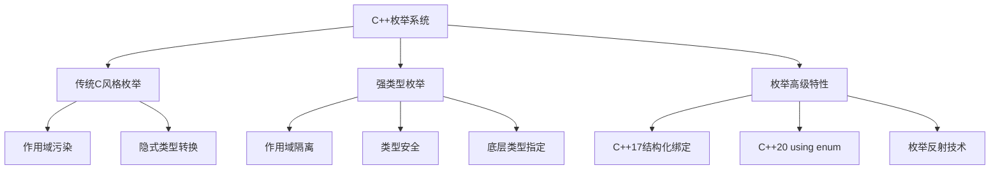
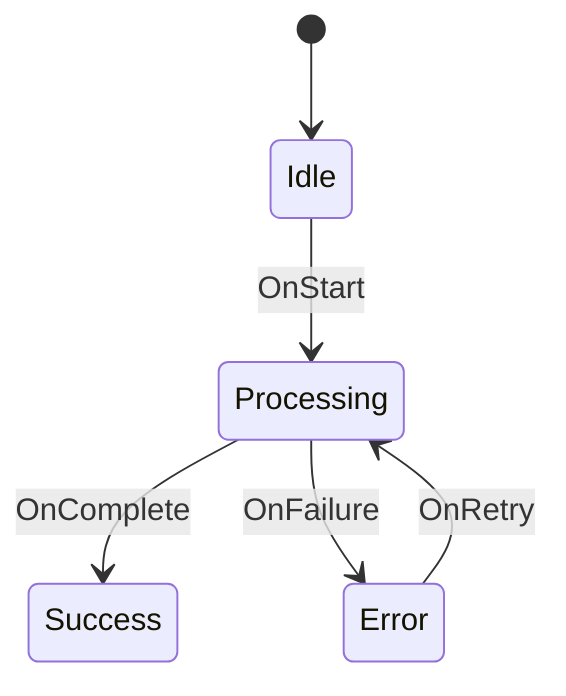

# C++枚举系统深度解析与工程实践指南

## 一、枚举类型知识图谱


## 二、枚举类型技术规范

### 2.1 枚举定义标准格式
```cpp
// 传统枚举（不推荐在新代码中使用）
enum LegacyColor {
    RED,    // 0
    GREEN,  // 1
    BLUE = 5
};

// 强类型枚举（推荐）
enum class Color : uint8_t {
    Red,    // 0
    Green,  // 1
    Blue = 5
};

// 前向声明（C++11+）
enum class Status : uint16_t;
```

### 2.2 枚举特性对比表
| 特性 | 传统枚举 | 强类型枚举 | 适用场景 |
|------|----------|------------|----------|
| 作用域 | 污染父作用域 | 隔离作用域 | 大型项目推荐强类型 |
| 类型转换 | 隐式转换 | 需显式转换 | 类型安全场景用强类型 |
| 底层类型 | 不可指定 | 可指定 | 内存敏感场景用强类型 |
| 前向声明 | 不支持 | 支持 | 头文件设计 |

## 三、生产环境最佳实践

### 3.1 枚举工程化规范
1. **命名规则**：
   - 类名：PascalCase（如`ColorSpace`）
   - 枚举值：kPascalCase或ALL_CAPS（保持项目统一）

2. **类型安全包装**：
```cpp
template<typename Enum>
constexpr auto to_underlying(Enum e) noexcept {
    return static_cast<std::underlying_type_t<Enum>>(e);
}
```

3. **边界检查（C++17）**：
```cpp
enum class LogLevel { Debug, Info, Warning, Error };

constexpr bool isValidLogLevel(LogLevel level) {
    switch(level) {
        case LogLevel::Debug:
        case LogLevel::Info:
        case LogLevel::Warning:
        case LogLevel::Error:
            return true;
        default:
            return false;
    }
}
```

### 3.2 性能优化策略
| 场景 | 优化方案 | 性能影响 | 兼容性 |
|------|----------|----------|--------|
| 高频枚举比较 | 指定底层为整型 | 减少类型转换开销 | C++11+ |
| 网络传输 | 使用固定宽度类型 | 保证二进制兼容性 | C++11+ |
| 位标志组合 | enum class + 运算符重载 | 优于传统enum | C++11+ |

## 四、高级应用模式

### 4.1 枚举反射技术
```cpp
template<typename T>
constexpr auto enum_to_string(T value) {
    static_assert(std::is_enum_v<T>, "T must be enum type");
    
    // 实际项目中可使用宏生成映射表
    if constexpr (std::is_same_v<T, Color>) {
        switch(value) {
            case Color::Red: return "Red";
            case Color::Green: return "Green";
            case Color::Blue: return "Blue";
            default: return "Unknown";
        }
    }
}
```

### 4.2 枚举集合处理（C++20）
```cpp
enum class DeviceState { Off, Standby, Active, Fault };

constexpr std::array allStates = {
    DeviceState::Off,
    DeviceState::Standby,
    DeviceState::Active,
    DeviceState::Fault
};

// 范围遍历
for (auto state : allStates) {
    processState(state);
}
```

## 五、调试与错误处理

### 5.1 常见陷阱检测表
| 错误类型 | 示例 | 解决方案 |
|----------|------|----------|
| 隐式转换 | `int i = Color::Red` | 使用enum class |
| 作用域污染 | `enum { A }; int A;` | 使用enum class |
| 未初始化 | `Color c;` | 始终初始化枚举变量 |
| 越界值 | `Color c = static_cast<Color>(100)` | 添加边界检查 |

### 5.2 调试工具支持
1. **GDB/LLDB**：
   ```bash
   # 打印枚举变量
   p (Color::Red)
   # 显示底层值
   p/x (int)myEnum
   ```

2. **IDE支持**：
   - Visual Studio：智能提示枚举值
   - CLion：支持重构枚举名称

## 六、设计模式应用

### 6.1 状态机实现


```cpp
enum class State { Idle, Processing, Success, Error };

class StateMachine {
    State current = State::Idle;
    
    void transition(Event event) {
        switch(current) {
            case State::Idle:
                if (event == Event::Start) current = State::Processing;
                break;
            // 其他状态转换...
        }
    }
};
```

## 七、跨版本兼容方案

### 7.1 C++11向后兼容层
```cpp
#if __cplusplus < 201103L
// C++98兼容实现
enum LegacyEnum { A, B };
#define ENUM_CLASS(NAME, TYPE, ...) enum NAME { __VA_ARGS__ }
#else
// C++11+原生实现
#define ENUM_CLASS(NAME, TYPE, ...) enum class NAME : TYPE { __VA_ARGS__ }
#endif

ENUM_CLASS(ModernEnum, uint8_t, X=1, Y=2);
```