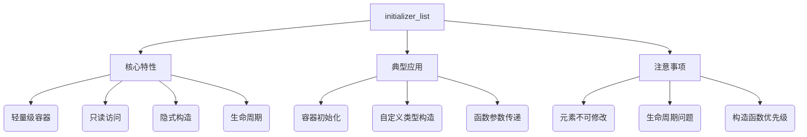
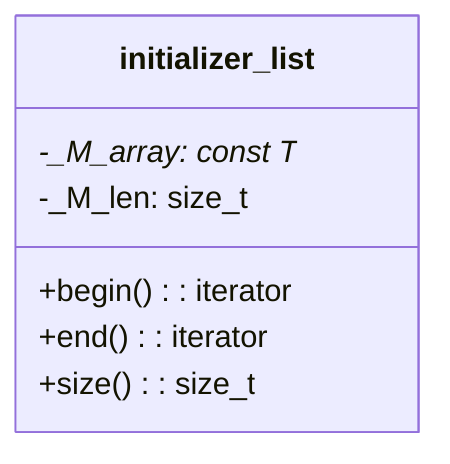

# std::initializer_list 深度解析



## 一、核心概念解析

### 1.1 基本定义
```cpp
template< class T >
class initializer_list;  // C++11起
```

`std::initializer_list`是：
- 访问const T类型对象数组的轻量代理
- 标准库容器初始化的底层机制
- 现代C++统一初始化语法的关键组件

### 1.2 自动构造场景
| 场景 | 示例 | 底层机制 |
|------|------|----------|
| 列表初始化 | `vector<int> v{1,2,3};` | 调用接受initializer_list的构造函数 |
| 函数调用 | `func({1,2,3});` | 参数隐式转换 |
| auto推导 | `auto x = {1,2,3};` | auto特殊推导规则 |

## 二、深度使用指南

### 2.1 标准库集成
```cpp
// 容器初始化对比
vector<int> v1(3, 5);    // [5,5,5]
vector<int> v2{3, 5};    // [3,5] ← initializer_list优先

// 复合结构初始化
map<string, int> m = {
    {"one", 1},
    {"two", 2}  // 每个键值对都是一个initializer_list
};
```

### 2.2 自定义类型应用
```cpp
class Tensor {
public:
    // 多维初始化支持
    Tensor(std::initializer_list<std::initializer_list<double>> data) {
        for (auto& row : data) {
            data_.emplace_back(row);
        }
    }
private:
    vector<vector<double>> data_;
};

Tensor t = {
    {1.0, 2.0},
    {3.0, 4.0}
};
```

### 2.3 高级函数用法
```cpp
// 可变参数模板的替代方案
template<typename T>
void log(std::initializer_list<T> args) {
    for (auto&& arg : args) {
        std::cout << arg << " ";
    }
}

log({"Error:", 42, "at line", __LINE__});  // 混合类型需相同T
```

## 三、关键机制剖析

### 3.1 内存模型


- 仅包含原始数组指针和长度
- 不管理元素内存生命周期
- 典型实现大小：2个指针（16字节 on x64）

### 3.2 构造函数优先级
```cpp
class Widget {
public:
    Widget(int, int);  // #1
    Widget(std::initializer_list<int>);  // #2
};

Widget w1(10, 20);   // 调用#1
Widget w2{10, 20};   // 调用#2 ← 优先匹配
Widget w3({10, 20}); // 显式调用#2
```

## 四、工程实践要点

### 4.1 性能优化
| 场景 | 建议方案 | 理论依据 |
|------|----------|----------|
| 大型数据 | 改用span或array_view | 避免临时数组拷贝 |
| 频繁调用 | 转换为const引用传递 | 减少对象构造开销 |
| 修改需求 | 转换为vector | initializer_list只读 |

### 4.2 典型错误案例
```cpp
// 危险：返回临时initializer_list
auto make_list() {
    return {1, 2, 3};  // 底层数组随临时对象销毁
}

// 安全替代方案
auto make_vector() {
    return vector<int>{1, 2, 3};
}
```

## 五、现代C++演进

### 5.1 C++14增强
- auto返回类型推导支持initializer_list
```cpp
auto create_list() {
    return {1, 2, 3};  // C++14起合法
}
```

### 5.2 C++17特性
- 类模板参数推导(CTAD)与initializer_list交互
```cpp
std::vector v{1, 2, 3};  // 自动推导vector<int>

auto x = {1, 2, 3};   // x是initializer_list<int>
auto y{1, 2, 3};      // C++17起报错（必须用=初始化）
auto z = {1};         // z是initializer_list<int>
auto w{1};            // C++17起w是int（！重要变化）

```


## 六、跨版本兼容方案

```cpp
#if __cplusplus >= 201103L
    #define MODERN_INIT_LIST(...) {__VA_ARGS__}
#else
    #define MODERN_INIT_LIST(...) /* 传统初始化方式 */
#endif
```
