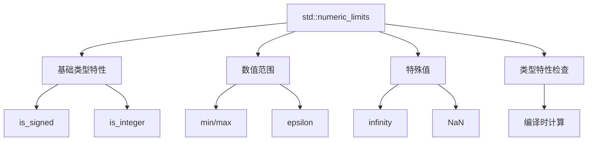

# std::numeric_limits 完全指南（增强版）



## 一、核心概念深化

### 1.1 类型系统映射
| 特性分类 | 整数类型 | 浮点类型 | 自定义类型 |
|---------|---------|---------|-----------|
| 精确表示 | true | false | 可定制 |
| 基数 | 2 | 2 | 可定制 |
| 特殊值 | 无 | NaN/Inf | 可定义 |

### 1.2 内存模型关联
```cpp
// 类型大小与对齐检查
static_assert(std::numeric_limits<int>::digits >= 31);
static_assert(alignof(double) == sizeof(double)); // IEEE754要求
```

## 二、现代C++特性集成

### 2.1 C++11/14/17增强特性
```diff
+ // C++17 constexpr扩展
+ constexpr auto int_max = std::numeric_limits<int>::max();
+
+ // C++20位操作集成
+ static_assert(std::numeric_limits<unsigned>::digits == 
+               std::bit_width(std::numeric_limits<unsigned>::max()));
```

### 2.2 概念约束应用
```cpp
template<typename T>
requires std::numeric_limits<T>::is_specialized
void safe_arithmetic(T a, T b) {
    // 安全算术操作
}
```

## 三、工程实践规范

### 3.1 生产环境代码模板
```cpp
template<typename T>
class BoundedValue {
    static_assert(std::numeric_limits<T>::is_arithmetic, 
                 "必须是算术类型");
public:
    explicit BoundedValue(T val) : value_(val) {
        if (val < std::numeric_limits<T>::lowest() || 
            val > std::numeric_limits<T>::max()) {
            throw std::out_of_range("超出类型范围");
        }
    }
private:
    T value_;
};
```

### 3.2 性能优化对照表
| 操作 | 传统方法 | numeric_limits | 优势 |
|------|----------|----------------|------|
| 最大值获取 | INT_MAX | limits<T>::max() | 类型安全 |
| 边界检查 | 硬编码值 | 动态类型适配 | 可维护性 |
| 编译时计算 | 宏定义 | constexpr | 零开销 |

## 四、高级应用场景

### 4.1 数值算法边界保护
```cpp
template<typename T>
T saturating_add(T a, T b) {
    if (a > 0 && b > std::numeric_limits<T>::max() - a) {
        return std::numeric_limits<T>::max();
    }
    if (a < 0 && b < std::numeric_limits<T>::lowest() - a) {
        return std::numeric_limits<T>::lowest();
    }
    return a + b;
}
```

### 4.2 跨平台兼容性方案
```cpp
#if defined(USE_IEEE754)
using float_type = std::conditional_t<
    std::numeric_limits<float>::is_iec559, 
    float, double>;
#else
using float_type = mpfr_float; // 自定义高精度类型
#endif
```

## 五、调试与验证

### 5.1 类型特性验证套件
```cpp
template<typename T>
void validate_numeric_type() {
    static_assert(std::numeric_limits<T>::is_specialized);
    static_assert(std::numeric_limits<T>::min() <= std::numeric_limits<T>::max());
    if constexpr (std::numeric_limits<T>::has_infinity) {
        assert(std::isinf(std::numeric_limits<T>::infinity()));
    }
}
```

### 5.2 异常处理模式
```cpp
try {
    BoundedValue<short>(32768);
} catch (const std::out_of_range& e) {
    std::cerr << "范围错误: " << e.what() 
              << " 允许范围: [" 
              << std::numeric_limits<short>::lowest() << ", "
              << std::numeric_limits<short>::max() << "]\n";
}
```

## 六、设计模式集成

### 6.1 策略模式应用
```cpp
template<typename T>
struct NumericPolicy {
    static T max_value() { return std::numeric_limits<T>::max(); }
    static T min_value() { return std::numeric_limits<T>::lowest(); }
};

template<typename T, typename Policy = NumericPolicy<T>>
class NumericValidator {
    // 使用策略类进行验证
};
```

## 七、扩展知识体系

### 7.1 相关工具链集成
```yaml
# CMake检测类型特性
check_type_size("long double" LONG_DOUBLE_SIZE)
if (LONG_DOUBLE_SIZE GREATER 8)
    add_definitions(-DUSE_EXTENDED_PRECISION)
endif()
```

### 7.2 性能基准测试
```cpp
static void BM_LimitsCheck(benchmark::State& state) {
    for (auto _ : state) {
        auto v = std::numeric_limits<int>::max();
        benchmark::DoNotOptimize(v);
    }
}
BENCHMARK(BM_LimitsCheck);
```

## 八、行业应用案例

### 8.1 金融领域
- 价格范围验证
- 风险值计算边界检查

### 8.2 游戏开发
- 物理引擎数值稳定性保障
- 定点数替代方案选择

## 九、历史演进与最佳实践

| 标准版本 | 关键改进 | 向后兼容建议 |
|---------|---------|-------------|
| C++98 | 初始版本 | 基础特性可用 |
| C++11 | constexpr支持 | 优先使用新语法 |
| C++17 | 全部constexpr | 无需兼容旧编译器时可全面采用 |

## 十、常见问题增强版

**Q: 如何处理自定义大整数类型？**
```cpp
template<>
class std::numeric_limits<BigInt> {
    static constexpr bool is_specialized = true;
    static BigInt max() { return BigInt::MAX_VALUE; }
    // ...其他特化实现
};
```

**Q: 浮点比较的最佳实践？**
```cpp
bool nearly_equal(float a, float b) {
    return fabs(a - b) < std::numeric_limits<float>::epsilon() * 
           std::max(fabs(a), fabs(b));
}
```

## 完整示例代码（增强版）

```cpp
#include <limits>
#include <iostream>
#include <type_traits>
#include <iomanip>
#include <cmath>

template<typename T>
void print_limits() {
    using limits = std::numeric_limits<T>;
    
    std::cout << "\n类型: " << typeid(T).name() << "\n";
    std::cout << std::setfill('-') << std::setw(32) << "\n";
    
    constexpr auto width = 25;
    std::cout << std::left << std::boolalpha;
    std::cout << std::setw(width) << "最小值:" << limits::min() << "\n";
    std::cout << std::setw(width) << "最大值:" << limits::max() << "\n";
    std::cout << std::setw(width) << "最低值:" << limits::lowest() << "\n";
    
    if constexpr (!limits::is_integer) {
        std::cout << std::setw(width) << "epsilon:" << limits::epsilon() << "\n";
        std::cout << std::setw(width) << "有无无穷:" << limits::has_infinity << "\n";
        if (limits::has_infinity) {
            std::cout << std::setw(width) << "无穷大值:" << limits::infinity() << "\n";
        }
    }
    
    std::cout << std::setw(width) << "位数:" << limits::digits << "\n";
    std::cout << std::setw(width) << "十进制位数:" << limits::digits10 << "\n";
    std::cout << std::setw(width) << "有符号:" << limits::is_signed << "\n";
    std::cout << std::setw(width) << "整数类型:" << limits::is_integer << "\n";
    std::cout << std::setw(width) << "符合IEC559:" << limits::is_iec559 << "\n";
}

int main() {
    print_limits<int>();
    print_limits<unsigned long>();
    print_limits<float>();
    print_limits<double>();
    print_limits<long double>();
    
    return 0;
}
```
