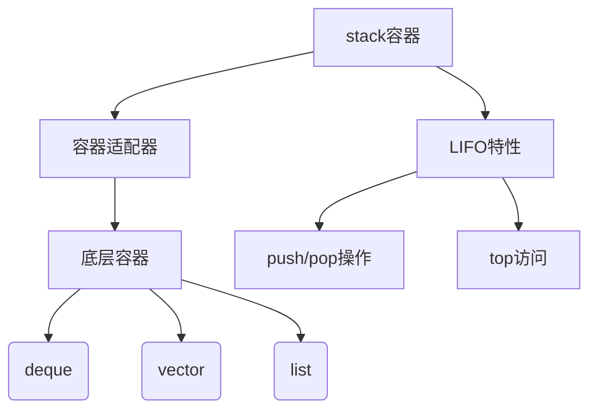

# C++ Stack容器完整指南

## 一、核心概念图谱


## 二、模板定义详解
### 2.1 基本模板结构
```cpp
template<
    class T,
    class Container = std::deque<T>
> class stack;
```

### 2.2 模板参数要求
| 参数 | 要求 | 默认值 | 注意事项 |
|------|------|--------|----------|
| T | 元素类型 | 无 | 必须与Container::value_type一致 |
| Container | 必须满足SequenceContainer要求 | std::deque | 需提供back(), push_back(), pop_back() |

**支持的底层容器**：
- std::deque（默认）
- std::vector
- std::list
- 自定义满足要求的容器

## 三、接口全览
### 3.1 构造与赋值
| 方法 | 说明 | 时间复杂度 |
|------|------|------------|
| stack() | 默认构造 | O(1) |
| stack(const stack&) | 拷贝构造 | O(n) |
| operator= | 赋值操作 | O(n) |

### 3.2 元素访问
| 方法 | 说明 | 注意事项 |
|------|------|----------|
| top() | 访问栈顶元素 | 空栈调用是UB |
| empty() | 判断是否为空 | 推荐先检查再操作 |

### 3.3 容量操作
| 方法 | 说明 | 典型用途 |
|------|------|----------|
| size() | 返回元素数量 | 容量监控 |
| empty() | 判断是否为空 | 循环条件 |

### 3.4 修改操作
| 方法 | 说明 | 版本要求 |
|------|------|----------|
| push() | 压入元素 | C++98 |
| pop() | 弹出元素 | C++98 |
| emplace() | 原位构造 | C++11 |
| swap() | 交换内容 | C++11 |

## 四、关键特性详解

### 4.1 emplace方法
```cpp
template< class... Args >
void emplace( Args&&... args );
```
**优势**：
- 避免临时对象构造
- 直接使用参数构造元素
- 更高效的对象创建方式

**示例对比**：
```cpp
stack<pair<int, string>> s;

// 传统方式
s.push(make_pair(1, "hello"));  // 需要构造临时对象

// emplace方式
s.emplace(1, "hello");  // 直接构造
```

### 4.2 底层容器选择指南
| 容器类型 | 适用场景 | 性能特点 |
|----------|----------|----------|
| deque | 默认选择 | 平衡插入/删除性能 |
| vector | 需要连续内存 | 可能触发频繁扩容 |
| list | 大型元素 | 稳定O(1)操作 |

## 五、最佳实践示例

### 5.1 基础用法
```cpp
#include <stack>
#include <iostream>

void basicUsage() {
    std::stack<int> s;
    
    // 压栈操作
    for(int i = 0; i < 5; ++i) {
        s.push(i * 10);
    }
    
    // 遍历栈
    while(!s.empty()) {
        std::cout << "Top element: " << s.top() << std::endl;
        s.pop();  // 出栈
    }
}
```

### 5.2 线程安全实现
```cpp
#include <stack>
#include <mutex>
#include <thread>

template<typename T>
class ThreadSafeStack {
    std::stack<T> data;
    mutable std::mutex m;
public:
    void push(T new_value) {
        std::lock_guard<std::mutex> lock(m);
        data.push(std::move(new_value));
    }
    
    bool try_pop(T& value) {
        std::lock_guard<std::mutex> lock(m);
        if(data.empty()) return false;
        value = std::move(data.top());
        data.pop();
        return true;
    }
};
```

## 六、性能优化建议

1. **预分配空间**（使用vector时）：
```cpp
std::stack<int, std::vector<int>> s;
s.c.reserve(100);  // 预先分配空间
```

2. **移动语义应用**：
```cpp
std::string largeData = getLargeString();
s.push(std::move(largeData));  // 避免拷贝
```

3. **批量操作优化**：
```cpp
// 批量压栈更高效的方式
for(auto&& item : items) {
    s.push(std::forward<decltype(item)>(item));
}
```

## 七、常见错误及避免

1. **空栈访问**：
```cpp
std::stack<int> s;
// 错误：未检查直接访问
int val = s.top();  // UB

// 正确做法
if(!s.empty()) {
    val = s.top();
}
```

2. **迭代器误用**：
```cpp
// stack不提供迭代器接口
// 错误尝试：
for(auto it = s.begin(); it != s.end(); ++it)  // 编译错误
```

3. **容器不匹配**：
```cpp
// 错误：vector<bool>不满足全部要求
std::stack<bool, std::vector<bool>> s;  // 可能引发问题
```

## 八、扩展应用场景

1. **算法应用**：
   - 括号匹配检查
   - 表达式求值
   - 函数调用栈模拟

2. **系统开发**：
   - 页面访问历史记录
   - 撤销操作实现
   - 递归转非递归

3. **游戏开发**：
   - 状态管理
   - 操作回放系统
   - 场景切换管理

## 九、跨版本兼容性

| 特性 | C++11 | C++14 | C++17 | C++20 |
|------|-------|-------|-------|-------|
| emplace | ✓ | 优化 | 优化 | 不变 |
| swap | ✓ | 不变 | 增加nodiscard | 不变 |
| deduction guides | × | × | ✓ | 优化 |