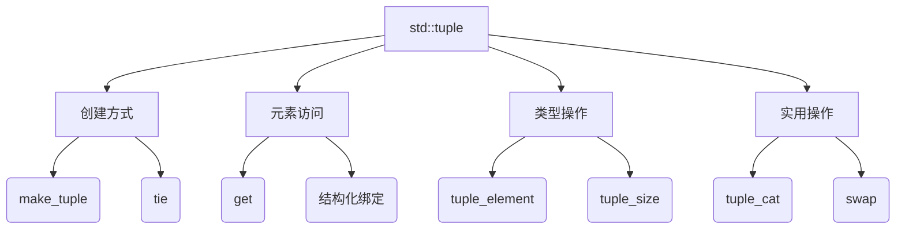
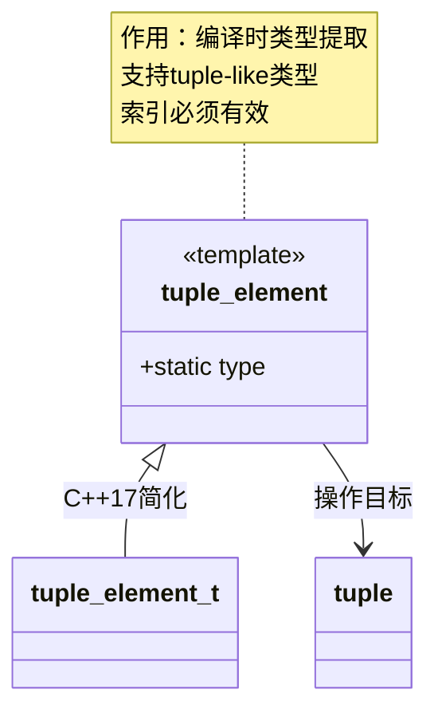

# C++元组(Tuple)全面指南

## 一、核心概念图谱


## 二、创建与初始化

### 2.1 创建方式对比表
| 方法 | 语法示例 | 适用场景 | 注意事项 |
|------|----------|----------|----------|
| 直接构造 | `tuple<int, string> t(1, "test")` | 明确知道元素类型和值 | 类型必须严格匹配 |
| make_tuple | `auto t = make_tuple(3.14, 'A')` | 自动推导类型 | 可能产生意外类型推导 |
| tie | `tie(gpa, grade, name)` | 创建左值引用元组 | 常用于解包返回值 |
| forward_as_tuple | `forward_as_tuple(a, b)` | 完美转发参数 | 可能包含悬垂引用 |

### 2.2 高级构造示例
```cpp
// 连接多个元组
auto t1 = make_tuple(1, "Hello");
auto t2 = make_tuple(3.14, 'A');
auto combined = tuple_cat(t1, t2, make_pair("key", 42));

// 带引用的元组
int x = 10;
string s = "test";
auto ref_tuple = tie(x, s);  // 包含int&和string&
```

## 三、元素访问与操作

### 3.1 访问方法对比
| 方法 | 示例 | 版本要求 | 适用场景 |
|------|------|----------|----------|
| get-by-index | `get<0>(t)` | C++11 | 通用访问方式 |
| get-by-type | `get<int>(t)` | C++14 | 类型唯一时更清晰 |
| 结构化绑定 | `auto& [a,b] = t` | C++17 | 多返回值解包 |

### 3.2 安全访问模式
```cpp
template <typename Tuple, size_t Index>
void safe_get(const Tuple& t) {
    static_assert(Index < tuple_size_v<Tuple>, 
                 "Index out of bounds");
    if constexpr (is_reference_v<tuple_element_t<Index, Tuple>>) {
        cout << "Element is a reference" << endl;
    }
    cout << get<Index>(t) << endl;
}
```

## 四、类型特征操作

### 4.1 tuple_element深度解析


**典型应用场景**：
1. 元组遍历实现
```cpp
template <typename Tuple, size_t Index = 0>
void process_tuple(const Tuple& t) {
    if constexpr (Index < tuple_size_v<Tuple>) {
        using ElementType = tuple_element_t<Index, Tuple>;
        cout << "Processing type: " << typeid(ElementType).name() << endl;
        process_tuple<Tuple, Index + 1>(t);
    }
}


std::tuple_element<1, decltype(tp)>::type ages; 
```

### 4.2 tuple_size进阶用法
**性能关键点**：
- 纯编译时计算，零运行时开销
- 支持所有tuple-like类型（pair/array等）

**错误处理模式**：
```cpp
template <typename T>
constexpr void check_tuple_size() {
    static_assert(tuple_size_v<T> <= 10, 
                 "Tuple too large for processing");
    // 安全处理逻辑...
}

std::tuple<int, char, double> mytuple (10, 'a', 3.14);
std::cout << std::tuple_size<decltype(mytuple)>::value;
```

## 五、工程实践应用

### 5.1 多返回值模式
```cpp
// 工厂函数返回多值
auto create_resource() -> tuple<Handle, Status, Timestamp> {
    // ...
    return {handle, status, now()};
}

// 客户端使用(C++17结构化绑定)
auto [h, st, ts] = create_resource();
if (st.ok()) {
    use_resource(h, ts);
}
```

### 5.2 元编程应用
**类型列表实现**：
```cpp
template <typename... Ts>
struct type_list {
    using as_tuple = tuple<Ts...>;
    static constexpr size_t size = tuple_size_v<as_tuple>;
    
    template <size_t I>
    using type = tuple_element_t<I, as_tuple>;
};
```

## 六、性能优化指南

### 6.1 内存布局分析
| 元素类型 | 对齐方式 | 内存占用 | 访问效率 |
|----------|----------|----------|----------|
| 相同类型 | 连续存储 | 紧凑 | 高 |
| 混合类型 | 按最大对齐 | 可能有填充 | 中等 |
| 包含引用 | 存储指针 | 固定大小 | 高 |

### 6.2 移动语义优化
```cpp
auto process_large_data() {
    vector<double> big_data(1'000'000);
    // ...处理数据...
    return make_tuple(move(big_data), get_status());  // 避免拷贝
}
```

## 七、调试与错误处理

### 7.1 常见UB案例
```cpp
// 错误1：越界访问
auto t = make_tuple(1, 2);
auto x = get<2>(t);  // 运行时崩溃或UB

// 错误2：悬垂引用
string_view get_view() {
    string s = "temp";
    return s;  // 返回局部对象视图
}
```


## 八、扩展应用场景

### 8.1 反射模拟
```cpp
template <typename T>
void print_fields(const T& obj) {
    if constexpr (is_aggregate_v<T>) {
        constexpr auto names = get_field_names<T>();
        auto values = to_tuple(obj);
        
        [&]<size_t... I>(index_sequence<I...>) {
            ((cout << get<I>(names) << ": " << get<I>(values) << endl), ...);
        }(make_index_sequence<tuple_size_v<decltype(values)>>{});
    }
}
```

### 8.2 协程应用
```cpp
generator<tuple<int, string>> produce_data() {
    for (int i = 0; ; ++i) {
        auto data = co_await fetch_async();
        co_yield make_tuple(i, move(data));
    }
}
```
