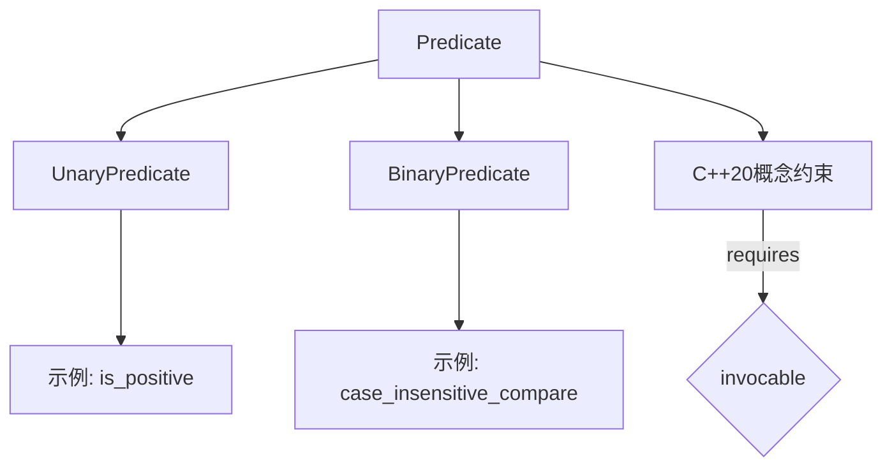

# 仿函数（Function Object）深度解析

## 一、核心概念与特性
### 1. 本质定义
- **对象模拟函数**：通过重载`operator()`实现函数调用语义的类实例
- **关键特征**：
  - 对象可携带状态（成员变量）
  - 支持模板化（编译期多态）
  - 可继承的完整类型

### 2. 类型对比分析
| 特性                | 仿函数           | 函数指针       | Lambda表达式   |
|---------------------|----------------|--------------|---------------|
| 状态保持            | ✓              | ✗            | ✓（捕获列表）   |
| 内联优化            | 编译器通常优化   | 取决于编译器   | 编译器通常优化  |
| 模板支持            | ✓              | ✗            | C++20起支持    |
| 调试信息            | 类型名称清晰     | 指针地址      | 匿名类型       |

## 二、标准规范实现
### 1. 基础实现模板
```cpp
// 符合STL规范的仿函数示例
template <typename T>
struct Less {
    // 标记类型（STL算法识别用）
    using is_transparent = void;  // C++14透明运算符支持
    
    // const调用运算符（线程安全基础）
    bool operator()(const T& lhs, const T& rhs) const {
        return lhs < rhs;
    }
    
    // 支持异质比较（C++14）
    template <typename U, typename V>
    bool operator()(U&& lhs, V&& rhs) const {
        return std::forward<U>(lhs) < std::forward<V>(rhs);
    }
};
```

### 2. 现代C++增强
```cpp
// C++17 nodiscard + constexpr 优化
template <typename T>
class [[nodiscard]] Square {
public:
    constexpr T operator()(T x) const noexcept {
        return x * x;
    }
};
```

## 三、标准库集成实践
### 1. 算法策略定制
```cpp
// 自定义排序策略
vector<Employee> staff;
sort(staff.begin(), staff.end(), 
    [](const auto& a, const auto& b) {
        return tie(a.department, a.salary) < 
               tie(b.department, b.salary);
    });
```

### 2. 智能指针定制删除器
```cpp
// 文件句柄管理
unique_ptr<FILE, decltype([](FILE* f) { 
    if (f) fclose(f); 
})> filePtr(fopen("data.txt", "r"));
```

## 四、性能优化指南
1. **小对象优化**：保持仿函数小巧以利用寄存器传递
2. **强制内联**：对关键路径使用`__attribute__((always_inline))`
3. **避免虚函数**：运行时多态会阻碍优化

# 谓词（Predicate）系统详解

## 一、类型体系与约束


## 二、现代C++最佳实践
### 1. 编译期谓词
```cpp
// C++17 constexpr if 结合
template <typename T>
auto process(const T& val) {
    if constexpr (is_arithmetic_v<T>) {
        return val * 2;
    } else if constexpr (is_pointer_v<T>) {
        return *val;
    }
}
```

### 2. 类型安全的谓词组合
```cpp
// C++20 std::ranges 组合谓词
auto is_valid = [](const auto& obj) {
    return obj.id() > 0 && obj.validate();
};

vector<Item> items;
auto it = ranges::find_if(items, is_valid);
```

## 三、典型应用模式
### 1. 策略模式实现
```cpp
template <typename Filter>
class DataProcessor {
    Filter filter_;
public:
    template <typename F>
    DataProcessor(F&& f) : filter_(std::forward<F>(f)) {}

    void process(vector<Data>& data) {
        data.erase(
            remove_if(data.begin(), data.end(), 
                     [this](const auto& d) {
                         return !filter_(d);
                     }),
            data.end()
        );
    }
};
```

### 2. 多条件过滤（C++20 ranges）
```cpp
namespace rs = std::ranges;
namespace vw = std::views;

auto results = data 
    | vw::filter([](const auto& x) { return x.active(); })
    | vw::transform([](const auto& x) { return x.value(); })
    | vw::take(100);
```

## 四、错误防御规范
1. **异常安全**：谓词不应抛出异常（标记noexcept）
2. **纯函数保证**：相同输入始终产生相同输出
3. **线程安全**：避免修改共享状态

## 五、性能关键点
1. **谓词复杂度**：O(1)谓词 vs O(n)算法复杂度
2. **缓存友好**：谓词应避免破坏局部性原理
3. **分支预测**：简单谓词有助于CPU预测
