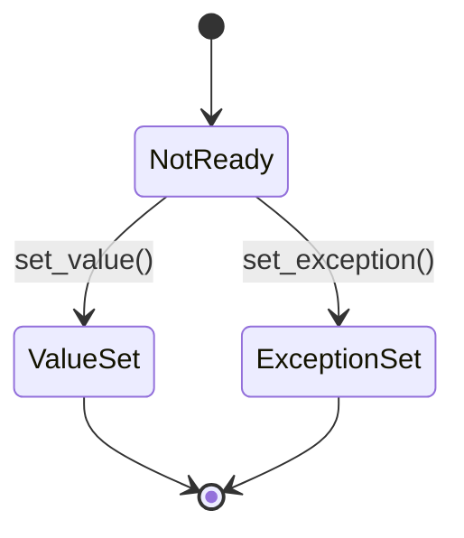
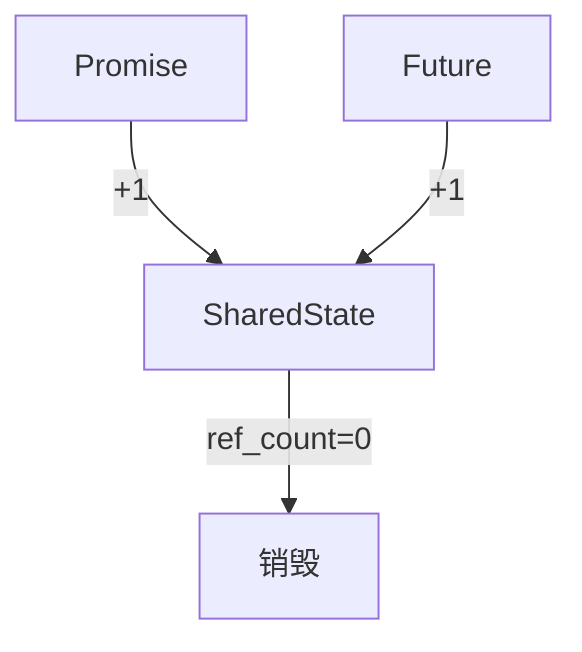

# C++共享状态(Shared State)深度解析与实战指南

## 一、共享状态核心概念

### 1.1 基本定义
共享状态是C++标准库中实现异步编程的核心机制，作为`std::future`、`std::promise`、`std::packaged_task`和`std::async`等组件之间的桥梁。

**本质特征**：
- 线程安全的内部同步对象
- 存储异步操作的结果（值或异常）
- 记录操作完成状态（未完成/已完成）
- 管理异步操作的生命周期

### 1.2 核心组件关系
```cpp
// 基本使用示例
std::promise<int> data_producer;
std::future<int> data_consumer = data_producer.get_future();

// 线程1：生产者
data_producer.set_value(42);

// 线程2：消费者
int result = data_consumer.get();  // 获取42
```

## 二、实现原理深度剖析

### 2.1 内部数据结构
典型实现包含以下关键部分：
```cpp
struct SharedState {
    std::mutex mtx;                // 互斥锁
    std::condition_variable cv;    // 条件变量
    std::atomic<unsigned> ref_count; // 引用计数
    bool ready = false;            // 就绪状态
    union {
        T value;                   // 存储的值
        std::exception_ptr eptr;   // 存储的异常
    };
};
```

### 2.2 状态转换机制


### 2.3 线程安全保证
- **写操作序列**：
  1. 获取互斥锁
  2. 存储结果（值/异常）
  3. 标记为就绪状态（内存屏障）
  4. 通知所有等待线程
  5. 释放锁

- **读操作序列**：
  1. 检查就绪状态
  2. 若未就绪则等待条件变量
  3. 获取锁
  4. 读取结果
  5. 释放锁

## 三、生命周期管理

### 3.1 引用计数机制


### 3.2 关键规则详解
1. **Promise析构**：
   - 减少引用计数
   - 若计数归零且未设置结果，存储`std::future_error(broken_promise)`

2. **Future析构**：
   - 仅减少引用计数
   - 不改变存储的结果

3. **结果就绪后**：
   - 共享状态会保持直到最后一个引用释放
   - 结果值在最后一个future被销毁后才会释放

## 四、实战应用与最佳实践

### 4.1 基础使用模式
#### 生产者-消费者模式
```cpp
void producer(std::promise<std::string>& p) {
    try {
        std::string result = fetch_data();
        p.set_value(result);
    } catch(...) {
        p.set_exception(std::current_exception());
    }
}

void consumer(std::future<std::string>& f) {
    try {
        std::string data = f.get();
        process(data);
    } catch(const std::exception& e) {
        handle_error(e);
    }
}
```

#### 多结果收集器
```cpp
std::vector<std::future<int>> futures;

// 启动多个任务
for(int i = 0; i < 10; ++i) {
    std::promise<int> p;
    futures.push_back(p.get_future());
    std::thread(worker, std::move(p), i).detach();
}

// 收集结果
std::vector<int> results;
for(auto& f : futures) {
    results.push_back(f.get());
}
```

### 4.2 高级应用模式
#### 可取消任务实现
```cpp
class CancellableTask {
    std::promise<void> p;
    std::atomic<bool> cancelled{false};
    std::thread worker;
    
public:
    template<typename F>
    CancellableTask(F&& task) {
        auto future = p.get_future();
        worker = std::thread([this, future=std::move(future), task=std::forward<F>(task)]{
            if(future.wait_for(std::chrono::milliseconds(100)) != std::future_status::timeout) {
                return;  // 被取消
            }
            task();
        });
    }
    
    void cancel() {
        cancelled = true;
        p.set_value();
        if(worker.joinable()) worker.join();
    }
    
    ~CancellableTask() {
        if(worker.joinable()) worker.join();
    }
};
```

#### 共享future广播模式
```cpp
std::promise<int> global_promise;
std::shared_future<int> global_future = global_promise.get_future().share();

// 多个消费者可以同时访问
void consumer1() {
    int value = global_future.get();
    // ...
}

void consumer2() {
    int value = global_future.get();
    // ...
}
```

## 五、性能优化指南

### 5.1 创建开销对比
| 构造方式          | 内存分配次数 | 线程创建 | 适用场景               |
|-------------------|-------------|---------|-----------------------|
| std::promise      | 2           | 无      | 手动控制的任务         |
| std::packaged_task| 1           | 无      | 已有可调用对象包装     |
| std::async        | 1-2         | 可能    | 快速启动异步任务       |

### 5.2 等待优化技巧
1. **批量等待**：使用`wait_for_all`模式
   ```cpp
   template<typename... Futures>
   void wait_for_all(Futures&... futures) {
       while(!(futures.wait_for(std::chrono::seconds(0)) == std::future_status::ready && ...)) {
           std::this_thread::yield();
       }
   }
   ```

2. **超时控制**：
   ```cpp
   auto status = future.wait_for(std::chrono::milliseconds(100));
   if(status == std::future_status::ready) {
       // 处理结果
   }
   ```

## 六、常见问题解决方案

### 6.1 Promise析构过早问题
**错误示例**：
```cpp
std::future<int> create_future() {
    std::promise<int> p;
    auto f = p.get_future();
    return f;  // p被析构，future将抛出broken_promise
}
```

**正确做法**：
```cpp
std::future<int> create_future() {
    auto shared_p = std::make_shared<std::promise<int>>();
    auto f = shared_p->get_future();
    // 保持promise存活
    std::thread([shared_p]{
        shared_p->set_value(42);
    }).detach();
    return f;
}
```

### 6.2 多future竞争解决方案
**问题场景**：
```cpp
std::promise<void> p;
auto f1 = p.get_future();
auto f2 = p.get_future();  // 错误！promise只能生成一个future
```

**正确方案**：
```cpp
std::promise<void> p;
auto shared_f = p.get_future().share();  // 转为shared_future

// 现在可以安全复制
auto f1 = shared_f;
auto f2 = shared_f;
```

## 七、现代C++扩展应用

### 7.1 协程集成
```cpp
std::future<int> async_task() {
    auto promise = std::make_shared<std::promise<int>>();
    auto future = promise->get_future();
    
    std::thread([promise]{
        try {
            int result = co_await some_coroutine();
            promise->set_value(result);
        } catch(...) {
            promise->set_exception(std::current_exception());
        }
    }).detach();
    
    return future;
}
```

### 7.2 与执行器(executor)结合
```cpp
template<typename Executor>
std::future<int> execute_on(Executor& ex, std::function<int()> task) {
    std::promise<int> p;
    auto f = p.get_future();
    
    ex.execute([p=std::move(p), task=std::move(task)]() mutable {
        try {
            p.set_value(task());
        } catch(...) {
            p.set_exception(std::current_exception());
        }
    });
    
    return f;
}
```

## 八、深入理解实现细节

### 8.1 主流标准库实现对比
| 特性               | libstdc++ (GCC) | libc++ (LLVM) | MSVC STL      |
|--------------------|----------------|---------------|---------------|
| 小对象优化         | 是             | 是            | 是            |
| 条件变量延迟分配   | 是             | 否            | 是            |
| 无锁路径           | 部分           | 完整          | 部分          |

### 8.2 自定义分配器支持
```cpp
template<typename T, typename Alloc>
class promise_with_allocator {
    using SharedState = /* 使用Alloc分配的状态 */;
    
    std::shared_ptr<SharedState> state;
    
public:
    promise_with_allocator(const Alloc& alloc) : 
        state(std::allocate_shared<SharedState>(alloc)) {}
    
    // ...其他接口实现...
};
```

## 九、总结与最佳实践清单

### 9.1 核心原则
1. **单一所有权**：每个promise只关联一个future
2. **结果完整性**：确保所有执行路径都设置值或异常
3. **生命周期管理**：保持promise存活直到future完成
4. **异常安全**：使用RAII包装资源

### 9.2 性能优化清单
- 对小结果使用`std::async`自动优化
- 对长期存活的future使用`shared_future`
- 批量处理多个future时使用`when_all`模式
- 考虑使用自定义分配器减少内存分配开销

### 9.3 错误处理模式
```cpp
std::future<void> safe_async(std::function<void()> task) {
    auto promise = std::make_shared<std::promise<void>>();
    auto future = promise->get_future();
    
    std::thread([promise, task]{
        try {
            task();
            promise->set_value();
        } catch(...) {
            promise->set_exception(std::current_exception());
        }
    }).detach();
    
    return future;
}
```