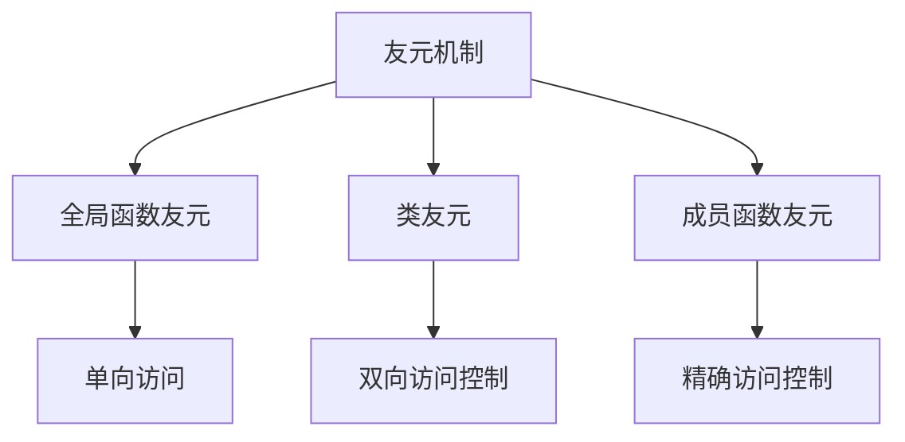
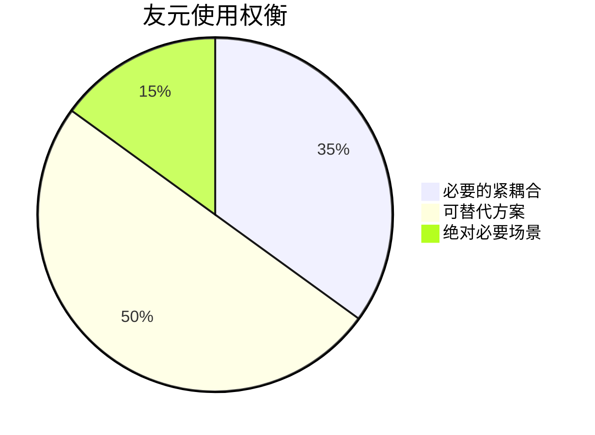

# C++友元机制深度解析

## 一、友元机制知识图谱


## 二、友元类型详解

### 2.1 全局函数友元
**特性**：
- 允许特定全局函数访问类的所有成员（包括private/protected）
- 单向访问关系
- 常用于运算符重载等场景

```cpp
class BankAccount {
    friend void auditAccount(BankAccount& acc);  // 友元声明
private:
    double balance;
    string accountNumber;
public:
    BankAccount(string num, double bal) 
        : accountNumber(num), balance(bal) {}
};

// 审计函数可以访问私有成员
void auditAccount(BankAccount& acc) {
    cout << "Auditing account: " << acc.accountNumber 
         << ", Balance: " << acc.balance << endl;
}
```

**最佳实践**：
1. 将友元声明放在类定义的开始或结尾处
2. 友元函数应在类声明附近定义
3. 避免过度使用，破坏封装性

### 2.2 类友元
**特性**：
- 整个友元类可以访问目标类的所有成员
- 建立类之间的紧密协作关系
- 常用于设计模式中的组合类

```cpp
class SecureContainer {
    friend class SecurityManager;  // 友元类声明
private:
    string secretData;
protected:
    void encryptData();
public:
    SecureContainer(string data) : secretData(data) {}
};

class SecurityManager {
public:
    void inspect(SecureContainer& container) {
        cout << "Inspecting: " << container.secretData << endl;
        container.encryptData();  // 可以访问protected成员
    }
};
```

**设计考量**：
| 优点 | 缺点 |
|------|------|
| 简化紧密耦合类的设计 | 破坏封装性 |
| 方便实现特殊权限管理 | 增加维护难度 |
| 提升特定场景下的性能 | 可能引入循环依赖 |

### 2.3 成员函数友元
**特性**：
- 精确控制到类中的特定成员函数
- 需要前向声明(forward declaration)
- 最细粒度的友元控制

```cpp
class Building;  // 前向声明

class Inspector {
public:
    void checkStructure(Building& bld);
    void checkSafety(Building& bld);
};

class Building {
    friend void Inspector::checkSafety(Building& bld);  // 仅授权特定成员
private:
    string structuralDetails;
    string safetyIssues;
public:
    Building() : structuralDetails("stable"), safetyIssues("none") {}
};

// 成员函数定义必须在Building类之后
void Inspector::checkSafety(Building& bld) {
    cout << "Safety issues: " << bld.safetyIssues << endl;
    // 不能访问structuralDetails
}
```

## 三、友元机制高级主题

### 3.1 模板友元
```cpp
template<typename T>
class Storage {
    friend class StorageManager<T>;  // 模板类友元
private:
    T secretData;
};

template<typename T>
class StorageManager {
public:
    void verify(Storage<T>& storage) {
        cout << "Verifying: " << storage.secretData << endl;
    }
};
```

### 3.2 友元关系特性表
| 特性 | 全局函数 | 类 | 成员函数 |
|------|----------|----|----------|
| 访问粒度 | 类级别 | 类级别 | 函数级别 |
| 需要前向声明 | 否 | 否 | 是 |
| 继承影响 | 不继承 | 不继承 | 不继承 |
| 常见用途 | 运算符重载 | 组合模式 | 精确权限控制 |

## 四、工程实践建议

### 4.1 使用场景评估
**推荐使用场景**：
1. 运算符重载(<<, >>等)
2. 工厂模式中的对象创建
3. 单元测试中的白盒测试
4. 性能关键的紧密耦合组件

**应避免场景**：
1. 常规的类间通信
2. 可替代的公共接口场景
3. 可能破坏架构层次的情况

### 4.2 友元与封装平衡


### 4.3 现代C++替代方案
1. 使用public接口+移动语义
2. 考虑策略模式
3. 依赖注入框架
4. 基于concept的模板设计

## 五、常见问题解决方案

### 5.1 循环依赖处理
```cpp
// 前向声明解决循环依赖
class ClassB;

class ClassA {
    friend class ClassB;
private:
    int secretA;
};

class ClassB {
    friend class ClassA;
private:
    int secretB;
};
```

### 5.2 模板友元特化
```cpp
template<typename T>
class Box {
    friend void peek<T>(Box<T>& box);  // 模板函数友元
private:
    T contents;
};

template<typename T>
void peek(Box<T>& box) {
    cout << "Peeking: " << box.contents << endl;
}
```
