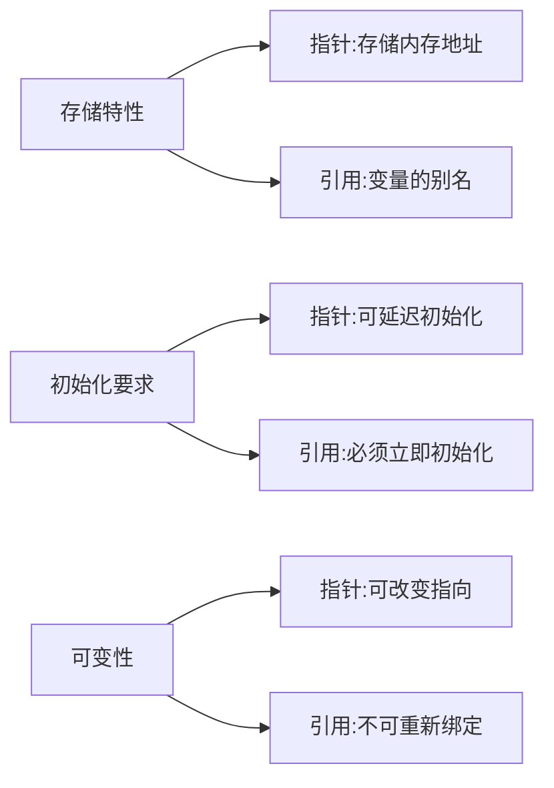

以下是根据您提供的指针和引用区别内容，经过结构化整理和知识增强后的完整文档：

# C++指针与引用深度解析

## 一、核心概念对比



## 二、详细特性分析

### 2.1 本质区别
| 特性        | 指针                          | 引用                          |
|-------------|-------------------------------|-------------------------------|
| 存储内容    | 内存地址                      | 变量的别名                    |
| 内存占用    | 独立存储空间（通常4/8字节）   | 编译器实现相关（可能优化掉）  |
| 访问方式    | 需解引用（*操作符）           | 直接访问原变量                |

### 2.2 初始化与生命周期
```cpp
// 指针示例
int* p;         // 合法：仅声明
p = &value;     // 后续初始化

// 引用示例
int& r = value; // 必须立即初始化
// int& r2;      // 错误：未初始化
```

### 2.3 多级间接访问
```cpp
int** pp = &p;   // 二级指针合法
int&& rr = 42;   // 右值引用（非多级引用）
// int& & rref;  // 错误：不能定义引用的引用
```

## 三、底层实现机制

### 3.1 汇编层面对比
```assembly
; x86汇编示例（引用实现）
mov eax, DWORD PTR [value]  ; 引用直接操作原变量
lea ebx, [value]            ; 指针操作地址
```

### 3.2 编译器处理差异
- **引用优化**：现代编译器可能将引用优化为直接变量访问
- **指针处理**：始终需要维护地址存储空间

## 四、参数传递语义

### 4.1 传参行为对照表
| 传递方式 | 实参影响 | 内存开销 | 典型应用场景       |
|----------|----------|----------|--------------------|
| 值传递   | 完全隔离 | 高       | 小型不可变数据     |
| 指针传递 | 间接影响 | 中       | 需要修改或可选参数 |
| 引用传递 | 直接影响 | 低       | 大型对象或必须参数 |

### 4.2 参数传递示例
```cpp
void modify(int* ptr, int& ref) {
    *ptr = 10;  // 修改指针指向的值
    ref = 20;   // 直接修改原变量
}

int main() {
    int value = 0;
    modify(&value, value);
    // value现在为20
}
```

## 五、高级应用场景

### 5.1 智能指针与引用
```cpp
std::unique_ptr<Obj> ptr(new Obj());
Obj& ref = *ptr;  // 获取对象引用

// 引用延长生命周期示例
const std::string& s = getTempString(); 
// 临时对象生命周期延长至引用作用域结束
```

### 5.2 现代C++特性结合
| 特性        | 指针应用                 | 引用应用                 |
|-------------|--------------------------|--------------------------|
| 移动语义    | 所有权转移               | 右值引用(T&&)            |
| 完美转发    | 不适用                   | 通用引用(auto&&)         |
| 类型推导    | auto* 保持指针特性       | auto& 保持引用特性       |

## 六、最佳实践指南

### 6.1 选择依据
- **使用引用**：
  - 函数参数传递（特别是大型对象）
  - 必须存在的对象参数
  - 操作符重载（如operator=）
  
- **使用指针**：
  - 可选参数（可接受nullptr）
  - 需要重新绑定的场景
  - 低级内存操作

### 6.2 危险用法警示
```cpp
// 危险：返回局部变量引用
int& dangerous() {
    int local = 42;
    return local;  // 悬垂引用！
}

// 安全：返回静态变量引用
int& safe() {
    static int s = 42;
    return s;
}
```

## 七、扩展知识

### 7.1 引用折叠规则
```cpp
template<typename T>
void forward(T&& param) {  // 通用引用
    // 根据传入实参类型发生引用折叠
}

// 引用折叠规则：
// T& & → T&
// T& && → T&
// T&& & → T&
// T&& && → T&&
```

### 7.2 指针引用转换
```cpp
int value = 10;
int* p = &value;
int*& pr = p;  // 指针的引用

*pr = 20;      // 通过引用修改指针指向的值
pr = nullptr;  // 通过引用修改指针本身
```


## 指针和引用的区别
- 指针是一个变量，存储的是一个地址，引用跟原来的变量实质上是同一个东西，是原变量的别名
- 指针可以有多级，引用只有一级
- 指针可以为空，引用不能为NULL且在定义时必须初始化
- 指针在初始化后可以改变指向，而引用在初始化之后不可再改变
- sizeof指针得到的是本指针的大小，sizeof引用得到的是引用所指向变量的大小
**当把指针作为参数进行传递时，也是将实参的一个拷贝传递给形参，两者指向的地址相同，但不是同一个变量，在函数中改变这个变量的指向不影响实参，而引用却可以。**
在汇编层面，一些编译器将引用当成指针操作，因此引用会占用空间。是否占用空间，应该结合编译器分析
引用在声明时必须初始化为另一变量，一旦出现必须为typename refname &varname形式；指针声明和定义可以分开，可以先只声明指针变量而不初始化，等用到时再指向具体变量。
引用一旦初始化之后就不可以再改变（变量可以被引用为多次，但引用只能作为一个变量引用）；指针变量可以重新指向别的变量。
不存在指向空值的引用，必须有具体实体；但是存在指向空值的指针。