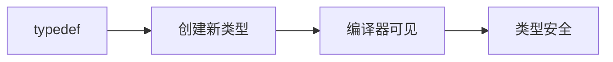
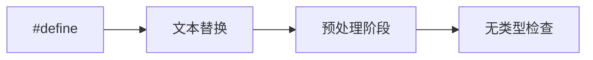

# 类型别名与宏定义对比分析

## 一、基础概念对比
### 1. typedef类型别名


- **核心特性**：
  - 创建**真正的类型别名**，符合C++类型系统
  - 作用域遵循C++规则（块作用域/命名空间作用域）
  - 支持模板元编程（C++11后可用using替代）

### 2. #define宏定义


- **潜在风险**：
  - 单纯的文本替换，不进行语法分析
  - 可能改变代码语义（如运算符优先级问题）
  - 调试信息不可见（宏在编译前被展开）

## 二、技术细节对比
### 1. 变量声明差异
```cpp
// Case 1: typedef
typedef char* p_char;
p_char p1, p2;  // 两个char指针

// Case 2: #define
#define p_char char*
p_char p3, p4;  // p3是指针，p4是char
```

**内存布局对比**：
| 声明方式 | p1 | p2 | p3 | p4 |
|----------|----|----|----|----|
| 类型     | char* | char* | char* | char |
| 大小(x64) | 8字节 | 8字节 | 8字节 | 1字节 |

### 2. const语义差异
```cpp
typedef char* p_char;
#define p_char char*

const p_char p1;  // char* const (顶层const)
const p_char p2;  // const char* (底层const)
```

**const修饰位置**：
- typedef版本：const修饰指针本身
- define版本：const修饰指向的数据

## 三、现代C++改进方案
### 1. using别名(C++11)
```cpp
using p_char = char*;  // 等价typedef但更清晰
using const_p_char = const char*;  // 明确指定const位置
```

**优势**：
- 模板友好（支持模板别名）
- 可读性更强
- 支持带模板参数的复杂类型

### 2. 类型特征检查(C++17)
```cpp
static_assert(std::is_same_v<p_char, char*>);
static_assert(!std::is_same_v<const p_char, const char*>);
```

## 四、工程实践建议
### 1. 代码审查清单
- [ ] 禁止使用#define定义类型别名
- [ ] 复杂类型优先使用using
- [ ] 结合static_assert进行类型验证

### 2. 性能考量
| 方案 | 编译时间 | 调试支持 | 类型安全 |
|------|----------|----------|----------|
| typedef | 正常 | 完善 | 高 |
| #define | 更快 | 无 | 无 |
| using | 正常 | 完善 | 高 |

## 五、进阶应用示例
### 1. 函数指针类型
```cpp
// 传统方式
typedef void (*Callback)(int);

// 现代C++
using Callback = void(*)(int);

// 结合noexcept
using SafeCallback = void(*)(int) noexcept;
```

### 2. 模板元编程
```cpp
template<typename T>
using Vec = std::vector<T, MyAllocator<T>>;

Vec<int> v;  // 等价std::vector<int, MyAllocator<int>>
```

## 六、面试深度问题
### Q1：以下代码的输出是什么？
```cpp
using Ptr = int*;
#define PTR int*

Ptr a, b;
PTR c, d;

std::cout << std::is_same_v<decltype(a), int*> << " "
          << std::is_same_v<decltype(b), int*> << " "
          << std::is_same_v<decltype(c), int*> << " "
          << std::is_same_v<decltype(d), int>;
```

**答案**：`1 1 1 0`

### Q2：如何实现类型安全的常量字符串定义？
```cpp
using ConstString = const char* const;  // 指针和内容都不可变
#define CONST_STRING const char*

// 测试
ConstString s1 = "hello";
CONST_STRING s2 = "world";
// s1++和*s1='a'都非法
// s2++合法但*s2='a'非法
```

## 总结对比表
| 特性 | typedef | #define | using |
|------|---------|---------|-------|
| 类型安全 | ✅ | ❌ | ✅ |
| 作用域 | 遵循C++ | 全局 | 遵循C++ |
| 模板支持 | ❌ | ❌ | ✅ |
| 调试可见 | ✅ | ❌ | ✅ |
| const行为 | 修饰指针 | 修饰数据 | 可精确控制 |

**最佳实践建议**：
1. 新项目统一使用using
2. 旧代码逐步替换#define定义的类型
3. 关键类型添加static_assert验证
4. 复杂类型定义添加详细注释说明const语义