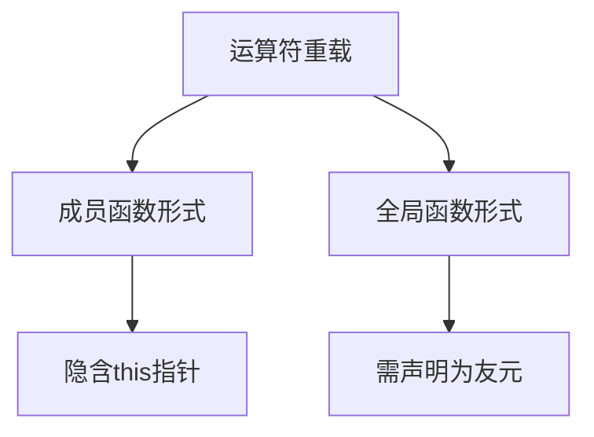

# C++运算符重载全面指南

## 一、运算符重载基础

### 1.1 基本概念


### 1.2 成员函数形式（改进版）
```cpp
class Add {
public:
    int a;
    int b;
    
    // 改进点1：添加const修饰符保证不修改操作数
    // 改进点2：使用引用避免拷贝
    Add operator+(const Add& rhs) const {
        return {a + rhs.a, b + rhs.b};  // 使用统一初始化(C++11)
    }
    
    // 改进点3：支持链式操作
    Add& operator+=(const Add& rhs) {
        a += rhs.a;
        b += rhs.b;
        return *this;
    }
};
```

## 二、全局函数形式（扩展版）

### 2.1 标准实现
```cpp
class Add {
    // 声明为友元以访问私有成员
    friend Add operator+(const Add& lhs, const Add& rhs);
    
public:
    // ... 其他成员
};

// 全局运算符重载
Add operator+(const Add& lhs, const Add& rhs) {
    return {lhs.a + rhs.a, lhs.b + rhs.b};
}
```

### 2.2 性能优化版本
```cpp
// 使用移动语义优化返回效率
Add operator+(Add lhs, const Add& rhs) {
    lhs += rhs;  // 复用operator+=
    return lhs;  // NRVO优化
}
```

## 三、运算符重载最佳实践

### 3.1 设计原则对照表
| 原则 | 说明 | 示例 |
|------|------|------|
| 语义一致性 | 保持运算符原有含义 | `+`应实现加法而非减法 |
| 完备性 | 相关运算符应一起重载 | `+`与`+=`、`-`与`-=`等 |
| 异常安全 | 保证操作不会泄露资源 | 使用RAII管理资源 |
| 返回类型 | 符合直觉的返回类型 | 算术运算符返回新对象 |

### 3.2 常见运算符重载规范

```cpp
// 输入输出运算符重载
std::ostream& operator<<(std::ostream& os, const Add& obj) {
    return os << "(" << obj.a << ", " << obj.b << ")";
}

// 比较运算符重载(C++20可使用<=>简化)
bool operator==(const Add& lhs, const Add& rhs) {
    return lhs.a == rhs.a && lhs.b == rhs.b;
}
```

## 四、高级应用场景

### 4.1 类型转换运算符
```cpp
class Add {
public:
    // 隐式转换到int
    operator int() const { return a + b; }
    
    // 显式转换到字符串(C++11)
    explicit operator std::string() const {
        return std::to_string(a) + "+" + std::to_string(b);
    }
};
```

### 4.2 函数调用运算符
```cpp
class Adder {
public:
    int operator()(int x, int y) const {
        return x + y;
    }
};

// 使用示例
Adder add;
int sum = add(3, 4);  // 函数对象
```

## 五、错误案例与修正

### 5.1 常见错误模式
```cpp
// 错误1：返回局部变量引用
Add& operator+(const Add& lhs, const Add& rhs) {
    Add temp = lhs;
    temp += rhs;
    return temp;  // 悬垂引用！
}

// 错误2：修改左操作数
Add operator+(Add& lhs, const Add& rhs) {
    lhs.a += rhs.a;  // 意外修改左值
    return lhs;
}
```

### 5.2 现代C++改进方案
```cpp
// C++17折叠表达式实现可变参数加法
template<typename... Args>
auto addAll(Args... args) {
    return (args + ...);  // 折叠表达式
}
```

## 六、运算符重载工具支持

### 6.1 clang-tidy检查规则
```bash
# 检查运算符重载问题
clang-tidy -checks='modernize-use-equals-default,readability-avoid-const-params-in-decls'
```

### 6.2 单元测试模板
```cpp
TEST(AddOperator, Addition) {
    Add a{1, 2}, b{3, 4};
    auto c = a + b;
    EXPECT_EQ(c.a, 4);
    EXPECT_EQ(c.b, 6);
}
```

## 七、设计模式应用

### 7.1 策略模式与运算符重载
```cpp
class AddStrategy {
public:
    virtual int compute(int a, int b) const = 0;
    virtual ~AddStrategy() = default;
};

class SafeAdd : public AddStrategy {
    int compute(int a, int b) const override {
        if ((b > 0) && (a > std::numeric_limits<int>::max() - b)) {
            throw std::overflow_error("Addition overflow");
        }
        return a + b;
    }
};

// 使用运算符重载包装策略
Add operator+(const Add& lhs, const Add& rhs) {
    static SafeAdd strategy;
    return {strategy.compute(lhs.a, rhs.a), 
            strategy.compute(lhs.b, rhs.b)};
}
```
