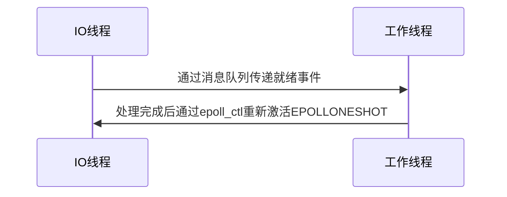

# Linux 高性能网络编程：epoll 深度解析与实践指南

## 一、epoll 核心架构与原理

### 1.1 设计哲学
- **事件驱动模型**：区别于轮询机制，epoll 采用回调机制实现 O(1) 时间复杂度的事件检测
- **内核数据结构**：
  ```mermaid
  graph LR
  A[红黑树] -->|存储所有监控的fd| B[就绪链表]
  B -->|事件触发时填充| C[用户空间events数组]
  ```
 
### 1.2 触发模式对比
| 特性               | 水平触发 (LT)              | 边沿触发 (ET)               |
|--------------------|---------------------------|----------------------------|
| 通知频率           | 条件满足时重复通知         | 状态变化时仅通知一次        |
| 编程复杂度         | 较低                      | 较高（需非阻塞IO）          |
| 性能表现           | 一般                      | 更高（减少epoll_wait调用）  |
| 适用场景           | 传统业务逻辑              | 高频交易/游戏服务器         |

### 1.3 内核实现关键点
- **mmap 加速**：内核与用户空间共享就绪列表内存区域
- **零拷贝机制**：避免 `select/poll` 的 FD 集合拷贝开销

---

## 二、完整 API 详解与最佳实践

### 2.1 核心函数增强说明
#### `epoll_create1()` (推荐替代 epoll_create)
```c
int epollfd = epoll_create1(EPOLL_CLOEXEC); 
// 添加CLOEXEC标志避免fd泄漏到子进程
```

#### `epoll_ctl()` 高级用法
```c
struct epoll_event ev;
ev.events = EPOLLIN | EPOLLET | EPOLLONESHOT;  // 组合标志
ev.data.ptr = &connection_ctx;  // 推荐存储上下文指针而非fd

if (epoll_ctl(epollfd, EPOLL_CTL_MOD, fd, &ev) == -1) {
    if (errno == ENOENT) {
        // 处理fd已被移除的情况
    }
}
```

### 2.2 完整服务端实现示例
```c
#define MAX_EVENTS 1024
#define BUF_SIZE 4096

struct connection {
    int fd;
    char buf[BUF_SIZE];
    size_t bytes_used;
};

int main() {
    int listen_sock = setup_listening_socket(8080);
    int epollfd = epoll_create1(0);
    
    struct epoll_event ev, events[MAX_EVENTS];
    ev.events = EPOLLIN | EPOLLET;
    ev.data.ptr = malloc(sizeof(struct connection));
    ((struct connection*)ev.data.ptr)->fd = listen_sock;
    
    epoll_ctl(epollfd, EPOLL_CTL_ADD, listen_sock, &ev);

    while (1) {
        int nfds = epoll_wait(epollfd, events, MAX_EVENTS, -1);
        for (int i = 0; i < nfds; ++i) {
            handle_event(events[i].data.ptr, events[i].events);
        }
    }
}

void handle_event(struct connection* conn, uint32_t events) {
    if (events & EPOLLERR) {
        close_connection(conn);
        return;
    }
    
    if (events & EPOLLIN) {
        ssize_t count = recv(conn->fd, conn->buf + conn->bytes_used, 
                           BUF_SIZE - conn->bytes_used, 0);
        if (count <= 0) {
            close_connection(conn);
        } else {
            conn->bytes_used += count;
            process_data(conn);
        }
    }
    
    if (events & EPOLLOUT) {
        // 处理写就绪逻辑
    }
}
```

---

## 三、高级应用模式

### 3.1 多线程协作方案


### 3.2 定时器集成
```c
// 使用timerfd_create创建定时器
int timerfd = timerfd_create(CLOCK_MONOTONIC, TFD_NONBLOCK);
struct itimerspec its = { .it_interval = {1, 0}, .it_value = {1, 0} };
timerfd_settime(timerfd, 0, &its, NULL);

// 加入epoll监控
ev.events = EPOLLIN | EPOLLET;
ev.data.fd = timerfd;
epoll_ctl(epollfd, EPOLL_CTL_ADD, timerfd, &ev);
```

---

## 四、性能调优手册

### 4.1 关键内核参数
```bash
# 最大文件描述符数
echo 1000000 > /proc/sys/fs/file-max

# TCP连接快速回收
echo 1 > /proc/sys/net/ipv4/tcp_tw_reuse

# epoll等待列表大小（Linux 4.13+）
sysctl -w fs.epoll.max_user_watches=1048576
```

### 4.2 性能对比测试
使用 `wrk` 压测工具比较不同模式：
```bash
# LT模式测试
wrk -t4 -c1000 -d30s http://127.0.0.1:8080

# ET模式测试（需修改代码）
wrk -t4 -c1000 -d30s http://127.0.0.1:8080
```

---

## 五、典型问题解决方案

### 5.1 惊群问题优化
```c
// 多进程场景下使用
ev.events = EPOLLIN | EPOLLEXCLUSIVE;
epoll_ctl(epollfd, EPOLL_CTL_ADD, listen_sock, &ev);
```

### 5.2 连接风暴处理
```python
# 使用令牌桶算法限流（伪代码）
class RateLimiter:
    def __init__(self, rate):
        self.tokens = rate
        self.last_check = time.time()
    
    def check(self):
        now = time.time()
        elapsed = now - self.last_check
        self.tokens = min(rate, self.tokens + elapsed * rate)
        self.last_check = now
        if self.tokens >= 1:
            self.tokens -= 1
            return True
        return False
```
