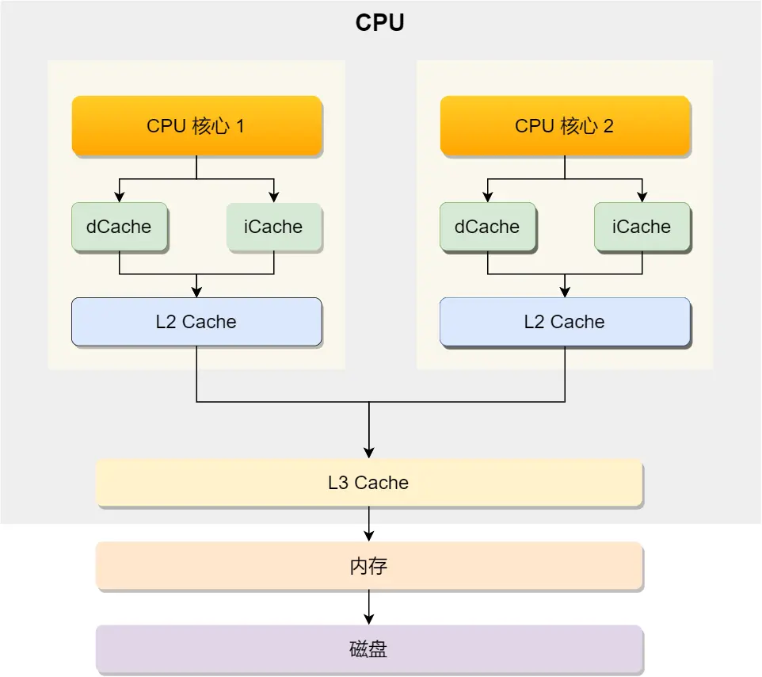
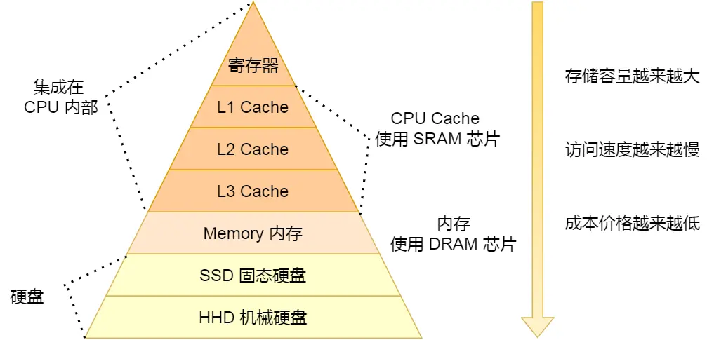
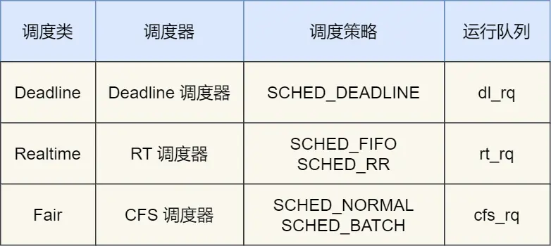

# **CPU 缓存机制与数据读写**

1. **缓存层级结构**  
   - 现代 CPU 采用多级缓存：L1/L2 Cache（核心独享），L3 Cache（核心共享）
   - **存储金字塔层级**（速度递减，容量递增）：  
     ```
     CPU寄存器 → L1 Cache → L2 Cache → L3 Cache → 内存 → 硬盘
     ```
   - 访问延时对比：L1 Cache 比内存快 100 倍
    
2. **数据读写单位**  
   - 以 **CPU Cache Line** 为单位读写数据（通常 64 字节）
   - 连续访问数组时，高缓存命中率可提升性能

3. **伪共享问题（False Sharing）**  
   - **问题根源**：多个线程同时修改同一 Cache Line 中的不同变量，导致缓存频繁失效
   - **MESI 协议下的冲突过程**：  
     - 多核加载同一 Cache Line → 状态标记为“共享”
     - 任一核心修改变量 → 触发其他核心 Cache Line 失效 → 反复同步数据
   - **解决方案**：  
     - **字节填充对齐**（空间换时间）：  
       ```c
       struct { 
           long a;
           long padding[7]; // 填充至 64 字节
           long b;
       };
       ```
     - **应用层实践**：如 Disruptor 框架通过继承 + 填充 14 个 long 变量隔离热点数据

---

### **CPU 任务调度机制**
1. **任务分类与优先级**  
   | 类型       | 优先级范围 | 响应要求 | 调度类          |
   |------------|------------|----------|-----------------|
   | 实时任务   | 0~99       | 极高     | Deadline/Realtime |
   | 普通任务   | 100~139    | 普通     | Fair (CFS)      |

2. **调度策略**  
   - **实时任务**：  
     - `SCHED_DEADLINE`：最近截止时间优先
     - `SCHED_FIFO`：同优先级先到先服务，高优先级可抢占
     - `SCHED_RR`：同优先级轮转时间片
   - **普通任务**：  
     - **完全公平调度（CFS）**：按虚拟运行时间 `vruntime` 排序（值小优先）
     - 计算公式：`vruntime = 实际运行时间 × (NICE_0_LOAD / 权重)`  
       （权重值由 `nice` 值决定，`nice` 越低权重越高）

3. **运行队列（Run Queue）**  
   - 每个 CPU 维护三个队列：`dl_rq`（Deadline）、`rt_rq`（Realtime）、`cfs_rq`（CFS）
   - 调度优先级：**Deadline > Realtime > Fair**

4. **优先级调整**  
   - **`nice` 值**：调整普通任务优先级（范围 -20~19，默认 0，值越低优先级越高）
   - 设置示例：  
     ```bash
     nice -n -3 mysqld    # 启动时设置
     renice -3 -p <PID>   # 调整运行中任务
     ```
   - **实时任务设置**：  
     ```bash
     chrt -f 1 -p 99 <PID>  # 设优先级 99（最高实时级）
     ```

---

### **核心总结**
1. **缓存优化**  
   - 利用 Cache Line 特性提升连续数据访问效率
   - 避免伪共享：隔离多线程高频修改的变量（字节填充/Cache Line 对齐）

2. **任务调度**  
   - 实时任务：通过优先级抢占保证响应速度
   - 普通任务：CFS 算法保障公平性，`nice` 值微调优先级
   - 延时敏感任务：可设为实时任务（`chrt`）或提高 `nice` 优先级

