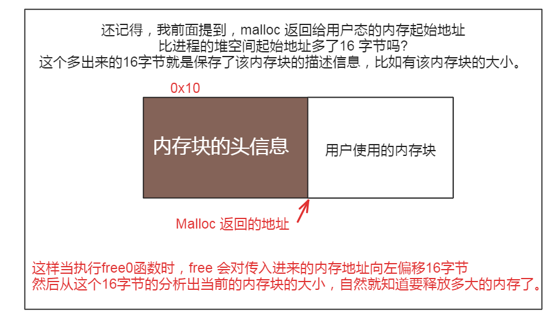

free 释放内存后，内存的状态会因不同的分配方式而有所不同。对于通过 brk 系统调用分配的内存，当使用 free () 释放堆内存时，若要释放的内存不在堆顶，内核不会立即释放内存，而是进行内存回收，标记这部分内存为空闲，且不会取消已经建立好的内存映射。这样下次 malloc 时可以直接使用这块空闲内存，从而减少系统调用次数，但也会产生内存碎片。对于通过 mmap 系统调用分配的内存，free () 释放后会完全归还给操作系统，取消已建立的内存映射，避免了内存的长期占用。释放后的内存空间的值将变得不确定，不应再被访问。同时，释放内存后，指针仍然指向分配的内存空间，指针指向的地址没有变化，地址内的内容也没有发生变化，变化的是这块内存的可使用权限。需要注意的是，free 函数并不会清空被释放的内存空间中的数据，在释放内存之前，我们需要手动清空内存中的敏感数据，以防止数据泄露的风险。

malloc通过brk() 方式申请的内存，free 释放内存的时候，并不会把内存归还给操作系统，而是缓存在 malloc 的内存池中，待下次使用；
malloc通过mmap() 方式申请的内存，free 释放内存的时候，会把内存归还给操作系统，内存得到真正的释放。

