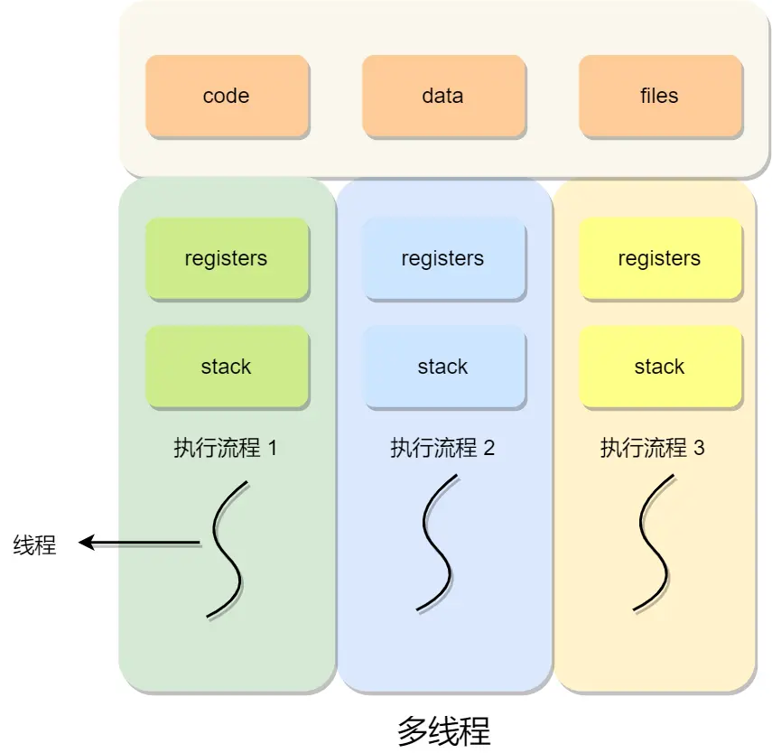

# 多线程冲突解决方案



#### **竞争条件与临界区**
- **竞争条件**：多线程并发操作共享变量时，因执行顺序不确定导致结果错误。
  - 示例：两个线程对共享变量 `i` 自增 10000 次，预期结果 20000，实际可能为 15173（因线程切换）。
- **临界区**：访问共享资源的代码片段，需保证**互斥访问**（仅一个线程可执行）。
  - **互斥**：线程在临界区执行时，其他线程被阻塞。

#### **同步与互斥**
| **概念**   | **目标**                              | **区别**                          |
|------------|---------------------------------------|-----------------------------------|
| **互斥**   | 同一时刻仅一个线程访问共享资源          | 解决资源竞争                      |
| **同步**   | 线程间协作（如：A 执行完再执行 B）      | 解决执行顺序依赖                  |

---

#### **实现互斥与同步**
##### **1. 锁（Lock）**
- **加锁/解锁**：进入临界区前加锁，退出时解锁。
- **锁类型**：
  - **忙等待锁（自旋锁）**：
    - 通过 CPU 原子指令（如 `Test-and-Set`）实现。
    - 获取锁失败时循环等待，占用 CPU。
    ```c
    void lock(int *flag) {
        while (TestAndSet(flag, 1) == 1); // 原子操作：测试并置位
    }
    ```
  - **无等待锁**：
    - 获取锁失败时，线程进入等待队列并让出 CPU。
    - 解锁时唤醒队列中的线程。

##### **2. 信号量（Semaphore）**
- **整型变量 `sem`**：表示资源数量。
- **原子操作**：
  - **P 操作**（`wait`）：`sem--`，若 `sem < 0` 则阻塞线程。
  - **V 操作**（`signal`）：`sem++`，若 `sem ≤ 0` 则唤醒一个线程。
- **应用场景**：
  - **互斥**：初始化 `sem = 1`（二元信号量）。
    ```c
    sem_t mutex;
    P(mutex); // 进入临界区
    // 访问共享资源
    V(mutex); // 退出临界区
    ```
  - **同步**：初始化 `sem = 0`（事件通知）。
    ```c
    // 线程 A（生产者）
    V(sem); // 通知就绪

    // 线程 B（消费者）
    P(sem); // 等待通知
    ```

---

#### **经典问题解决方案**
##### **1. 生产者-消费者问题**
- **需求**：
  - 生产者写入缓冲区，消费者读取缓冲区。
  - 缓冲区满时生产者等待，空时消费者等待。
- **信号量设计**：
  - `mutex = 1`（互斥访问缓冲区）。
  - `fullBuffers = 0`（已用缓冲区数量）。
  - `emptyBuffers = N`（空闲缓冲区数量）。
```c
// 生产者
P(emptyBuffers); // 检查空闲槽位
P(mutex);         // 进入临界区
write_data();     // 写入数据
V(mutex);         // 退出临界区
V(fullBuffers);   // 增加已用槽位

// 消费者
P(fullBuffers);   // 检查数据是否就绪
P(mutex);         // 进入临界区
read_data();      // 读取数据
V(mutex);         // 退出临界区
V(emptyBuffers);  // 增加空闲槽位
```

##### **2. 哲学家就餐问题**
- **需求**：5 哲学家共用 5 支叉子，需两支叉子才能进餐。
- **解决方案**：
  - **避免死锁**：奇数编号哲学家先拿右叉，偶数编号先拿左叉。
    ```c
    void philosopher(int i) {
        if (i % 2 == 0) {
            P(fork[i]);        // 拿左叉
            P(fork[(i+1)%5]);  // 拿右叉
        } else {
            P(fork[(i+1)%5]);  // 拿右叉
            P(fork[i]);        // 拿左叉
        }
        eat();
        V(fork[i]);            // 放左叉
        V(fork[(i+1)%5]);      // 放右叉
    }
    ```

##### **3. 读者-写者问题**
- **需求**：
  - 允许多读者同时读。
  - 写者必须互斥访问。
- **策略**：
  - **公平策略**（避免饥饿）：
    ```c
    sem_t rMutex = 1;   // 读者互斥
    sem_t wDataMutex=1; // 写者互斥
    sem_t flag = 1;     // 公平竞争
    int rCount = 0;     // 读者计数

    // 读者
    P(flag);            // 申请公平锁
    P(rMutex);          // 进入读者队列
    if (rCount == 0) P(wDataMutex); // 首个读者阻塞写者
    rCount++;
    V(rMutex);
    V(flag);
    read_data();        // 读数据
    P(rMutex);
    rCount--;
    if (rCount == 0) V(wDataMutex); // 最后一个读者唤醒写者
    V(rMutex);

    // 写者
    P(flag);
    P(wDataMutex);      // 申请写锁
    write_data();       // 写数据
    V(wDataMutex);
    V(flag);
    ```

---

#### **关键总结**
- **互斥**：通过锁或信号量确保临界区仅一个线程执行。
- **同步**：通过信号量协调线程执行顺序（如生产者-消费者）。
- **避免饥饿**：公平策略（如读者-写者问题中的 `flag` 信号量）。
- **原子操作**：锁和信号量的基础（如 `Test-and-Set`、P/V 操作）。