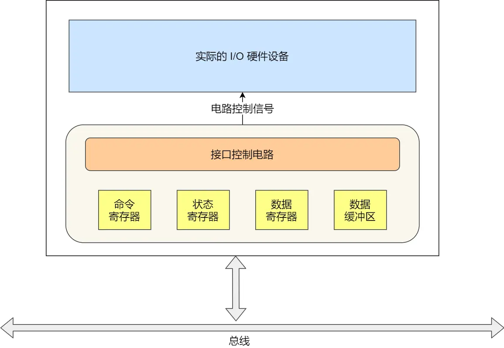
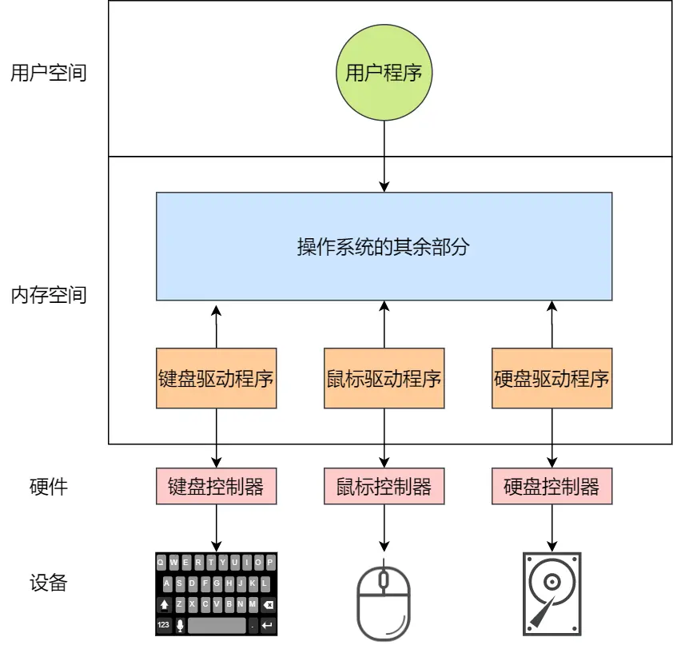
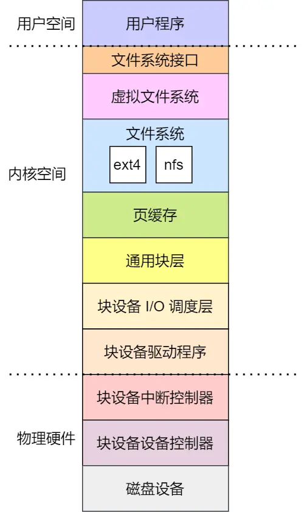

# 设备控制器  
计算机通过**设备控制器**统一管理各类输入输出设备（键盘、鼠标、显示器等）。设备控制器包含芯片和寄存器，用于与CPU通信：  
- **数据寄存器**：CPU写入需传输的数据（如打印字符）。  
- **命令寄存器**：CPU发送操作指令（如开启/关闭设备）。  
- **状态寄存器**：标记设备状态（如工作完成），防止CPU在设备忙时发送指令。  

**设备分类**：  
- **块设备**（硬盘、USB）：数据按固定块存储，可寻址。  
- **字符设备**（鼠标）：以字符流传输，不可寻址。  
块设备控制器通过**数据缓冲区**减少频繁操作：CPU写入/读取数据需缓冲区囤积到一定量才进行传输。  

**CPU与设备通信方式**：  
1. **端口I/O**：通过特殊汇编指令（如 `in/out`）操作寄存器。  
2. **内存映射I/O**：将控制寄存器映射到内存空间，直接读写。  

---

### I/O控制方式  
**问题**：设备完成任务后如何通知CPU？  
1. **轮询等待**：CPU持续检查状态寄存器（效率低，占用CPU资源）。  
2. **中断**：设备通过中断控制器通知CPU，CPU暂停当前任务处理中断。  
   - 软中断：代码调用（如 `INT` 指令）。  
   - 硬件中断：设备触发。  

**DMA（直接内存访问）**：  
为减少频繁中断（如磁盘读写），DMA控制器在CPU不参与时直接完成设备I/O数据到内存的传输：  
1. CPU向DMA控制器发送指令（数据量/存放位置）。  
2. DMA控制器读取设备数据到内存。  
3. 传输完成后，DMA通过中断通知CPU。  
**优势**：仅传输开始和结束需CPU干预。  

---

### 设备驱动程序  
**作用**：屏蔽设备控制器差异，为操作系统提供统一接口。  
- 驱动程序面向设备控制器，发出操作指令。  
- 初始化时注册**中断处理函数**，响应设备中断请求。  

**中断处理流程**：  
1. 设备控制器发送中断请求。  
2. 保存被中断进程的CPU上下文。  
3. 执行设备中断处理函数。  
4. 恢复进程上下文。  

---

### 通用块层  
**功能**：  
1. 为文件系统提供标准块设备访问接口。  
2. 管理I/O请求队列，通过**I/O调度器**优化磁盘效率。  

通用块层是处于文件系统和磁盘驱动中间的一个块设备抽象层，它主要有两个功能：

第一个功能，向上为文件系统和应用程序，提供访问块设备的标准接口，向下把各种不同的磁盘设备抽象为统一的块设备，并在内核层面，提供一个框架来管理这些设备的驱动程序；
第二功能，通用层还会给文件系统和应用程序发来的 I/O 请求排队，接着会对队列重新排序、请求合并等方式，也就是 I/O 调度，主要目的是为了提高磁盘读写的效率。
**Linux的5种I/O调度算法**：  
| 算法               | 特点                     | 适用场景    |  
|-------------------|------------------        |----------|  
| 无调度             | 直接提交I/O请求            | 虚拟机（由物理机调度）|  
| 先入先出（FIFO）    | 按请求顺序执行             | 简单场景  |  
| 完全公平（CFQ）     | 为每个进程分配均匀I/O时间片（默认算法）      | 通用系统  |  
| 优先级             | 高优先级请求优先执行        | 多进程系统（如桌面）  |  
| 最终期限（Deadline）| 为读/写请求分队列，确保超时请求优先处理   | 高I/O压力场景（如数据库）|  

---

### 存储系统I/O软件分层  
1. **文件系统层**：  
   - 提供标准文件访问接口（如 `read`/`write`）。  
   - 通过 `ioctl` 配置设备属性。  
   - 使用页缓存、索引节点缓存等减少块设备调用。  
2. **通用块层**：  
   - 管理I/O队列与调度。  
3. **设备层**：  
   - 硬件设备、控制器及驱动，执行最终I/O操作。  

---

### 键盘输入流程  
1. **硬件交互**：  
   - 键盘控制器生成扫描码，存入寄存器并发送中断请求。  
2. **CPU处理**：  
   - 保存当前进程上下文，调用键盘中断处理程序。  
3. **数据转换**：  
   - 从键盘缓冲区读取扫描码 → 转换为ASCII码（如 `A`）。  
   - ASCII码存入**读缓冲区队列**。  
4. **显示输出**：  
   - 显示设备驱动从读队列取数据 → 写入**写缓冲区队列** → 传输到显示器控制器 → 渲染到屏幕。  
5. **恢复进程**：  
   - 完成显示后恢复被中断进程。  
