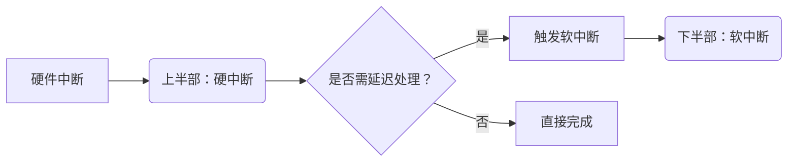
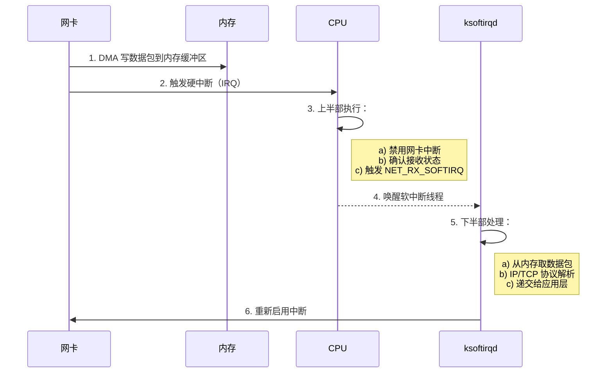
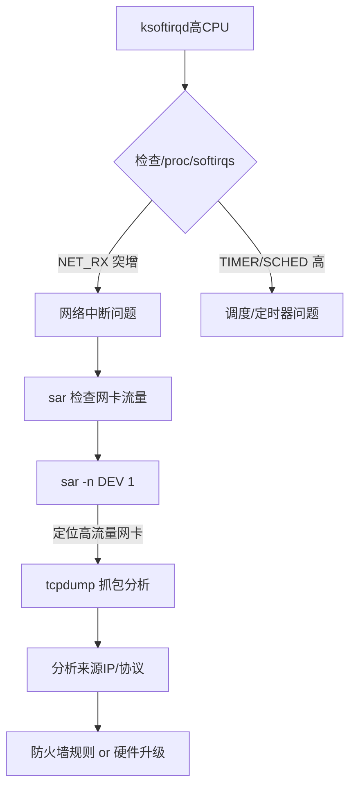

# Linux 中断处理机制详解：上半部与下半部

## 一、中断的本质与作用
- **定义**：中断是 CPU 响应硬件事件的**异步通知机制**，使系统能及时处理外部事件（如键盘输入、网络包到达）。
- **核心价值**：
  - **提高并发性**：避免 CPU 轮询硬件状态，释放计算资源
  - **保证实时性**：关键事件可立即抢占当前任务
  - **硬件解耦**：设备通过中断与 CPU 通信，无需了解系统内部状态

## 二、中断处理的分阶段设计
### 问题背景
| 问题                | 后果                     |
|---------------------|--------------------------|
| 中断处理程序执行过长 | 系统响应延迟，可能丢失后续中断 |
| 高频中断            | CPU 被频繁抢占，吞吐量下降    |

### 解决方案：两阶段处理


#### 1. **上半部（Top Half）**
- **别名**：硬中断（Hard IRQ）
- **核心特性**：
  - **硬件触发**：由设备物理信号引发
  - **执行上下文**：中断上下文（不可睡眠）
  - **关键操作**：
    - 禁止当前 CPU 的本地中断（避免嵌套中断）
    - 硬件状态读取/清除
    - 数据暂存到内存缓冲区
    - **触发软中断**（核心衔接点）
- **设计原则**：**极简执行**（μs 级），通常 < 100 条指令

#### 2. **下半部（Bottom Half）**
- **别名**：软中断（SoftIRQ）
- **核心特性**：
  - **内核触发**：由上半部通过 `raise_softirq()` 发起
  - **执行上下文**：内核线程上下文（可睡眠）
  - **调度机制**：
    - 每个 CPU 有专属内核线程 `ksoftirqd/0`，`ksoftirqd/1`...
    - 在 `ksoftirqd` 线程中异步执行
  - **典型任务**：
    - 网络协议栈处理（如 TCP/IP 解包）
    - 磁盘 I/O 完成处理
    - 定时器回调
    - RCU 锁释放

### 三、关键对比：上半部 vs 下半部
| 特性                | 上半部（硬中断）          | 下半部（软中断）            |
|---------------------|--------------------------|---------------------------|
| **触发源**          | 硬件设备                  | 内核代码（通常由上半部触发）|
| **执行上下文**      | 中断上下文                | 进程上下文（内核线程）      |
| **可否被中断**      | 不可（本地中断关闭）      | 可（支持抢占）             |
| **可否睡眠**        | ❌ 禁止                  | ✅ 允许                   |
| **执行延迟要求**    | 纳秒-微秒级              | 毫秒级                    |
| **典型操作**        | 硬件寄存器操作            | 协议处理/内存管理          |
| **CPU 亲和性**      | 绑定中断发生的 CPU        | 可跨 CPU 调度              |

---

## 四、网络包处理实战案例


---

## 五、监控与分析工具
### 1. 软中断统计
```bash
# 查看软中断累计次数
cat /proc/softirqs
```
输出示例：
```
                    CPU0       CPU1
          HI:          1          0
       TIMER:   12345678   11987654
      NET_TX:        102         98
      NET_RX:   98765432   87654321  # 网络接收中断
       BLOCK:          0          0
    IRQ_POLL:          0          0
     TASKLET:        123        456
       SCHED:     876543     765432
     HRTIMER:          0          0
         RCU:    3456789    3210987
```

### 2. 动态监控变化
```bash
# 每2秒高亮显示变化值
watch -d -n 2 'cat /proc/softirqs'
```

### 3. 内核线程查看
```bash
ps aux | grep '\\[ksoftirqd\\]'
```
输出示例：
```
root        11  0.0  0.0      0     0 ?        S    Aug01   0:01 [ksoftirqd/0]
root        18  0.0  0.0      0     0 ?        S    Aug01   0:00 [ksoftirqd/1]
```

---

## 六、性能问题诊断流程
当 `top` 显示 `ksoftirqd` 高 CPU 占用时：


### 诊断命令示例：
```bash
# 1. 实时监控网卡吞吐
sar -n DEV 1  # 每秒刷新网络设备统计

# 2. 抓取 eth0 的入向包（-i 指定网卡，-s 抓包长度）
tcpdump -i eth0 -s 0 -w capture.pcap 'src net 192.168.1.0/24'

# 3. 分析高中断频率原因
cat /proc/interrupts | grep eth0  # 确认中断分发均衡性
```

---

## 七、扩展知识
### 1. 中断屏蔽机制
- **本地中断关闭**：`local_irq_disable()`（仅当前 CPU）
- **全局中断关闭**：`spin_lock_irqsave()`（谨慎使用！）

### 2. 软中断类型（include/linux/interrupt.h）
```c
enum {
    HI_SOFTIRQ=0,     // 高优先级tasklet
    TIMER_SOFTIRQ,    // 定时器
    NET_TX_SOFTIRQ,   // 网络发送
    NET_RX_SOFTIRQ,   // 网络接收
    BLOCK_SOFTIRQ,    // 块设备
    IRQ_POLL_SOFTIRQ,
    TASKLET_SOFTIRQ,  // 常规tasklet
    SCHED_SOFTIRQ,    // 进程调度
    HRTIMER_SOFTIRQ,
    RCU_SOFTIRQ,      // RCU锁
    NR_SOFTIRQS
};
```

### 3. 替代机制对比
| 机制        | 执行上下文     | 是否可并行 | 延迟要求   | 典型场景         |
|------------|--------------|-----------|-----------|------------------|
| **软中断**  | 内核线程      | ✅ 多CPU  | 低延迟     | 网络/块设备      |
| **Tasklet** | 内核线程      | ❌ 串行化 | 中等       | 设备驱动         |
| **工作队列**| 进程上下文    | ✅        | 无严格要求 | 可睡眠的长任务   |

> **最佳实践**：现代驱动优先使用工作队列（workqueue），因其更安全且支持睡眠操作。
