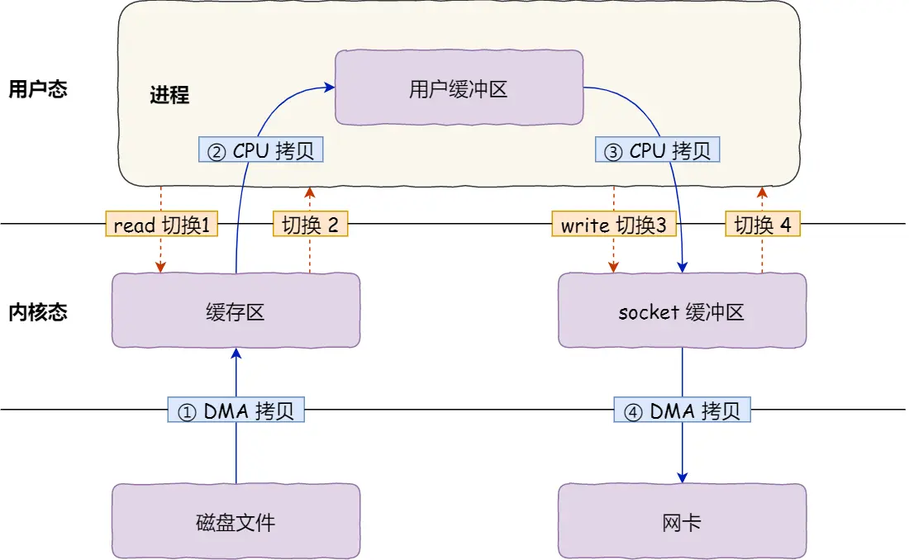

# 零拷贝

磁盘是计算机系统最慢的硬件之一，读写速度远低于内存（相差 10 倍以上）。因此，优化磁盘 I/O 的技术（如零拷贝、直接 I/O、异步 I/O）对提高系统吞吐量至关重要。操作系统内核的磁盘高速缓存区（PageCache）也能有效减少磁盘访问次数。


## 为什么要有 DMA 技术?

在 DMA 技术出现前，I/O 过程如下：
1.  CPU 向磁盘控制器发出指令后返回。
2.  磁盘控制器准备数据，放入其内部缓冲区，然后发出中断。
3.  CPU 响应中断，将磁盘控制器缓冲区的数据逐字节读入 CPU 寄存器，再写入内存。此期间 CPU 无法执行其他任务。

整个过程需要 CPU 全程参与数据搬运。对于少量数据尚可，但面对千兆网卡或硬盘传输大量数据时，CPU 将不堪重负。

为此，发明了 **DMA（直接内存访问）技术**：I/O 设备与内存的数据传输工作由 DMA 控制器负责，CPU 仅需下达传输指令（传输内容、源地址、目标地址），不再参与具体搬运。

**DMA 传输过程：**
1.  用户进程调用 `read`，发出 I/O 请求，进程阻塞。
2.  操作系统将请求发送给 DMA，CPU 转去执行其他任务。
3.  DMA 将请求发送给磁盘。
4.  磁盘读取数据到磁盘控制器缓冲区，缓冲区满后向 DMA 发送中断。
5.  DMA 将磁盘控制器缓冲区的数据拷贝到内核缓冲区（无需 CPU）。
6.  DMA 数据足够后，向 CPU 发送中断。
7.  CPU 将数据从内核缓冲区拷贝到用户空间，系统调用返回。

CPU 不再参与“磁盘控制器缓冲区到内核空间”的数据搬运，该工作由 DMA 完成。但传输指令（内容、源、目标）仍需 CPU 告知 DMA 控制器。

> 如今，每个 I/O 设备通常都有自己的 DMA 控制器。

## 传统的文件传输有多糟糕？

最简单的文件传输方式：从磁盘读取文件，通过网络协议发送给客户端。

传统 I/O 方式 (`read(file, tmp_buf, len); write(socket, tmp_buf, len);`) 涉及：
*   **4 次上下文切换：** 两次系统调用 (`read`, `write`)，每次涉及用户态与内核态切换（共 2 次切换/调用）。高并发下切换开销累积显著。
*   **4 次数据拷贝：**
    1.  **DMA:** 磁盘数据 -> 内核缓冲区 (PageCache)。
    2.  **CPU:** 内核缓冲区 -> 用户缓冲区。
    3.  **CPU:** 用户缓冲区 -> 内核 Socket 缓冲区。
    4.  **DMA:** Socket 缓冲区 -> 网卡缓冲区。

传输一份数据却搬运了 4 次，过多的 CPU 拷贝消耗资源，严重降低系统性能。高并发下，冗余的上下文切换和数据拷贝开销巨大。

**优化目标：** 减少用户态/内核态上下文切换次数和内存拷贝次数。

## 如何优化文件传输的性能？

*   **减少上下文切换：** 减少系统调用次数。每次系统调用导致 2 次上下文切换。
*   **减少数据拷贝：** 文件传输场景通常无需在用户空间加工数据，因此“内核缓冲区 -> 用户缓冲区 -> Socket 缓冲区”的拷贝是多余的，可消除用户缓冲区。

## 如何实现零拷贝？

零拷贝技术主要实现方式：`mmap + write` 和 `sendfile`。

### mmap + write
用 `mmap()` 替代 `read()`：
```c
buf = mmap(file, len);
write(sockfd, buf, len);
```
`mmap()` 将内核缓冲区直接映射到用户空间，内核与用户空间共享该缓冲区。

**过程：**
1.  `mmap()`: DMA 拷贝磁盘数据到内核缓冲区，应用进程与内核共享此缓冲区。
2.  `write()`: CPU 将内核缓冲区数据拷贝到 Socket 缓冲区。
3.  DMA 将 Socket 缓冲区数据拷贝到网卡缓冲区。

**效果：** 比传统方式减少 1 次 CPU 拷贝（省去内核缓冲区->用户缓冲区），但仍需 4 次上下文切换和 3 次数据拷贝（1 次 CPU 拷贝）。

### sendfile
Linux 2.1+ 提供 `sendfile()` 系统调用：
```c
#include <sys/socket.h>
ssize_t sendfile(int out_fd, int in_fd, off_t *offset, size_t count); // 目标fd, 源fd, 偏移, 长度
```

**过程 (Linux <2.4 / 网卡不支持 SG-DMA)：**
1.  DMA 拷贝磁盘数据到内核缓冲区。
2.  CPU 将内核缓冲区数据拷贝到 Socket 缓冲区。
3.  DMA 拷贝 Socket 缓冲区数据到网卡缓冲区。

**效果：** 合并 `read`+`write`，减少为 2 次上下文切换和 3 次数据拷贝（1 次 CPU 拷贝）。

**过程 (Linux 2.4+ / 网卡支持 SG-DMA)：**
1.  DMA 拷贝磁盘数据到内核缓冲区。
2.  将缓冲区描述符和数据长度传入 Socket 缓冲区。网卡 SG-DMA 控制器直接从内核缓冲区拷贝数据到网卡缓冲区。

**效果：** 仅 2 次上下文切换和 **2 次 DMA 拷贝**，**全程无需 CPU 搬运数据**。这就是**零拷贝 (Zero-copy)**。

零拷贝将文件传输性能提高至少一倍以上。

## 使用零拷贝技术的项目

*   **Kafka:** 利用零拷贝提升 I/O 吞吐率。其文件传输最终调用 Java NIO 的 `transferTo` 方法（底层使用 `sendfile`）。测试表明零拷贝可缩短 65% 传输时间。
*   **Nginx:** 默认开启零拷贝 (`sendfile on;`)。配置项含义：
    *   `on`: 使用 `sendfile` (零拷贝)，2 次上下文切换 + 2 次 DMA 拷贝。
    *   `off`: 使用 `read`+`write` (传统方式)，4 次上下文切换 + 4 次拷贝。

## PageCache 有什么作用？

零拷贝第一步中的“内核缓冲区”即 **PageCache（磁盘高速缓存）**。其作用：

1.  **缓存最近访问数据：** 利用程序局部性原理，提升访问缓存数据性能。
2.  **预读：** 读取磁盘时，内核会预读后续数据到 PageCache。顺序读性能优于随机读，预读和 I/O 合并调度功不可没。

**优势：** 将磁盘读写转化为内存读写，结合预读与 I/O 合并，进一步提升零拷贝性能。

**大文件问题：**
传输大文件（GB 级）时，PageCache 可能失效：
1.  大文件快速占满 PageCache，挤占“热点”小文件缓存空间，降低其性能。
2.  大文件数据被再次访问概率低，未能享受缓存优势，却多了一次 DMA 拷贝到 PageCache 的开销。
因此，**大文件传输不应使用 PageCache（即不使用零拷贝）**，以免在高并发下导致严重性能问题。

## 大文件传输用什么方式实现？

传统 `read` 会阻塞进程等待磁盘 I/O 完成。对于大文件，应使用 **异步 I/O (AIO) + 直接 I/O**：

*   **异步 I/O (AIO)：**
    1.  前半程：内核发起读请求后立即返回，进程可处理其他任务。
    2.  后半程：数据就绪后，内核通知进程处理。
*   **直接 I/O：** 绕开 PageCache 的 I/O（使用 PageCache 称为缓存 I/O）。异步 I/O 通常与直接 I/O 配合使用。

**直接 I/O 适用场景：**
1.  应用已自实现数据缓存，无需 PageCache 二次缓存（如 MySQL 可配置）。
2.  传输大文件：避免 PageCache 被占满且缓存命中率低的问题。

**直接 I/O 的代价：** 无法享受内核的 I/O 调度合并和预读优化。

**结论：**
*   传输小文件：使用**零拷贝技术**（利用 PageCache）。
*   传输大文件：使用**异步 I/O + 直接 I/O**（绕开 PageCache）。

**Nginx 配置示例：**
```nginx
location /video/ {
    sendfile on;    # 小文件：零拷贝 (sendfile)
    aio on;         # 大文件：开启异步 I/O
    directio 1024m; # 文件大于 1024MB 时使用直接 I/O
}
```

## 总结

*   **DMA 作用：** 解放 CPU，使其仅需下达 I/O 传输指令，具体搬运由 DMA 控制器完成。
*   **传统 I/O 问题：** 文件传输需 4 次上下文切换 + 4 次数据拷贝（2 次 DMA, 2 次 CPU）。
*   **零拷贝优化：**
    *   通过 `sendfile` 合并系统调用，减少上下文切换。
    *   数据在内核中处理，减少拷贝次数。结合 SG-DMA 实现真正的零拷贝（2 次切换 + 2 次 DMA 拷贝）。
    *   Kafka、Nginx 等广泛应用零拷贝提升性能。
*   **PageCache 作用：** 缓存热点数据、预读、协助 I/O 合并调度，提升零拷贝性能。
*   **零拷贝限制：**
    *   不允许进程加工文件内容（如压缩）。
    *   大文件传输会降低 PageCache 效率，需使用 **异步 I/O + 直接 I/O**。
*   **策略选择：** 根据文件大小选择技术（如 Nginx 配置所示）。
