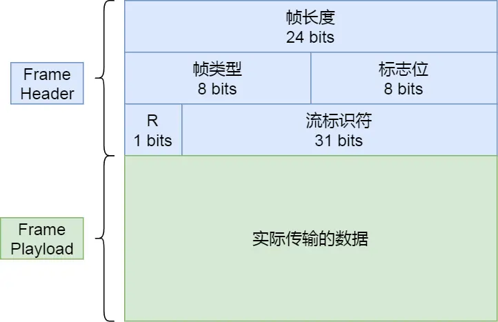

### HTTP/2 的优势  
#### HTTP/1.1 协议的性能问题  
当前站点特性变化导致 HTTP/1.1 高延迟问题：  
1. **延迟难以下降**：网络带宽提升，但延迟存在下限瓶颈。  
2. **并发连接有限**：浏览器最大并发连接数为 6 个，且需经历 TCP/TLS 握手及慢启动过程。  
3. **队头阻塞**：同一连接必须完成一个 HTTP 事务（请求+响应）才能处理下一个。  
4. **头部巨大且重复**：无状态协议需每个请求携带完整头部（尤其含大体积 Cookie）。  
5. **不支持服务器推送**：客户端需轮询获取通知，浪费带宽和服务器资源。  

#### 兼容 HTTP/1.1  
HTTP/2 的兼容策略：  
- 协议名不变（`http://` 明文，`https://` 加密），实现平滑升级。  
- 保留 HTTP/1.1 的**语义层**（请求方法、状态码、头字段），改造**语法层**（报文传输格式）。  

#### 头部压缩  
**HPACK 算法组成**：  
1. **静态字典**：61 组高频头部字段（如 `:status: 200` 对应索引 8）。  
   - 例：`server: nghttpx` 从 17 字节压缩至 8 字节（压缩率 47%）。  
2. **动态字典**：索引从 62 起步，动态更新重复字段（如 `User-Agent`）。  
   - **同一连接重复传输相同头部时生效，通过索引号替代字段值。**  
3. **Huffman 编码**：对字符串进行高频信息压缩。  

#### 二进制帧 
 
**帧结构**：  
```plaintext
+-----------------------------------+  
| 长度 (3字节) | 类型 (1字节) | 标志位 (1字节) | 流标识符 (4字节) | 帧载荷 (变长) |  
+-----------------------------------+  
```  
- **关键帧类型**：  
  - `HEADERS`：HTTP 头部  
  - `DATA`：消息负载  
  - `SETTINGS`：连接配置  
  - `PUSH_PROMISE`：服务器推送资源  
- **流标识符 (Stream ID)**：31 位标识符（约 21 亿），用于多路复用。  

#### 并发传输  
**核心概念关系**：  
```  
1 TCP 连接 = 多个 Stream  
1 Stream   = 多个 Message（HTTP 请求/响应）  
1 Message  = 多个 Frame（最小二进制单位）  
```  
- **并发机制**：  
  - 不同 Stream 的帧可乱序发送（依据 Stream ID 组装）。  
  - 同一 Stream 内的帧必须有序。  
- **Stream ID 规则**：  
  - 客户端发起：奇数号（如 Stream 1）  
  - 服务器推送：偶数号（如 Stream 2）  
- 并发优势：100 个 Stream 复用 1 个 TCP 连接，避免 HTTP/1.1 的多次握手开销。  

#### 服务器主动推送  
**操作流程**：  
1. 客户端请求 HTML（Stream 1）。  
2. 服务器通过 `PUSH_PROMISE` 帧通知将推送 CSS（在 Stream 2 发送）。  
3. 并行传输 HTML（Stream 1）和 CSS（Stream 2）。  
**Nginx 配置示例**：  
```nginx  
location /test.html {  
  http2_push /test.css;  
}  
```  

#### 总结  
HTTP/2 的核心优化：  
1. **头部压缩**：静态表 + 动态表 + Huffman 编码，压缩率 50%~90%。  
   - 动态表需限制大小（如 Nginx 的 `http2_max_requests`）。  
2. **二进制帧**：高效解析，支持精细控制（优先级、流状态）。  
3. **Stream 并发**：多 Stream 复用单 TCP 连接，解决应用层队头阻塞。  
4. **服务器推送**：通过偶数号 Stream 主动推送资源，减少往返延迟。  

**遗留问题**：  
HTTP/2 仍存在 TCP 层队头阻塞（内核需按序处理字节数据）。解决方案：HTTP/3 基于 UDP 协议。  

