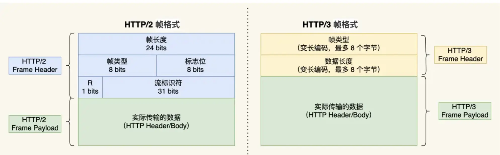

### **HTTP/3 核心特性与QUIC协议解析**  
#### **HTTP/2的遗留问题**  
1. **队头阻塞（Head-of-Line Blocking）**  
   - **根本原因**：HTTP/2基于TCP，多个请求复用同一TCP连接。若**任意TCP包丢失**，后续数据包（即使完整接收）需等待重传，阻塞所有请求。  
   - **示例**：Stream 2丢失一个TCP包 → Stream 3/4的报文虽到达，但内核因数据不连续无法提交给应用层。  

2. **高延迟握手**  
   - TCP三次握手 + TLS 1.2四次握手 = **3 RTT延迟**。  
   - **额外影响**：TCP慢启动机制进一步降低初始传输速率。  

3. **连接迁移成本高**  
   - TCP连接依赖**四元组（源IP/端口 + 目标IP/端口）**。  
   - 设备切换网络（如4G→WiFi）导致IP变化时，必须重建连接（重新握手 + 慢启动）。  

---

### **HTTP/3的解决方案：QUIC协议**  
#### **QUIC的核心优势**  
| 问题                | QUIC解决方案                                                      |
|---------------------|-----------------------------------------------------------------|
| **队头阻塞**        | 基于UDP实现**独立流（Stream）**：某个流丢包仅阻塞该流，其他流正常处理。    |
| **握手延迟**        | 合并TLS 1.3与连接建立 → **1 RTT完成握手**，会话恢复时可实现**0-RTT传输**|
| **连接迁移**        | 通过**连接ID（Connection ID）** 标识连接，IP变化时无缝复用原连接。      |

#### **关键技术细节**  
1. **无队头阻塞原理**  
   - QUIC为每个数据包添加**独立序号**，丢失后仅重传该包，不影响其他流。  
   - *对比HTTP/2*：TCP要求严格有序，单个丢包阻塞整个连接。  

2. **快速连接建立**  
   - QUIC内置TLS，握手阶段同时协商加密参数与连接ID → 减少通信轮次。  
   - **0-RTT场景**：第二次连接时，应用数据可与握手信息合并发送。  

3. **QPACK头部压缩**  
   - **改进动态表同步**：  
     - 新增单向流：  
       - `QPACK Encoder Stream`：发送动态表更新（如新HTTP头部）。  
       - `QPACK Decoder Stream`：确认动态表更新完成。  
   - **解决HPACK阻塞**：动态表更新与HTTP请求分离，避免丢包导致解码阻塞。  

---

### **HTTP/3协议层改进**  

- **帧结构简化**：  
  - 帧头仅含**类型（Type）** 和 **长度（Length）**，直接复用QUIC的流机制。  
- **静态表扩展**：  
  - QPACK静态表从HTTP/2的61项增至**91项**，提升常见头部压缩率。  

---

### **总结：HTTP/3的核心价值**  
| 对比项          | HTTP/2                    | HTTP/3                      |
|-----------------|--------------------------|-----------------------------|
| **传输层**      | TCP                       | UDP + QUIC                  |
| **队头阻塞**    | TCP层阻塞整个连接            | 仅影响丢包的单个流             |
| **握手延迟**    | 3 RTT（TCP+TLS）           | 1 RTT（首次），0-RTT（恢复连接）|
| **网络迁移**    | 需重建连接                  | 通过连接ID无缝迁移             |
| **头部压缩**    | HPACK（动态表阻塞风险）      | QPACK（双向同步动态表）         |
