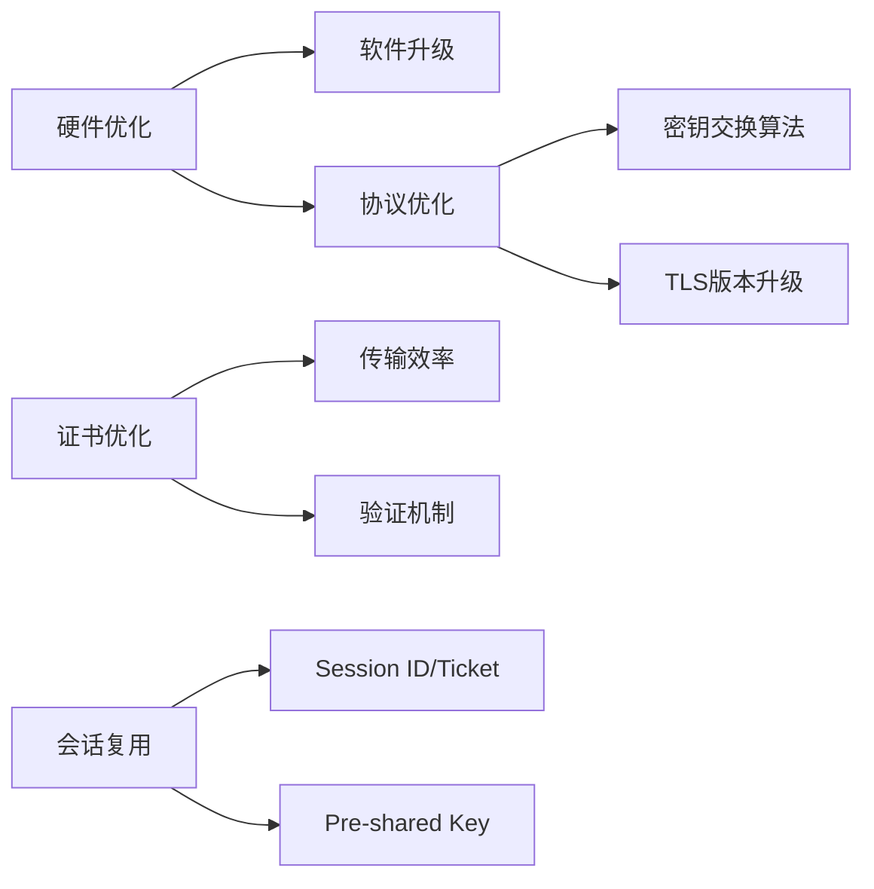

以下是对文档的格式化处理，已删除非核心内容（导航、评论区、推广信息等），保留技术要点并优化结构：

---

### **3.5 HTTPS 性能优化策略**  
**核心挑战：** TLS 握手增加 2 RTT 延迟 + 计算资源消耗  
**优化方向：**  


---

#### **一、性能损耗分析**  
1. **TLS 握手阶段（主要瓶颈）**  
   - **计算密集型操作**：  
     - ECDHE 临时密钥生成  
     - 证书吊销状态检查（CRL/OCSP）  
     - `Pre-Master` 密钥计算  
   - **网络延迟**：最长 2 RTT  
2. **数据传输阶段**  
   - 对称加密（AES/ChaCha20）性能损耗小，硬件加速后可忽略  

---

#### **二、优化方案详解**  
##### **1. 硬件优化**  
- **CPU 选择**：  
  - 优先支持 **AES-NI 指令集**的 CPU（加速 AES 加解密）  
  - Linux 检测命令：  
    ```bash
    grep -c aes /proc/cpuinfo  # >0 表示支持
    ```
- **算法适配**：  
  - 无 AES-NI → 选用 **ChaCha20**（对 CPU 更友好）  

##### **2. 协议优化**  
- **密钥交换算法**：  
  - 用 **ECDHE 替代 RSA**：  
    - 支持 False Start（节省 1 RTT）  
    - 具备前向安全性  
    - 优先选择 **x25519 椭圆曲线**（性能最佳）  
    - Nginx 配置示例：  
      ```nginx
      ssl_ecdh_curve x25519:secp384r1;  # 优先 x25519
      ```
- **TLS 版本升级**：  
  - **TLS 1.3 优势**：  
    | **对比项**       | TLS 1.2         | TLS 1.3         |
    |------------------|-----------------|-----------------|
    | 握手耗时         | 2 RTT           | 1 RTT           |
    | 密钥交换算法     | 支持 RSA/ECDHE  | 仅 ECDHE        |
    | 密码套件         | 大量（易被降级攻击） | 仅 5 个安全套件 |
  - 禁用不安全套件：  
    ```nginx
    ssl_ciphers TLS_AES_128_GCM_SHA256:TLS_CHACHA20_POLY1305_SHA256;
    ```

##### **3. 证书优化**  
- **传输效率**：  
  - 选用 **ECC 证书**（较 RSA 证书体积减少 60%）  
- **验证机制**：  
  - **OCSP Stapling 方案**：  
    ```mermaid
    sequenceDiagram
      服务器->>CA: 周期性查询证书状态
      CA-->>服务器: 返回签名的时间戳响应
      客户端->>服务器: TLS 握手请求
      服务器->>客户端: 附带缓存的 OCSP 响应
    ```
    - **优势**：客户端免直接访问 CA，减少 DNS 查询、建连开销  

##### **4. 会话复用**  
| **技术**       | **原理**                     | **延迟** | **缺点**                  |
|----------------|------------------------------|----------|--------------------------|
| Session ID     | 服务端缓存会话密钥           | 1 RTT    | 服务器内存压力大          |
| Session Ticket | 客户端保管加密的会话密钥票据 | 1 RTT    | 需集群同步加密密钥        |
| Pre-shared Key | TLS 1.3 中票据与请求同时发送 | 0 RTT    | 重放攻击风险（需设过期时间） |

> **重放攻击防护**：  
> - 会话密钥设置合理过期时间  
> - 仅对安全请求（GET/HEAD）启用会话复用  

---

### **总结与实施建议**  
| **优化类别** | **具体措施**                                  | **效果**                     |
|--------------|---------------------------------------------|------------------------------|
| 硬件         | 支持 AES-NI 的 CPU + AES 算法               | 加速对称加密                 |
| 协议         | ECDHE + x25519 曲线 + TLS 1.3              | 减少 1 RTT，提升安全性       |
| 证书         | ECC 证书 + OCSP Stapling                    | 减少传输体积，加速验证       |
| 会话管理     | TLS 1.3 Pre-shared Key（配合过期时间限制） | 重连 0 RTT，避免握手开销     |

> **注**：  
> - 软件升级：Linux 内核 ≥4.x + OpenSSL ≥1.1.1  
> - 风险控制：会话密钥过期时间需平衡性能与安全性  
