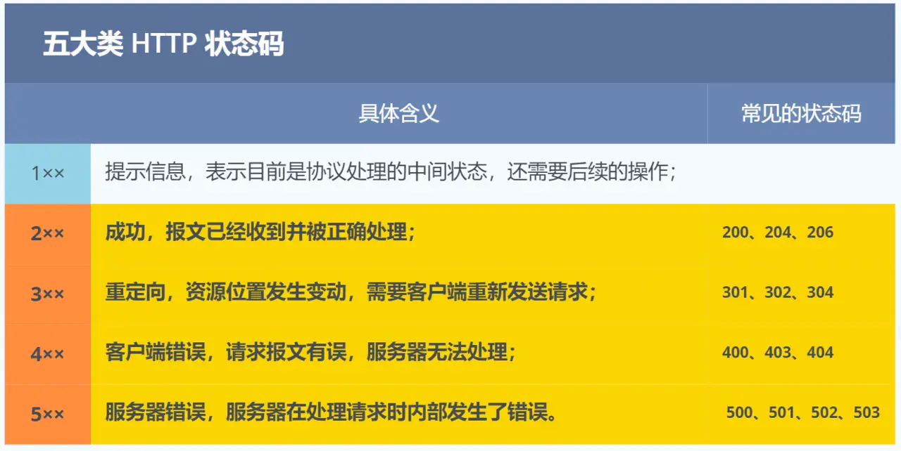
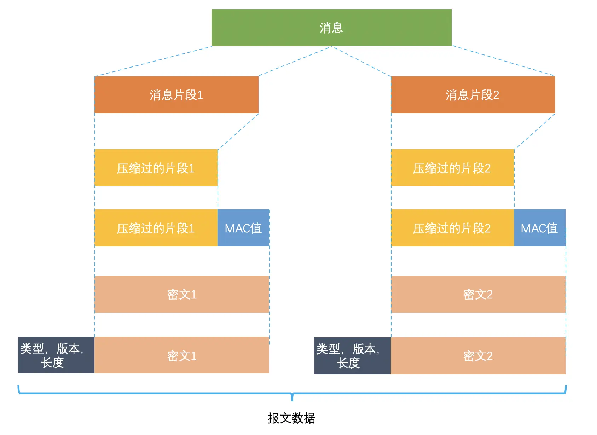

### **3.1 HTTP 常见面试题精要**
#### **一、HTTP 基本概念**
1. **HTTP 定义**  
   - **超文本传输协议**（HyperText Transfer Protocol），基于“请求-响应”模型在两点间传输超文本（文本/图片/视频等）。
   - 核心组成：
     - **协议**：计算机间通信的行为约定（如报文格式、错误处理）。
     - **传输**：数据在两点间双向传输，支持中间节点接力。
     - **超文本**：含超链接的多媒体内容（如HTML）。

2. **常见状态码**  

   | 类别 | 状态码       | 含义                        |
   |------|--------------|---------------------------|
   | 1xx  | 100/101      | 协议处理中间状态（极少使用）   |
   | 2xx  | 200 OK       | 成功处理请求                |
   |      | 204 No Content | 成功但无返回数据           |
   |      | 206 Partial Content | 分块传输/断点续传     |
   | 3xx  | 301          | 资源永久重定向（需更新URL）   |
   |      | 302          | 资源临时重定向（保持原URL）   |
   |      | 304          | 资源未修改（使用缓存）        |
   | 4xx  | 400          | 请求报文错误（笼统错误）      |
   |      | 403          | 服务器禁止访问              |
   |      | 404          | 资源不存在                  |
   | 5xx  | 500          | 服务器内部错误              |
   |      | 502          | 网关/代理服务器错误          |
   |      | 503          | 服务器繁忙（临时不可用）      |

3. **关键字段**  
   | 字段                | 作用                               |
   |---------------------|-----------------------------------|
   | `Host`              | 指定访问的服务器域名                 |
   | `Content-Length`    | 响应数据长度（解决TCP粘包）           |
   | `Connection: Keep-Alive` | 启用长连接复用TCP通道           |
   | `Content-Type`      | 响应数据类型（如`text/html; charset=utf-8`）|
   | `Content-Encoding`  | 响应数据压缩格式（如`gzip`）          |

---

#### **二、GET 与 POST**
GET 的语义是请求获取指定的资源。GET 方法是安全、幂等、可被缓存的。

POST 的语义是根据请求负荷（报文主体）对指定的资源做出处理，具体的处理方式视资源类型而不同。POST 不安全，不幂等，（大部分实现）不可缓存。
| **对比项**      | GET                                | POST    |
|----------------|----------------------|-----------------------|
| **语义**        | 获取资源（安全、幂等）  | 提交数据（非安全、非幂等） |
| **参数位置**     | URL中（仅ASCII字符）    | 报文Body（支持任意格式） |
| **缓存**        | 可缓存（书签/代理）       | 不可缓存（大部分实现）   |
| **数据长度限制** | URL长度受限（浏览器限制）   | 无限制                |
| **安全性**      | 参数暴露于URL（需HTTPS加密| Body加密传输（仍需HTTPS）|

> **注意**：  
> - GET 可带Body（RFC未禁止），但不符合语义规范。  
> - 安全性取决于是否使用HTTPS，与GET/POST无关。

---

#### **三、HTTP 缓存技术**
1. **强制缓存**  
   - **机制**：浏览器直接使用本地缓存（无需询问服务器）。  
   - **响应头**：  
     - `Cache-Control: max-age=3600`（相对时间，优先级高）  
     - `Expires: Wed, 21 Oct 2025 07:28:00 GMT`（绝对时间）  

2. **协商缓存**  
   - **机制**：浏览器携带标识询问服务器，由服务器决定是否使用缓存。  

   当使用 ETag 字段实现的协商缓存的过程：

当浏览器第一次请求访问服务器资源时，服务器会在返回这个资源的同时，在 Response 头部加上 ETag 唯一标识，这个唯一标识的值是根据当前请求的资源生成的；
当浏览器再次请求访问服务器中的该资源时，首先会先检查强制缓存是否过期：
如果没有过期，则直接使用本地缓存；
如果缓存过期了，会在 Request 头部加上 If-None-Match 字段，该字段的值就是 ETag 唯一标识；
服务器再次收到请求后，会根据请求中的 If-None-Match 值与当前请求的资源生成的唯一标识进行比较：
如果值相等，则返回 304 Not Modified，不会返回资源；
如果不相等，则返回 200 状态码和返回资源，并在 Response 头部加上新的 ETag 唯一标识；
如果浏览器收到 304 的请求响应状态码，则会从本地缓存中加载资源，否则更新资源。
#HTTP 特性
   - **标识比对**：  
     | 请求头               | 响应头            | 优势                |
     |----------------------|-----------------|--------------------|
     | `If-Modified-Since`  | `Last-Modified` | 简单（时间戳比对）    |
     | `If-None-Match`      | `ETag`          | 精准（内容哈希值比对） |
   - **流程**：  
     ```mermaid
     graph LR
     A[浏览器请求] --> B{缓存过期？}
     B -->|是| C[发送ETag/Last-Modified]
     C --> D{服务器比对资源}
     D -->|未修改| E[304 使用缓存]
     D -->|已修改| F[200 返回新资源]
     ```

---

#### **四、HTTP/1.1 特性**
| **优点**                        | **缺点**                              |
|---------------------------     |---------------------------------------|
| **简单**：Header+Body明文        | **无状态**：需Cookie/Session维护状态  |
| **灵活易扩展**：支持自定义字段/方法 | **明文传输**：数据易被窃取/篡改   |
| **跨平台**：广泛兼容             | **队头阻塞**：响应顺序导致延迟        |
| **长连接**：减少TCP握手开销       | **性能瓶颈**：Header未压缩、无优先级控制 |

> **长连接优化**：  
> - 保持TCP连接复用（减少握手次数）。  
> - 管道化（pipeline）理论支持并行请求，但默认未启用（仍存在响应阻塞）。

---

#### **五、HTTPS 核心机制**
1. **HTTP vs HTTPS**  
   | **对比项**   | HTTP           | HTTPS                      |
   |--------------|--------------|------------------------------|
   | 加密         | 明文传输        | SSL/TLS加密（混合加密）      |
   | 端口         | 80          | 443                            |
   | 认证         | 无           | CA证书验证服务器身份             |
   | 建立流程     | TCP三次握手    | TCP握手 + TLS握手（增加1-2 RTT） |


HTTP 由于是明文传输，所以安全上存在以下三个风险：

窃听风险，比如通信链路上可以获取通信内容，用户号容易没。
篡改风险，比如强制植入垃圾广告，视觉污染，用户眼容易瞎。
冒充风险，比如冒充淘宝网站，用户钱容易没。
2. **安全性保障**  
   - **混合加密**：  
     - 非对称加密交换**会话密钥** → 对称加密通信。  
   - **完整性校验**：  
     - 摘要算法生成**数据指纹**（如SHA-256）。  
   - **身份认证**：  
     - **数字证书**（CA签发）验证公钥归属（防中间人攻击）。  

公钥加密，私钥解密。这个目的是为了保证内容传输的安全，因为被公钥加密的内容，其他人是无法解密的，只有持有私钥的人，才能解密出实际的内容；
私钥加密，公钥解密。这个目的是为了保证消息不会被冒充，因为私钥是不可泄露的，如果公钥能正常解密出私钥加密的内容，就能证明这个消息是来源于持有私钥身份的人发送的。


客户端向服务器索要并验证服务器的公钥。
双方协商生产「会话秘钥」。
双方采用「会话秘钥」进行加密通信。
3. **TLS握手流程（RSA）**  
   1. ClientHello：客户端支持协议版本 + 随机数A， 密码套件列表，如 RSA 加密算法。
   2. ServerHello：服务器确认版本 + 随机数B + **证书**。  
   3. 客户端验证证书 → 用公钥加密**随机数C**发送。  
   4. 双方用随机数A/B/C生成**会话密钥**。  


具体过程如下：

首先，消息被分割成多个较短的片段,然后分别对每个片段进行压缩。

接下来，经过压缩的片段会被加上消息认证码（MAC 值，这个是通过哈希算法生成的），这是为了保证完整性，并进行数据的认证。通过附加消息认证码的 MAC 值，可以识别出篡改。与此同时，为了防止重放攻击，在计算消息认证码时，还加上了片段的编码。

再接下来，经过压缩的片段再加上消息认证码会一起通过对称密码进行加密。

最后，上述经过加密的数据再加上由数据类型、版本号、压缩后的长度组成的报头就是最终的报文数据。

记录协议完成后，最终的报文数据将传递到传输控制协议 (TCP) 层进行传输。

#### **六、HTTP 版本演进**
| **特性**     | HTTP/1.1       | HTTP/2           | HTTP/3         |
|--------------------|-----------------|---------------------|--------------------|
| **传输协议**       | TCP              | TCP                  | QUIC（基于UDP） |
| **头部压缩**       | 无               | HPACK算法             | QPACK算法  |
| **数据传输**       | 文本格式          | 二进制帧（Frame）      | 二进制帧   |
| **多路复用**       | 不支持| Stream并发（解决HTTP队头阻塞）| Stream独立（解决TCP队头阻塞）|
| **服务器推送**     | 不支持            | 支持主动推送资源        | 支持     |
| **连接建立速度**    | 慢（TCP+TLS握手）  | 中（TCP+TLS 1.3）    | 快（QUIC 0-1 RTT） |
| **移动网络适应性**  | 差（IP变需重连）    | 中                   | 优（连接ID迁移） |

> **关键问题**：  
> - **HTTP/2缺陷**：TCP层队头阻塞（丢包阻塞所有Stream）。  
> - **HTTP/3突破**：QUIC在UDP实现可靠传输 + 连接迁移。

---

### **附录：高频考点**
1. **Cookie vs Session**  
   - **Cookie**：客户端存储状态标识（有大小限制）。  
   - **Session**：服务端存储状态（依赖Session ID传递）。  

2. **HTTPS中间人攻击**  
   - **条件**：用户主动信任伪造证书 / 系统植入恶意根证书。  
   - **防护**：  
     - 不点击非法证书警告。  
     - 使用HTTPS双向认证（验证客户端身份）。  

3. **SSL/TLS关系**  
   - TLS是SSL标准化后的名称（功能等价）。  
