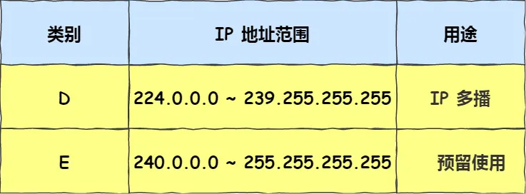

# **IP 基础知识要点：**

## **一、IP 基本认识 (网络层)**

*   **作用：** 实现主机与主机之间的点对点 (end-to-end) 通信。
*   **与 MAC (数据链路层) 的区别与联系：**
    *   **MAC：** 负责在**同一物理链路（直连）** 上的两个设备之间通信。作用范围是**局部链路**。
    *   **IP：** 负责在**不同网络（非直连）** 的主机之间进行通信传输。作用范围是**全局网络**。
    *   **类比：** IP 地址如同行程的起点和终点 (源IP, 目的IP)，在整个传输过程中通常不变 (无NAT时)。MAC 地址如同每一段具体交通工具的出发点和到达点 (源MAC, 目的MAC)，在数据包经过不同链路时会不断变化。

## **二、IP 地址的基础知识**  
1.  **表示与范围：**
    *   IPv4 地址：32 位二进制数，通常用点分十进制表示 (如 192.168.1.1)。
    *   理论最大主机数：2^32 ≈ 43 亿 (实际远少于此，因网络号/主机号划分、NAT 使用、多网卡设备等)。
    *   **补充说明：** 实际可分配地址受限于网络标识和主机标识的划分，以及广播地址 (主机号全1) 和网络地址 (主机号全0) 的预留。
2.  **分类地址 (A, B, C, D, E)：**  
**主机号全为 1 指定某个网络下的所有主机，用于广播
主机号全为 0 指定某个网络**
 广播地址用于在同一个链路中相互连接的主机之间发送数据包。

    *   **A类 (0...)：** 首位0，网络号8位，主机号24位。范围：1.0.0.0 - 126.255.255.255。最大网络数126 (1-126)，最大主机数 2^24 - 2 ≈ 1677万。
    *   **B类 (10..)：** 前两位10，网络号16位，主机号16位。范围：128.0.0.0 - 191.255.255.255。最大网络数 2^14 = 16384，最大主机数 2^16 - 2 = 65534。
    *   **C类 (110.)：** 前三位110，网络号24位，主机号8位。范围：192.0.0.0 - 223.255.255.255。最大网络数 2^21 ≈ 209万，最大主机数 2^8 - 2 = 254。
    
    *   **D类 (1110)：** 前四位1110，用于**组播 (Multicast)**。范围：224.0.0.0 - 239.255.255.255。
        *   **组播作用：** 将数据包发送给特定组内的所有主机 (一对多)，可穿透路由器。
        *   **组播地址分类：**
            *   224.0.0.0 ~ 224.0.0.255： 本地链路控制/预留 (路由器不转发)。
            *   224.0.1.0 ~ 238.255.255.255： 全局范围/用户可用。
            *   239.0.0.0 ~ 239.255.255.255： 本地管理/组织内部使用。
    *   **E类 (1111)：** 前四位1111，保留未使用。范围：240.0.0.0 - 255.255.255.255。
    
    *   **特殊地址：**
        *   **广播地址 (主机号全1)：** 用于向同一网络内所有主机发送数据包。分为本地广播 (如 192.168.1.255/24) 和直接广播 (如向 192.168.1.255/24 发送，需路由器支持且常被禁用)。
        *   **网络地址 (主机号全0)：** 标识网络本身。
    *   **分类地址缺点：**
        *   同一网络内缺乏地址层次 (不灵活)。
        *   地址块大小与实际需求不匹配 (C类太小，B类太大)，浪费严重。

3.  **无分类地址 CIDR (Classless Inter-Domain Routing)：**

    *   **核心：** 废除 A/B/C 类概念，灵活划分网络前缀 (Network Prefix) 和主机号。
    *   **表示：** `a.b.c.d/x` (如 192.168.1.0/24)。`x` 表示网络前缀的位数 (子网掩码中连续1的个数)。
    *   **子网掩码：** 32位二进制数，网络前缀部分全为1，主机号部分全为0。通过与 IP 地址进行按位 `AND` 运算得到网络地址。
    *   **子网划分：** 在 CIDR 基础上，**将主机号的一部分进一步划分为子网号 (Subnet ID) 和新的主机号 (Host ID)**。
    
        *   **示例 (C类 192.168.1.0/24 用掩码 255.255.255.192 (/26) 划分子网)：**
            *   借用原主机号 2 位 (192 = 11000000) 作为子网号。
            *   可划分出 4 个子网 (00, 01, 10, 11)：
                *   子网1: 192.168.1.0/26 (范围: .1 - .62, 广播: .63)
                *   子网2: 192.168.1.64/26 (范围: .65 - .126, 广播: .127)
                *   子网3: 192.168.1.128/26 (范围: .129 - .190, 广播: .191)
                *   子网4: 192.168.1.192/26 (范围: .193 - .254, 广播: .255)
4.  **公有 IP 地址与私有 IP 地址：**
    *   **公有 IP：** 全球唯一，由 ICANN 及其下属机构 (如 APNIC, CNNIC) 统一分配管理，用于互联网通信。相当于“全球门牌号”。
    *   **私有 IP：** 仅在特定内部网络 (如家庭、企业局域网) 内有效，可重复使用。由内部管理员分配。范围：
        *   A类: 10.0.0.0 ~ 10.255.255.255 (10.0.0.0/8)
        *   B类: 172.16.0.0 ~ 172.31.255.255 (172.16.0.0/12)
        *   C类: 192.168.0.0 ~ 192.168.255.255 (192.168.0.0/16)
    *   **NAT (Network Address Translation)：** 解决 IPv4 地址枯竭的关键技术，**将内部网络的私有 IP 地址映射为公有 IP 地址进行对外通信**。
        *   **NAPT (NAT Overload / PAT)：** **最常见的 NAT 形式，不仅转换 IP 地址，同时转换端口号 (Port)**。允许多个内部主机共享一个公有 IP 地址 (通过不同的端口号区分)。转换表在建立连接 (如 TCP SYN) 时动态生成。
        *   **NAT 缺点：**
            *   外部无法主动访问 NAT 内部服务器 (需手动配置端口映射或使用 NAT 穿透)。
            *   转换操作有性能开销。
            *   NAT 设备重启会导致所有 TCP 连接重置。
        *   **解决 NAT 问题：**
            *   采用 IPv6。
            *   **NAT 穿透技术 (如 STUN, TURN, ICE)：** **允许内部应用程序主动发现 NAT 的存在，获取公有 IP 和端口映射，并主动建立和维护映射条目**，使外部能够连接进来或提高 P2P 通信效率。
5.  **IP 地址与路由控制：**
    *   路由器根据目标 IP 地址的网络前缀查询路由表。
    *   选择最长匹配 (Longest Prefix Match) 的网络地址条目进行转发。
    *   **环回地址 (Loopback)：** 127.0.0.1 (localhost)，用于本机内部进程间网络通信，数据包不会流出主机。
6.  **IP 分片与重组：**
    *   原因：不同数据链路层有不同 MTU (最大传输单元，如以太网 MTU=1500 字节)。
    *   当 IP 数据包大小 > 出接口 MTU 时，路由器或源主机将其分片。
    *   **重组只在最终目标主机进行，中间路由器不重组。**
    *   **影响：** 分片丢失导致整个 IP 数据报无效。因此 TCP 使用 MSS 避免在 IP 层分片；UDP 应避免发送大于路径 MTU 的包。
7.  **IPv6 基本认识：**
    *   **地址长度：** 128 位，地址空间巨大。
    *   **表示：** 冒号十六进制 (如 2001:0db8:85a3:0000:0000:8a2e:0370:7334)，可省略前导零和连续零组 (::)。
    *   **主要类型：**
        *   **单播 (Unicast)：** 一对一。包括：
            *   **链路本地地址 (Link-Local)：** (FE80::/10) 同一链路有效，不跨路由器。
            *   **唯一本地地址 (Unique Local Address - ULA)：** (FC00::/7) 类似 IPv4 私有地址，内网使用。
            *   **全局单播地址 (Global Unicast Address - GUA)：** (2000::/3) 类似 IPv4 公有地址，全球互联网使用。
        *   **组播 (Multicast)：** (FF00::/8) 一对多。
        *   **任播 (Anycast)：** 一对最近 (由路由协议决定)。
        *   **无广播 (Broadcast)。**
    *   **相比 IPv4 的改进：**
        *   固定首部长度 (40 字节)，简化结构，提高路由器处理效率。
        *   取消首部校验和 (依赖上层和链路层校验)。
        *   取消分片/重组字段 (**只在源和目标主机分片/重组**，提高中间路由速度)。
        *   取消选项字段 (移至扩展首部)。
        *   支持自动配置 (SLAAC)，即插即用。
        *   内置 IPSec 支持，提升安全性。

## **三、IP 协议相关技术**
1.  **DNS (Domain Name System)：**
    *   **作用：** 将域名 (如 www.example.com) 解析为 IP 地址。
    *   **域名层级：** 从右向左层级升高 (根域 -> 顶级域 TLD -> 二级域 -> ...)。
    *   **解析流程 (迭代查询)：**
        1.  客户端查询本地 DNS 缓存 -> Hosts 文件 -> 本地 DNS 服务器。
        2.  本地 DNS 服务器查询根 DNS 服务器 (获知 TLD 服务器地址)。
        3.  本地 DNS 服务器查询 TLD 服务器 (获知权威 DNS 服务器地址)。
        4.  本地 DNS 服务器查询权威 DNS 服务器 (获得域名对应的 IP 地址)。
        5.  本地 DNS 服务器将 IP 地址返回给客户端。
2.  **ARP (Address Resolution Protocol) 与 RARP：**
    *   **ARP：** **已知目标 IP 地址，获取其 MAC 地址**。
        *   流程：源主机广播 ARP 请求 (包含目标 IP) -> 目标主机单播回复 ARP 响应 (包含自身 MAC) -> 源主机缓存映射。
    *   **RARP (Reverse ARP)：** **已知自身 MAC 地址，获取 IP 地址** (已淘汰，被 DHCP 取代)。需要 RARP 服务器支持。
3.  **DHCP (Dynamic Host Configuration Protocol)：**
    *   **作用：** 为主机自动分配 IP 地址、子网掩码、默认网关、DNS 服务器等网络配置。
    *   **工作流程 (4 报文交互)：**
        1.  **DHCP Discover：** 客户端广播 (源 IP 0.0.0.0, 目标 IP 255.255.255.255) 寻找 DHCP 服务器。
        2.  **DHCP Offer：** 服务器广播 (或单播) 提供可用的 IP 地址等配置信息。
        3.  **DHCP Request：** 客户端广播 (通常选择第一个收到的 Offer) 请求使用提供的配置。
        4.  **DHCP Ack：** 服务器广播 (或单播) 确认分配，客户端正式使用配置。
    *   **租期管理：** 客户端在租期过半 (T1) 时尝试单播续租 (Request)，失败则在租期 87.5% (T2) 时广播续租 (Request)。成功则续期，失败则到期释放 IP。
    *   **DHCP 中继代理：** 解决 DHCP 服务器与客户端不在同一网段的问题。中继代理接收客户端的广播请求，将其作为单播转发给 DHCP 服务器，并将服务器的回复广播回客户端所在网段。
4.  **ICMP (Internet Control Message Protocol)：**
    *   **作用：** 用于在 IP 网络中传递控制消息，**报告通信过程中的问题 (如目标不可达、超时) 和进行诊断查询 (如 Ping)**。
    *   **封装：** ICMP 报文封装在 IP 数据包中 (协议号 1)。
    *   **主要类型：**
        *   **查询报文 (Query)：** 如 Echo Request (Ping 请求) / Echo Reply (Ping 回复)。
        *   **差错报文 (Error)：** 如 Destination Unreachable (目标不可达), Time Exceeded (超时), Redirect (重定向)。
5.  **IGMP (Internet Group Management Protocol)：**
    *   **作用：** **管理主机加入或离开 IPv4 组播组**。工作在主机 (组播组成员) 和其直连的路由器之间。
    *   **版本：** v1, v2, v3 (v3 支持源过滤)。
    *   **工作机制 (以 IGMPv2 为例)：**
        *   **成员加入：** 主机主动发送 IGMP Report 报文 (目标地址为要加入的组播地址) 通知路由器。**补充说明：主机收到路由器的普遍组查询 (General Query) 后，会延迟随机时间发送 Report，若期间收到其他成员的 Report 则抑制自身发送。**
        *   **普遍组查询：** 路由器定期 (默认 125 秒) 向 `224.0.0.1` (所有主机) 发送 Query，探测组播组成员。
        *   **成员离开：**
            *   主机发送 Leave Group 报文 (目标地址 `224.0.0.2`，所有路由器)。
            *   路由器收到 Leave 后，向该组播组发送特定组查询 (Group-Specific Query)。
            *   若网段内仍有该组成员，成员会响应 Report；若无响应，路由器认为该组在网段内无成员，停止转发该组播流量。
    *   **补充说明：** IGMP Snooping 是交换机上的技术，监听 IGMP 报文来维护组播成员与端口的映射关系，优化组播流量的转发。

---
**关键补充说明总结：**
1.  **IP 与 MAC 协作：** 明确 IP 负责端到端路由，MAC 负责链路层传输，两者缺一不可。
2.  **组播地址应用：** 组播地址用于目标地址，主机 IP 地址不变，通过 Socket API 加入/离开组播组。
3.  **NAT/NAPT 核心：** NAPT 通过转换 IP + 端口实现多主机共享单一公网 IP，是解决 IPv4 枯竭的关键。
4.  **NAT 穿透：** 技术核心是让内网主机主动获取公网映射并维护，解决外部主动访问问题。
5.  **IP 分片重组位置：** 重组只在最终目标主机进行。
6.  **IPv6 改进本质：** 简化首部、取消中间分片/重组、内置安全与自动配置。
7.  **IGMP 交互：** 强调主机加入时的报告抑制机制和路由器处理离开的特定组查询过程。
8.  **DHCP 中继：** 解决跨网段分配 IP 问题。
9.  **ICMP 角色：** 网络层的“信使”，报告错误和进行诊断。