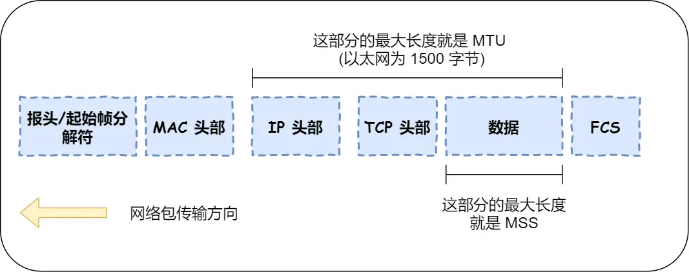

# 理解 TCP MSS（最大报文段长度）及其与 IP 分片的关系
###  1.  IP 分片的低效性
*   **问题根源：** 如果 TCP 直接将一个超大报文（超过 MTU）交给 IP 层，IP 层会将其分割成多个 **IP 分片**传输。
*   **可靠性代价：** IP 协议本身**没有超时重传机制**。如果**任何一个 IP 分片丢失**：
    1.  接收方 IP 层无法重组完整的原始数据包。
    2.  接收方 TCP 层收不到有效数据，**不会发送 ACK 确认**。
    3.  发送方 TCP 层**收不到 ACK，触发超时重传**。
    4.  发送方 TCP 层必须**重传整个原始 TCP 报文**（即使只丢了一个小分片）。
*   **后果：** 这种“**一个分片丢失，重传全部数据**”的方式**极其浪费带宽和增加延迟**。

###  2.  MSS 的解决方案
*   **核心思想：** **在 TCP 层主动限制每次发送的数据块大小**，使其加上 TCP/IP 头部后不超过 MTU，从而**避免 IP 层分片**。
*   **MSS 协商：** 在 TCP 三次握手建立连接时，客户端和服务端会在 `SYN` 和 `SYN-ACK` 报文中**交换各自的 MSS 值**。双方会选择**较小的那个 MSS 值**作为后续通信的约束。
*   **TCP 分段：** 当应用层数据过大时，TCP 层会根据协商好的 MSS 值，在发送缓冲区中将数据**切割成多个大小合适的 TCP 数据段**（每个段的数据部分 ≤ MSS）。
*   **独立传输与确认：** 每个 TCP 段（包含 TCP 头 + MSS 大小的数据）被封装进一个独立的 IP 包（长度 ≤ MTU）发送。接收方 TCP 层对**每个成功接收的 TCP 段**进行**独立的 ACK 确认**。

---

###  3.  MSS 带来的优势（对比 IP 分片）
| 特性         | IP 分片                                  | TCP MSS 分段                              | 优势说明                                                                 |
| :----------- | :--------------------------------------- | :---------------------------------------- | :----------------------------------------------------------------------- |
| **丢失重传** | 丢失一个分片，**重传整个原始数据包**       | 丢失一个 TCP 段，**仅重传该丢失段**         | **极大减少重传数据量**，节省带宽，降低延迟。                               |
| **确认粒度** | 接收方 IP 层重组后才通知 TCP，**确认粒度大** | 接收方 TCP 层对**每个段独立确认**（ACK）    | **更细粒度的确认机制**，发送方能更快感知丢失并重传特定段。                 |
| **传输效率** | 分片/重组开销大，重传代价高                | 分段/确认开销相对较小，重传代价低           | **显著提升整体传输效率和网络利用率**。                                    |
| **路径 MTU 发现** | 依赖性较低                               | 是实现 PMTUD 的基础                       | MSS 配合 PMTUD 能动态适应路径 MTU 变化，避免后续分片。                    |

---

### 📌 关键总结
*   **IP 分片是兜底机制：** IP 层分片确保了任何大小的 IP 数据报都能在物理网络上传输，这是网络层的基本职责。
*   **MSS 是优化策略：** TCP 作为可靠的传输层协议，引入 MSS 是为了**主动规避 IP 分片带来的可靠性陷阱和性能损失**。
*   **本质是分层协作：** MSS 体现了协议栈分层设计的思想——TCP 在自身层解决问题（分段、按序传输、可靠交付），而非将问题（低效重传）留给下层（IP）或上层（应用）。这种协作最终实现了**高效、可靠的数据传输**。