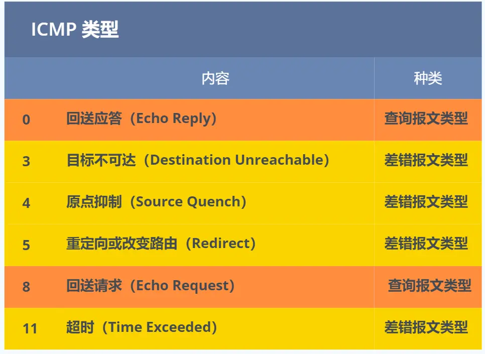
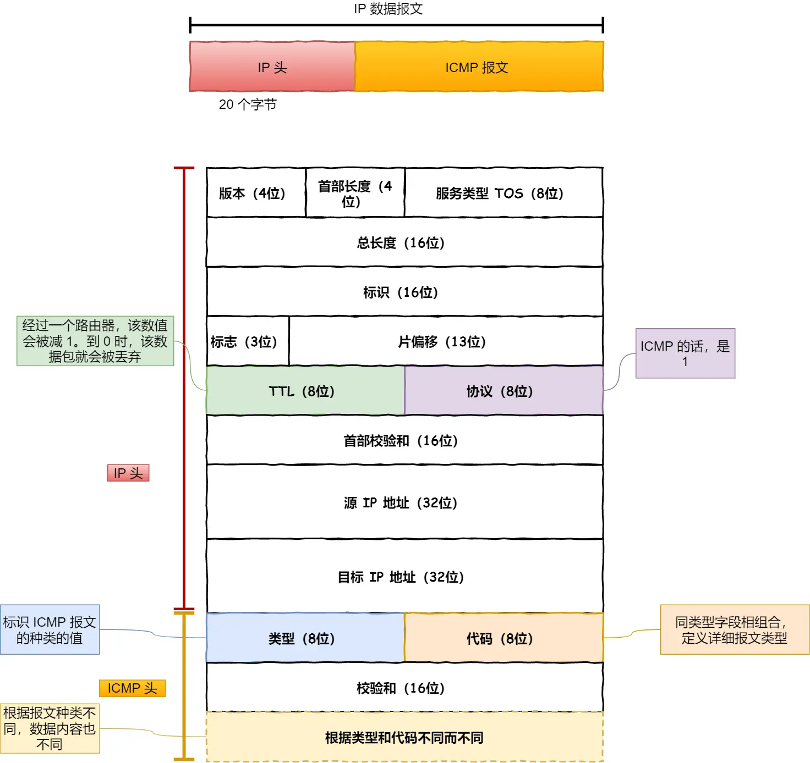

# ping 的工作原理
## IP协议的助手 —— ICMP 协议

*   **ICMP** 全称是 **Internet Control Message Protocol**，即**互联网控制报文协议**。
*   关键词：**控制**。它用于在网络传输出现问题时传递控制信息。

### ICMP 功能都有啥？

*   确认 IP 包是否成功送达目标地址。
*   报告发送过程中 IP 包被废弃的原因。
*   改善网络设置等。
*   当某个 IP 包因故未能达到目标地址时，ICMP 负责通知发送方具体原因。

**示例：ICMP 目标不可达消息**
主机 A 向主机 B 发送数据包。途中的路由器 2 未能发现主机 B，则路由器 2 会向主机 A 发送一个 **ICMP 目标不可达数据包**（使用 IP 发送）。主机 A 收到后解析即可得知问题原因。

### ICMP 报文结构

*   ICMP 报文封装在 **IP 包**里面，工作在网络层，是 IP 协议的助手。
*   ICMP 包头中的**类型（Type）字段**主要分为两大类：
    1.  **查询报文类型**：用于诊断。
    2.  **差错报文类型**：通知出错原因。

### 查询报文类型

*   **回送消息（Echo Request / Echo Reply）** - **类型 8 (请求) / 类型 0 (应答)**
    *   用于通信双方判断数据包是否成功到达。
    *   `ping` 命令就是利用此消息实现的。
    *   **报文结构**：
        *   **类型（Type）**：8 (请求) 或 0 (应答)
        *   **代码（Code）**：0
        *   **校验和（Checksum）**
        *   **标识符（Identifier）**：区分应用程序（如进程 PID）。
        *   **序号（Sequence Number）**：从 0 开始递增，用于确认包是否丢失。
        *   **数据（Data）**：`ping` 会存放发送请求的时间值，用于计算往返时间（RTT）。

### 差错报文类型

*   **目标不可达消息（Destination Unreachable）** - **类型 3**
    *   IP 路由器无法将包送达目标地址时发送。
    *   **代码（Code）** 字段指明具体原因：
        *   **0: 网络不可达（Network Unreachable）**：路由表匹配不到目标网络号。(较少使用)
        *   **1: 主机不可达（Host Unreachable）**：路由表无目标主机信息或主机未连接。
        *   **2: 协议不可达（Protocol Unreachable）**：目标主机防火墙禁止该协议（如 TCP）。
        *   **3: 端口不可达（Port Unreachable）**：目标主机无进程监听该端口。
        *   **4: 需要进行分片但设置了不分片位（Fragmentation Needed and Don't Fragment was Set）**：包超过 MTU 且不允许分片。
*   **原点抑制消息（Source Quench）** - **类型 4**
    *   路由器因拥塞无法发送数据时，通知源主机降低发送速率。（很少使用，可能导致不公平）
*   **重定向消息（Redirect）** - **类型 5**
    *   路由器发现源主机使用了非最优路径时，通知其下次发送给更合适的路由器。
*   **超时消息（Time Exceeded）** - **类型 11**
    *   IP 包的 **TTL (Time To Live)** 值减到 0 时，路由器丢弃该包并发送此消息给源主机。
    *   防止包在网络中无限循环，也可用于控制包的传输范围（设置小 TTL）。

## ping —— 查询报文类型的使用

**过程（以主机 A `ping` 主机 B 为例）：**

1.  **主机 A (发送端):**
    *   构建 **ICMP 回送请求消息 (Type=8)**：
        *   包含 **Identifier** (标识进程)、**Sequence Number** (序列号，递增)、发送时间戳。
    *   ICMP 包交给 **IP 层**：
        *   IP 层构建 IP 包：源 IP = A, 目的 IP = B, 协议字段 = 1 (ICMP)。
    *   IP 包交给 **数据链路层 (MAC 层)**：
        *   查询 ARP 缓存或发送 ARP 请求获取 B 的 MAC 地址。
        *   构建数据帧：源 MAC = A, 目的 MAC = B。
    *   发送数据帧。
2.  **主机 B (接收端):**
    *   检查目的 MAC 地址是否匹配。匹配则接收，否则丢弃。
    *   解封装：提取 IP 包 -> 提取 ICMP 包。
    *   发现是 **ICMP Echo Request (Type=8)**。
    *   构建 **ICMP 回送应答消息 (Type=0)**：
        *   使用收到的 **Identifier** 和 **Sequence Number**。
    *   按相同过程（IP -> MAC）将应答包发送回主机 A。
3.  **主机 A (接收应答):**
    *   收到 **ICMP Echo Reply (Type=0)**。
    *   检查 **Identifier** 和 **Sequence Number** 匹配。
    *   **可达性判断**：收到应答 -> 目标可达；超时未收到 -> 目标不可达。
    *   **计算 RTT**：当前时间 - 请求包中的时间戳。

> **注意**：跨网段通信时，过程涉及网关和路由器的转发，MAC 地址在每一跳都会改变，但 ICMP 报文核心内容不变。

## traceroute —— 差错报文类型的使用

`traceroute` (Unix/macOS) / `tracert` (Windows) 利用 ICMP 差错报文追踪路径或探测 MTU。

### 作用一：追踪路由路径

*   **原理**：故意设置特殊的 **TTL** 值，依次发送 UDP 包（目标端口通常从 33434 开始递增）。
    1.  发送 **TTL=1** 的 UDP 包 -> 到达第一个路由器 -> TTL 减为 0 -> 路由器丢弃包 -> 向源主机发送 **ICMP 超时 (Type=11)** 消息（包含路由器 IP）。
    2.  发送 **TTL=2** 的 UDP 包 -> 到达第二个路由器 -> TTL 减为 0 -> 丢弃 -> 发送 ICMP 超时消息...
    3.  重复此过程，直到 UDP 包到达目标主机。
*   **探测到达目标**：目标主机收到 UDP 包，发现目标端口不可达 -> 向源主机发送 **ICMP 端口不可达 (Type=3, Code=3)** 消息。源主机收到此消息即知已到达目标。
*   **结果**：源主机收到沿途路由器返回的 ICMP 超时消息，从而获得路径上所有路由器的 IP 地址序列。

### 作用二：路径 MTU 发现 (Path MTU Discovery)

*   **目的**：确定从源到目标路径上的最小 MTU（最大传输单元）。
*   **原理**：
    1.  发送端发送 IP 包，设置 **首部分片禁止标志位 (Don't Fragment, DF)** = 1。
    2.  如果包大小超过路径中某段链路的 MTU：
        *   该链路的路由器无法分片 -> 丢弃包。
        *   向源主机发送 **ICMP 目标不可达 (Type=3)** 消息，**Code=4 (需要进行分片但设置了不分片位)**，并在消息中包含该链路的 **MTU 值**。
    3.  源主机收到此 ICMP 消息后，减小包的大小（使用收到的 MTU 值）。
    4.  重复步骤 1-3，直到包能无分片地到达目标主机。
    5.  成功到达时的包大小即为路径 MTU。

