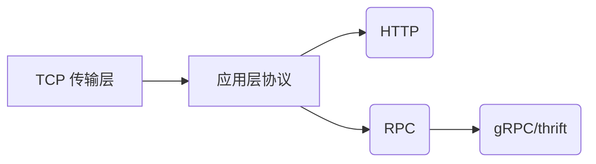
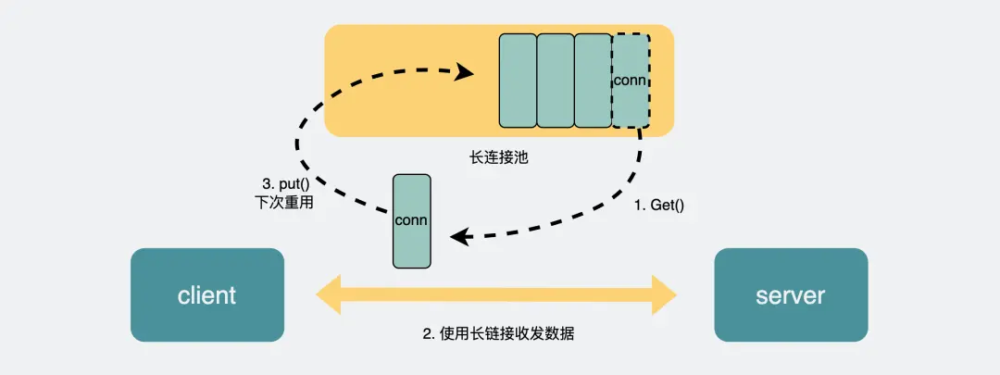

### **HTTP 与 RPC 的关系与区别**  
**核心问题：** 既然已有 HTTP 协议，为何还需 RPC？  
**本质认知：**  

> **关键点**：  
> - HTTP 和 RPC 都是基于 TCP 的应用层协议  
> - RPC 是**调用模式**（远程过程调用），而非具体协议  
> - gRPC/thrift 是 RPC 的**具体实现协议**  

---

#### **一、历史背景与定位差异**  
| **维度**       | HTTP 协议              | RPC 模式              |
|---------------|-----------------------|----------------------|
| **诞生时间**   | 1990年代               | 1980年代（早于 HTTP）   |
| **核心场景**   | B/S 架构（浏览器-服务器） | C/S 架构（客户端-服务器）|
| **设计目标**   | 跨厂商统一标准（如网页访问 | 内部服务高效通信        |
| **现代应用**   | 多端统一访问（网页/APP）  | 微服务间通信           |

---

#### **二、技术差异深度解析**  
##### **1. 服务发现机制**  
- **HTTP**：  
  - 通过 **DNS 解析域名**获取 IP + 端口（默认 80）  
  - 示例：浏览器访问 `www.example.com` → DNS 解析  
- **RPC**：  
  - 依赖**中间服务**（如 Consul/Etcd/Redis）存储服务地址  
  - 可选 **DNS 服务发现**（如 CoreDNS）  

##### **2. 连接管理方式**  

| **机制**    | HTTP/1.1          | RPC 典型实现         |
|------------|-------------------|---------------------|
| 连接复用    | Keep-Alive 长连接  | **连接池**（多连接复用）|
| 性能优化    | 部分语言库添加连接池 | 原生支持连接池         |
| 请求处理    | 串行（无多路复用）   | 并发复用多条连接       |

##### **3. 数据传输效率**  
- **HTTP/1.1 缺陷**：  
  - 文本协议（JSON/XML），**头部冗余大**  
  - 传输示例：  
    ```http
    Content-Type: application/json; charset=utf-8
    {"userId": 123, "userName": "Alice"}
    ```
- **RPC 优势**：  
  - 二进制协议（如 **Protobuf**），体积缩小 50%+  
  - 无浏览器兼容负担（如重定向）  
  - 序列化效率对比：  
    | **协议**   | 数据体积   | 序列化速度  |
    |------------|----------|-----------|
    | JSON       | 100%     | 基准       |
    | Protobuf   | 30-50%   | 快 3-5 倍  |

##### **4. 协议演进对比**  
- **HTTP/2**：  
  - 二进制分帧 + 头部压缩 → **性能接近 RPC**  
  - 2015年推出，**普及滞后于企业 RPC 落地**  
- **RPC 现状**：  
  - 老系统沿用既定 RPC 协议（历史惯性）  
  - 新系统可选 **gRPC（基于 HTTP/2）** 兼顾效率与标准化  

---

#### **三、核心结论**  
1. **存在意义**：  
   - RPC 解决**内部服务高效通信**问题（性能敏感场景）  
   - HTTP 解决**跨平台通用访问**问题（浏览器兼容需求）  
2. **适用场景**：  
   | **场景**             | 推荐协议    | 原因                |
   |---------------------|------------|---------------------|
   | 浏览器访问 Web 服务   | HTTP       | 原生支持、无需额外解析  |
   | 微服务间通信         | RPC         | 高性能、低延迟        |
   | 多端兼容（APP/Web）  | HTTP        | 统一接口、简化开发     |
3. **趋势融合**：  
   - 新兴 RPC 框架（如 gRPC）**基于 HTTP/2**  
   - 企业对外接口用 HTTP，内部微服务用 RPC  

> **终极答案**：  
> - RPC 不是替代 HTTP，而是在特定场景（性能/内部通信）提供更优解  
> - 如同“有了公路为何还需高铁”，**不同需求匹配不同技术栈**
