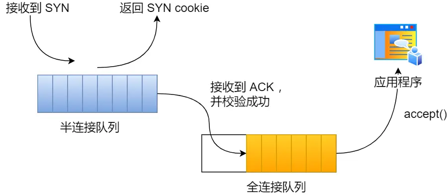

### SYN 报文被丢弃的场景及解决方案  

#### **场景一：开启 `tcp_tw_recycle` + NAT 环境**  
**问题原因**  
- 服务端开启 `tcp_tw_recycle` 和 `tcp_timestamps` 时，触发 **per-host PAWS 机制**。  
- PAWS 机制基于时间戳防止数据包重复，但对相同 IP（非四元组）做检查。  
- **NAT 问题**：多客户端通过同一 NAT 访问服务端时，服务端视为同一 IP。若新连接的时间戳小于旧连接残留时间戳，PAWS 会丢弃 SYN 报文。  

**关键细节**  
- ⚠️ `tcp_tw_recycle` 在 Linux 4.12+ 已废弃，**生产环境绝对禁用**。  
- **替代方案**：  
  - 客户端启用 `net.ipv4.tcp_tw_reuse`（需时间戳支持），重用 TIME_WAIT >1 秒的端口。  
  - 调整 `net.ipv4.ip_local_port_range` 扩大客户端端口范围（如 `32768-61000`）。  

---

#### **场景二：半连接队列（SYN 队列）满**  
**触发条件**  
- SYN 洪水攻击或高并发导致未完成握手的连接堆积。  
- 队列满后，新 SYN 报文被丢弃。  

**解决方案**  
1. **增大队列**：  
   ```bash
   # 内核参数（需三者同步调整）
   net.ipv4.tcp_max_syn_backlog = 16384  # 半连接队列上限
   net.core.somaxconn = 16384            # 全连接队列上限
   ```
   - **应用层配置**（如 Nginx）：  
     ```nginx
     listen 80 backlog=2048;  # 需 ≥ somaxconn
     ```
2. **启用 SYN Cookie**：  
   ```bash
   net.ipv4.tcp_syncookies = 1  # 队列满时通过 Cookie 验证连接
   ```

   syncookies 是这么做的：服务器根据当前状态计算出一个值，放在己方发出的 SYN+ACK 报文中发出，当客户端返回 ACK 报文时，取出该值验证，如果合法，就认为连接建立成功，如下图所示。

syncookies 参数主要有以下三个值：

0 值，表示关闭该功能；
1 值，表示仅当 SYN 半连接队列放不下时，再启用它；
2 值，表示无条件开启功能

3. **减少 SYN+ACK 重传次数**：  
   ```bash
   net.ipv4.tcp_synack_retries = 2  # 默认 5，降低可加速释放半连接
   ```

---

#### **场景三：全连接队列（accept 队列）满**  
**检测方法**  
```bash
ss -lnt | grep "LISTEN"
# 输出示例：
# LISTEN 0   128   *:8088   *:*
# Recv-Q=129 > Send-Q=128 → 队列溢出
```
- **`Recv-Q`**：当前等待 `accept()` 的连接数。  
- **`Send-Q`**：队列最大容量。  

**解决方案**  
1. **增大队列容量**：  
   - 调整 `net.core.somaxconn` 和应用层 `backlog`
   
2. **优化应用逻辑**：  
   - 确保及时调用 `accept()` 处理连接（如优化多线程/异步模型）。  

---

### **关键补充说明**  
1. **队列大小关系**  
   | 队列类型       | 决定因素                                  | 
   |----------------|------------------------------------------|
   | 半连接队列     | `min(backlog, somaxconn, tcp_max_syn_backlog)` |  
   | 全连接队列     | `min(backlog, somaxconn)`                |  

2. **参数调整建议**  
   | 参数                          | 安全值      | 作用                          |
   |-------------------------------|------------|-------------------------------|
   | `net.ipv4.tcp_syncookies`     | `1`        | 抗 SYN 洪水攻击               |
   | `net.ipv4.tcp_tw_reuse`       | `1`        | 客户端 TIME_WAIT 端口重用     |
   | `net.ipv4.tcp_max_syn_backlog`| `≥16384`   | 半连接队列上限                |
   | `net.core.somaxconn`          | `≥16384`   | 全连接队列上限                |

3. **操作注意**  
   - 修改内核参数：编辑 `/etc/sysctl.conf` → 执行 `sysctl -p` 生效。  
   - 修改应用配置（如 Nginx）后需重启服务。  
