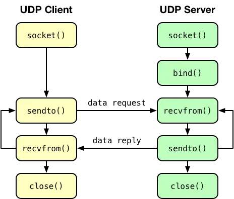
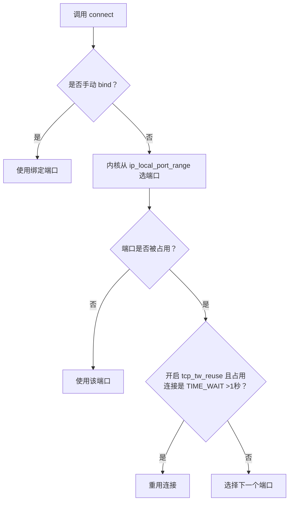

# **TCP/UDP 端口绑定核心问题解析**

#### **1. TCP 和 UDP 能否绑定同一端口？**
- **答案：可以**  
  - **原理**：  
    - 传输层通过端口号区分同一主机的不同应用程序。  
    - TCP/UDP 在内核中是独立模块，IP 包头的「协议号」字段（6=TCP, 17=UDP）决定数据包流向对应模块，再通过端口号定位具体应用。  
    - 因此，TCP 的 80 端口与 UDP 的 80 端口互不冲突。  
  - **验证**：  
    同时运行绑定 8888 端口的 TCP/UDP 服务端程序，`netstat` 可查看到两者共存。


#### **2. 多个 TCP 进程能否绑定同一端口？**
- **默认情况**：  
  - 若两个进程绑定的 **IP 地址和端口完全相同**，`bind()` 将报错 `Address already in use`。  
  - **例外**：  
    - 绑定 **不同 IP 地址 + 相同端口** 可成功（如进程 A 绑 `0.0.0.0:8888`，进程 B 绑 `192.168.1.100:8888`）。  
- **特殊说明**：  
  - `0.0.0.0` 表示绑定所有本地 IP，与具体 IP（如 `192.168.1.100`）冲突。  
  - **解决方案**：  
    **通过 `SO_REUSEPORT` 选项（Linux 内核 ≥3.9）允许多进程绑定相同 IP+端口。**

---

#### **3. 重启 TCP 服务报错 "Address in use" 的原因与解决**
- **原因**：  
  服务端主动关闭连接后，会进入 **TIME_WAIT 状态**（持续约 2MSL，默认 60 秒）。此期间，原 IP+PORT 组合仍被视为占用，导致重启时 `bind()` 失败。  
- **解决方案**：  
  在 `bind()` 前设置 **`SO_REUSEADDR`** 属性：  
  ```c
  int on = 1;
  setsockopt(listenfd, SOL_SOCKET, SO_REUSEADDR, &on, sizeof(on));
  ```  
  - **作用**：  
    - 允许绑定与 TIME_WAIT 连接相同的 IP+PORT。  
    - **允许绑定不同 IP 的相同端口**（如 `0.0.0.0:8888` 和 `192.168.1.100:8888`）。  

---

#### **4. 客户端端口复用问题**
- **默认行为**：  
  - 客户端通过 `connect()` 随机选择端口（范围由 `net.ipv4.ip_local_port_range` 定义，默认 32768-61000）。  
  - **TCP 连接由四元组唯一确定**（源 IP、源端口、目的 IP、目的端口）。只要四元组任一元素不同，端口可重复使用。  
    *例：客户端可用同一端口 `50004` 连接不同服务端（目的 IP 不同）。*  
- **主动绑定端口**：  
  - 客户端调用 `bind()` 可指定端口，但需满足：  
    - 多个客户端绑定的 **IP+PORT 不完全相同**（如 `192.168.1.100:6666` 与 `192.168.1.200:6666` 可共存）。  
  - **建议**：客户端通常交由内核自动选端口，避免手动绑定。

---

#### **5. 客户端 TIME_WAIT 过多导致端口耗尽？**
- **关键点**：  
  - 仅当客户端**密集连接同一目标服务器（相同目的 IP+端口）** 时，可能因端口资源耗尽（默认 28232 个）无法建立新连接。  
  - 连接**不同服务器**不受影响（四元组不同，端口可复用）。  
- **解决方案**：  
  开启内核参数 **`net.ipv4.tcp_tw_reuse`**：  
  ```bash
  sysctl -w net.ipv4.tcp_tw_reuse=1
  ```  
  - **作用**：  
    若新连接的端口被相同四元组的 TIME_WAIT 连接占用，且该状态持续 **>1 秒**，则重用该连接。  
  - **注意**：此参数仅对客户端（连接发起方）有效。  

---

### **总结图示**
#### **客户端端口选择流程**


---

> **补充说明**  
> - **`SO_REUSEADDR` vs `SO_REUSEPORT`**：前者解决 TIME_WAIT 冲突和不同 IP 的绑定冲突；后者允许多进程绑定相同 IP+端口（需高版本内核）。  
> - **TIME_WAIT 意义**：确保连接关闭可靠性，防止旧数据包干扰新连接。  
> - **四元组唯一性**：是理解端口复用的核心，网络层通过完整四元组区分不同连接。