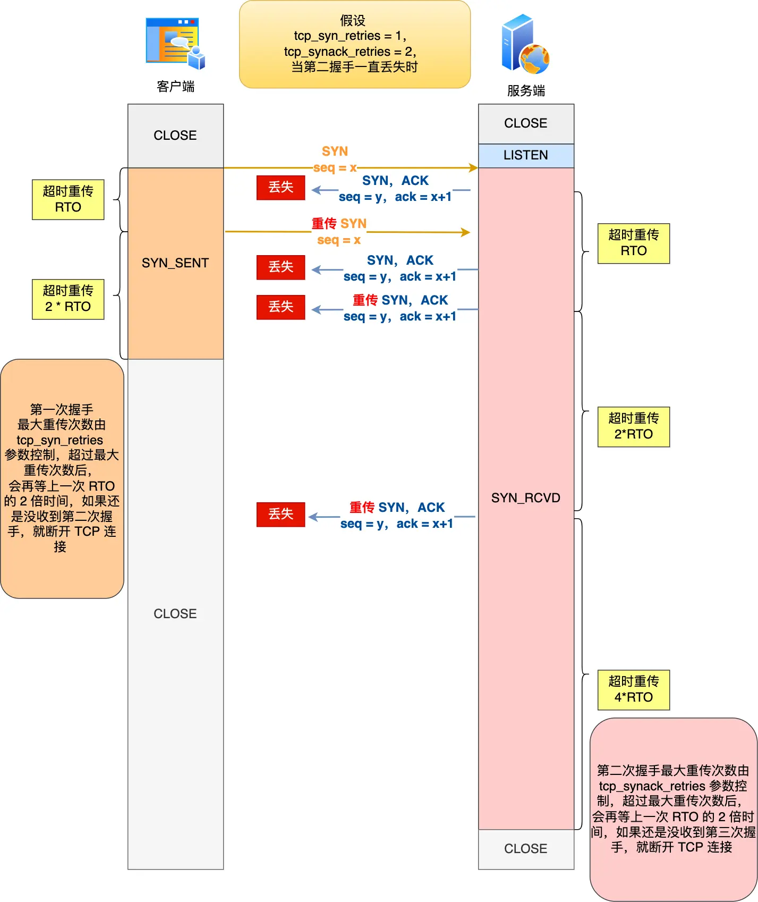
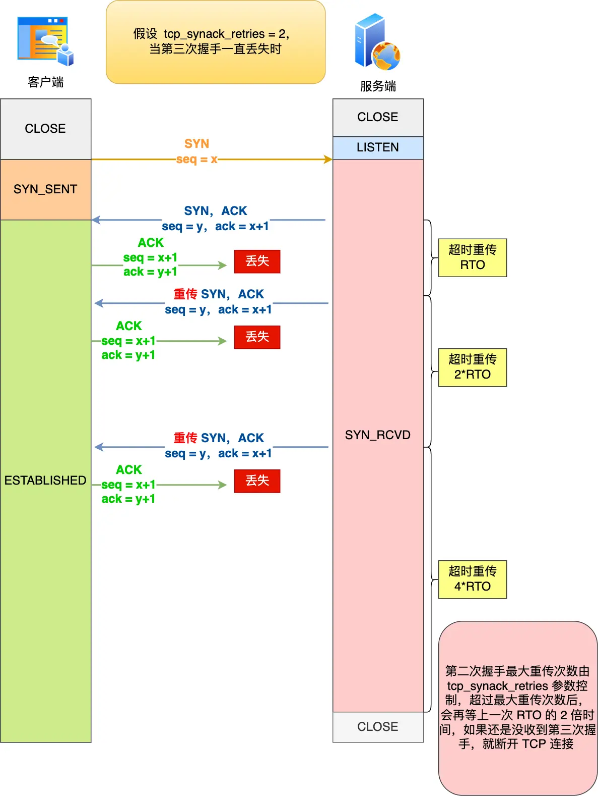

## 第一次握手丢失了，会发生什么？

当客户端想和服务端建立 TCP 连接时，首先发送的是 **SYN 报文**，然后进入 `SYN_SENT` 状态。

*   **问题：** 如果客户端迟迟收不到服务端的 **SYN-ACK 报文**（第二次握手），会触发 **超时重传** 机制。
*   **重传行为：**
    *   客户端会重传 SYN 报文。
    *   重传的 SYN 报文的序列号相同。
*   **超时时间：**
    *   初始超时时间由操作系统内核决定（常见为 1 秒或 3 秒），是固定值，修改需重新编译内核。
*   **重传次数：**
    *   在 Linux 中，由 `tcp_syn_retries` 内核参数控制，默认值为 `5`。
        ```bash
        # cat /proc/sys/net/ipv4/tcp_syn_retries
        5
        ```
*   **超时与重传间隔：**
    *   第一次重传：1 秒后
    *   第二次重传：2 秒后
    *   第三次重传：4 秒后
    *   第四次重传：8 秒后
    *   第五次重传：16 秒后
    *   **规律：** 每次超时时间是上一次的 2 倍。
*   **最终处理：**
    *   第五次重传后，继续等待 32 秒。
    *   如果仍未收到 SYN-ACK，客户端停止发送 SYN，断开 TCP 连接。
*   **总耗时：**
    *   `1 + 2 + 4 + 8 + 16 + 32 = 63 秒` (约 1 分钟)。

**示例 (`tcp_syn_retries = 3`):**

1.  客户端超时重传 SYN 报文 3 次（分别在 1s, 2s, 4s 后）。
2.  由于达到最大重传次数 (3)，客户端再等待 `8 秒` (上一次超时 4s 的 2 倍)。
3.  等待期间仍未收到 SYN-ACK，客户端断开连接。

---

## 第二次握手丢失了，会发生什么？

当服务端收到客户端的第一次握手 (SYN) 后，会回复 **SYN-ACK 报文**（第二次握手），并进入 `SYN_RCVD` 状态。该报文有两个目的：
1.  `ACK`：确认客户端的第一次握手 (SYN)。
2.  `SYN`：服务端发起建立连接的请求。

*   **问题：** 如果第二次握手 (SYN-ACK) 丢失。
*   **客户端视角：**
    *   客户端迟迟收不到对 SYN 的确认 (ACK)。
    *   客户端认为自己的 **第一次握手 (SYN) 可能丢失**。
    *   客户端触发超时重传机制，**重传 SYN 报文** (第一次握手)。
    *   重传行为受 `tcp_syn_retries` 参数控制（同第一次握手丢失）。
*   **服务端视角：**
    *   服务端发送了 SYN-ACK，但未收到客户端的 ACK 确认 (第三次握手)。
    *   服务端认为自己的 **第二次握手 (SYN-ACK) 可能丢失**。
    *   服务端触发超时重传机制，**重传 SYN-ACK 报文**。
    *   重传次数由 `tcp_synack_retries` 内核参数控制，默认值 `5`。
        ```bash
        # cat /proc/sys/net/ipv4/tcp_synack_retries
        5
        ```
*   **总结：**
    *   第二次握手丢失会导致 **双方都重传**：
        *   客户端重传 **SYN** (第一次握手)，受 `tcp_syn_retries` 限制。
        *   服务端重传 **SYN-ACK** (第二次握手)，受 `tcp_synack_retries` 限制。
    *   超时重传的时间间隔增长机制与第一次握手丢失类似（指数退避）。

**示例 (`tcp_syn_retries = 1`, `tcp_synack_retries = 2`):**

1.  **客户端：**
    *   超时重传 1 次 SYN 报文。
    *   达到 `tcp_syn_retries=1` 的最大重传次数。
    *   等待一段时间（上一次超时的 2 倍）。
    *   仍未收到 SYN-ACK，客户端断开连接。
2.  **服务端：**
    *   超时重传 2 次 SYN-ACK 报文。
    *   达到 `tcp_synack_retries=2` 的最大重传次数。
    *   等待一段时间（上一次超时的 2 倍）。
    *   仍未收到 ACK (第三次握手)，服务端断开连接。

---

## 第三次握手丢失了，会发生什么？

客户端收到服务端的 SYN-ACK 报文（第二次握手）后，会回复 **ACK 报文**（第三次握手），此时客户端状态进入 `ESTABLISHED` 状态。

*   **问题：** 如果第三次握手 (ACK) 丢失。
*   **关键点：** **ACK 报文本身不会被重传**。如果 ACK 丢失，由对方（此处是服务端）重传其需要确认的报文。
*   **服务端视角：**
    *   服务端发送了 SYN-ACK (第二次握手)，但未收到预期的 ACK 确认 (第三次握手)。
    *   服务端认为自己的 **第二次握手 (SYN-ACK) 可能丢失**（因为 ACK 不会重传）。
    *   服务端触发超时重传机制，**重传 SYN-ACK 报文**。
    *   重传行为受 `tcp_synack_retries` 参数控制（同第二次握手丢失）。
*   **客户端视角：**
    *   客户端已发出 ACK (第三次握手) 并进入 `ESTABLISHED` 状态。
    *   客户端认为连接已建立，可以开始发送应用数据。
    *   如果客户端发送数据，数据报文中的 ACK 字段也能起到确认服务端 SYN-ACK 的作用，从而间接完成第三次握手。

**示例 (`tcp_synack_retries = 2`):**

1.  服务端发送 SYN-ACK (第二次握手)。
2.  客户端的 ACK (第三次握手) 丢失。
3.  服务端超时重传 SYN-ACK 报文 2 次。
4.  达到 `tcp_synack_retries=2` 的最大重传次数。
5.  服务端等待一段时间（上一次超时的 2 倍）。
6.  仍未收到 ACK (第三次握手)，服务端断开连接。
7.  *（在此期间，如果客户端发送了应用数据，其携带的 ACK 能及时让服务端确认连接建立，避免断开）*
