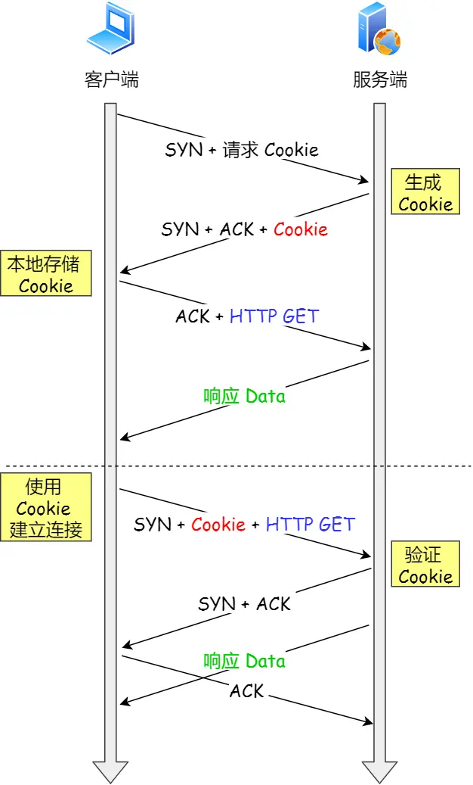

### **TCP性能优化指南**  
#### **一、优化方向**  
1. **三次握手性能提升**  
2. **四次挥手性能提升**  
3. **数据传输性能提升**  


### **二、三次握手性能优化**  
#### **1. 客户端优化**  
- **参数**：`tcp_syn_retries`（SYN 重传次数）  
  - **默认值**：5 次（重传时间：1s, 2s, 4s, 8s, 16s + 32s 等待）  
  - **建议**：内网环境可降低重试次数（如 2-3 次）以快速暴露错误。  

#### **2. 服务端优化**  
- **半连接队列（SYN队列）溢出处理**  
  - **检测命令**：`netstat -s | grep "SYNs to LISTEN"`  
  - **调整参数**（需同时调整）：  
    ```bash  
    # 内核参数  
    echo 1024 > /proc/sys/net/ipv4/tcp_max_syn_backlog  
    echo 1024 > /proc/sys/net/core/somaxconn  
    # Nginx 配置  
    server { listen 80 backlog=1024; }  
    ```  
  - **SYN攻击防护**：开启 `syncookies`  
    ```bash  
    echo 1 > /proc/sys/net/ipv4/tcp_syncookies  # 队列满时启用  
    ```  

- **SYN+ACK 重传**  
  - **参数**：`tcp_synack_retries`（默认 5 次，总耗时 63s）  
    ```bash  
    echo 2 > /proc/sys/net/ipv4/tcp_synack_retries  # 减少至 2 次  
    ```  

- **全连接队列（accept队列）溢出处理**  
  - **检测命令**：  
    ```bash  
    ss -ltn  # 查看 Recv-Q/Send-Q  
    netstat -s | grep "times the listen queue of a socket overflowed"  
    ```  
  - **队列大小**：`min(somaxconn, backlog)`  
  - **溢出策略**：  
    ```bash  
    echo 0 > /proc/sys/net/ipv4/tcp_abort_on_overflow  # 默认丢弃 ACK（推荐）  
    echo 1 > /proc/sys/net/ipv4/tcp_abort_on_overflow  # 发送 RST 复位连接  
    ```  

#### **3. 绕过三次握手（TCP Fast Open）** 
 
- **工作原理**：  
  - 首次连接缓存 Cookie，后续连接跳过三次握手。  
- **启用方式**：  
  ```bash  
  echo 3 > /proc/sys/net/ipv4/tcp_fastopen  # 客户端+服务端启用  
  ```  
- **要求**：客户端与服务端需同时支持。  

---

### **三、四次挥手性能优化**  
#### **1. 主动方优化**  
- **FIN 重传控制**：  
  - **参数**：`tcp_orphan_retries`（默认 8 次）  
    ```bash  
    echo 3 > /proc/sys/net/ipv4/tcp_orphan_retries  # 减少重试次数  
    ```  

- **孤儿连接限制**：  
  - **参数**：`tcp_max_orphans`（默认 16384）  
    ```bash  
    echo 32768 > /proc/sys/net/ipv4/tcp_max_orphans  # 增加最大孤儿连接数  
    ```  

- **TIME_WAIT 状态优化**：  
  - **数量限制**：  
    ```bash  
    echo 50000 > /proc/sys/net/ipv4/tcp_max_tw_buckets  
    ```  
  - **端口复用**（仅客户端）：  
    ```bash  
    echo 1 > /proc/sys/net/ipv4/tcp_tw_reuse  # 开启复用  
    echo 1 > /proc/sys/net/ipv4/tcp_timestamps  # 需同时开启  
    ```  
  - **避免使用**：`tcp_tw_recycle`（NAT 环境下有问题，Linux 4.12+ 已移除）  

#### **2. 被动方优化**  
- **CLOSE_WAIT 状态**：  
  - **问题定位**：应用未调用 `close()`，需检查代码逻辑。  
- **LAST_ACK 状态**：  
  - **FIN 重传**：由 `tcp_orphan_retries` 控制（同主动方）。  

---

### **四、数据传输性能优化**  
#### **1. 滑动窗口与缓冲区**  
- **窗口扩大因子**：  
  ```bash  
  echo 1 > /proc/sys/net/ipv4/tcp_window_scaling  # 支持 1GB 窗口  
  ```  
- **带宽时延积（BDP）计算**：  
  ```  
  BDP = 带宽 (bps) × RTT (秒)  
  示例：100MB/s × 0.01s = 1MB  
  ```  

#### **2. 缓冲区动态调整**  
- **发送缓冲区（`tcp_wmem`）**：  
  ```bash  
  echo "4096 16384 4194304" > /proc/sys/net/ipv4/tcp_wmem  # 最小值/默认值/最大值  
  ```  
- **接收缓冲区（`tcp_rmem`）**：  
  ```bash  
  echo "4096 87380 6291456" > /proc/sys/net/ipv4/tcp_rmem  
  echo 1 > /proc/sys/net/ipv4/tcp_moderate_rcvbuf  # 开启自动调节  
  ```  
- **TCP 内存总限制（`tcp_mem`）**：  
  ```bash  
  echo "88560 118080 177120" > /proc/sys/net/ipv4/tcp_mem  # 页数（1页=4KB）  
  ```  

#### **3. 调优建议**  
- **高并发场景**：  
  - 缓冲区最大值接近 BDP。  
  - 增大 `tcp_mem` 上限。  
- **内存紧张场景**：  
  - 降低缓冲区默认值。  
- **禁止操作**：  
  - 在代码中设置 `SO_SNDBUF`/`SO_RCVBUF`（关闭内核动态调整）。  

---

### **五、关键命令速查**  
| **功能**               | **命令**                                  |  
|------------------------|-------------------------------------------|  
| 查看 SYN 队列溢出      | `netstat -s \| grep "SYNs to LISTEN"`     |  
| 查看 accept 队列溢出   | `netstat -s \| grep "overflowed"`         |  
| 查看 accept 队列大小   | `ss -ltn`                                 |  
| 查看 TIME_WAIT 数量    | `ss -tan state time-wait \| wc -l`        |  
