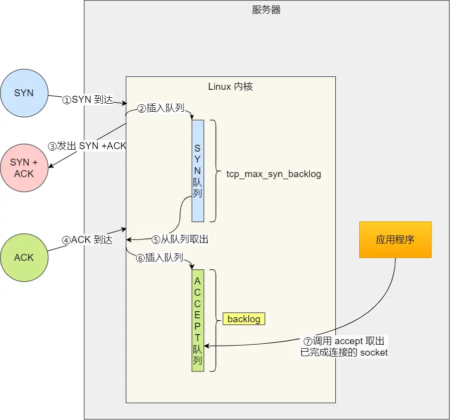

### TCP半连接队列和全连接队列 
 
#### 核心概念  
- **半连接队列（SYN队列）**：服务端收到 SYN 包后，将连接存入此队列（状态：`SYN_RECV`）。  
- **全连接队列（accept队列）**：完成三次握手后，内核将连接移至此队列，等待 `accept()` 调用。  

#### 全连接队列溢出实战  
**查看队列状态**：  
```bash
ss -lnt | grep :8088
# Recv-Q：当前全连接队列大小（等待 accept 的连接数）
# Send-Q：全连接队列最大值（如 128）
```  

**溢出现象**：  
- 压测命令（模拟 3 万并发）：  
  ```bash
  wrk -c 30000 -t 12 http://192.168.3.200:8088
  ```  
- 溢出检测：  
  ```bash
  netstat -s | grep overflowed
  # 输出："41150 times" 表示溢出累计次数
  ```  
- 内核响应策略（`tcp_abort_on_overflow`）：  
  - `0`（默认）：丢弃 ACK，客户端重试。  
  - `1`：发送 RST 复位报文，强制断开连接。  

**增大全连接队列**：  
队列最大值 = `min(somaxconn, backlog)`  
1. 调整内核参数：  
   ```bash
   echo 5000 > /proc/sys/net/core/somaxconn
   ```  
2. 调整应用 backlog（Nginx 示例）：  
   ```nginx
   listen 8088 backlog=5000;  # 修改配置文件
   systemctl restart nginx    # 重启生效
   ```  

#### 半连接队列溢出实战  
**查看半连接队列**：  
```bash
netstat -antp | grep SYN_RECV | wc -l  # 统计 SYN_RECV 状态连接数
```  

**模拟 SYN 攻击**：  
```bash
hping3 -S --flood -p 8088 192.168.3.200  # 发送大量 SYN 包
netstat -s | grep -i "SYNs to LISTEN"     # 查看溢出统计
```  

**队列最大值计算（Linux 2.6.32）**：  
- 公式：  
  ```plaintext
  若 max_syn_backlog > min(somaxconn, backlog):
      半连接队列最大值 = min(somaxconn, backlog) × 2
  否则:
      半连接队列最大值 = max_syn_backlog × 2
  ```  
- 实际限制条件：  
  1. 半连接队列满且未开启 `tcp_syncookies` 时丢弃 SYN。  
  2. 全连接队列满且未重传的 SYN+ACK 连接 >1 时丢弃。  
  3. 若 `max_syn_backlog - 当前队列长度 < (max_syn_backlog >> 2)` 时丢弃。  

#### 防御 SYN 攻击  
1. **增大半连接队列**：  
   - 同时调整 `somaxconn`、`backlog` 和 `tcp_max_syn_backlog`：  
     ```bash
     echo 5000 > /proc/sys/net/core/somaxconn
     echo 5000 > /proc/sys/net/ipv4/tcp_max_syn_backlog
     ```  
   - Nginx 需同步增大 `backlog` 并重启。  

2. **开启 tcp_syncookies**：  
   ```bash
   echo 1 > /proc/sys/net/ipv4/tcp_syncookies  # 半连接队列满时启用
   ```  
   - 机制：通过 SYN+ACK 携带 cookie 验证连接合法性，绕过半连接队列。  

3. **减少 SYN+ACK 重传次数**：  
   ```bash
   echo 2 > /proc/sys/net/ipv4/tcp_synack_retries  # 降低重传次数
   ```  

#### 关键结论  
- 全连接队列溢出时，优先调整 `somaxconn` 和 `backlog`。  
- 半连接队列大小由 `somaxconn`、`backlog`、`tcp_max_syn_backlog` 共同决定。  
- `tcp_syncookies=1` 是应对 SYN 攻击的有效方案，避免队列资源耗尽。  

