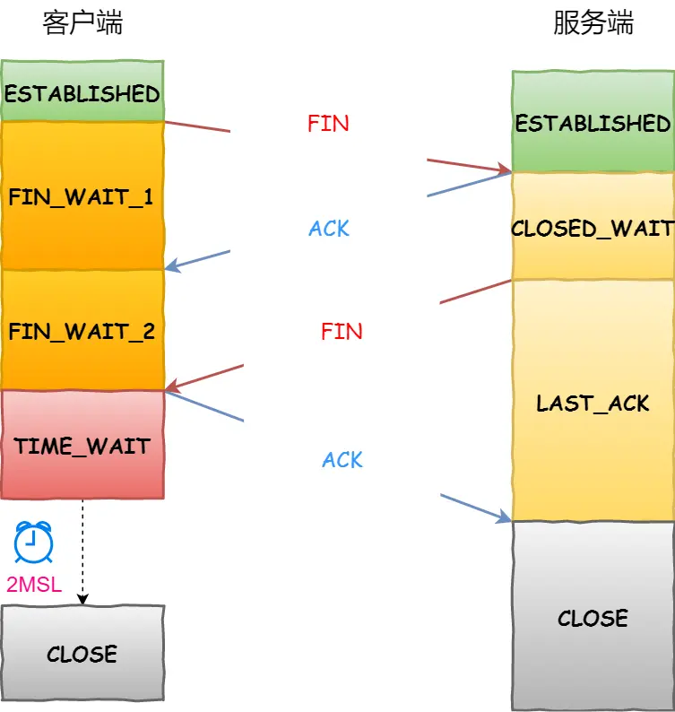

### **TCP 四次挥手过程**

```
1. 客户端发送 FIN 报文（FIN=1） → 进入 `FIN_WAIT_1`  
2. 服务端回复 ACK 报文 → 进入 `CLOSE_WAIT`  
3. 客户端收到 ACK → 进入 `FIN_WAIT_2`  
4. 服务端处理完数据后发送 FIN 报文 → 进入 `LAST_ACK`  
5. 客户端回复 ACK → 进入 `TIME_WAIT`  
6. 服务端收到 ACK → 进入 `CLOSED`  
7. 客户端等待 `2MSL` 后 → 进入 `CLOSED`
```
> 📌 **关键点**：  
> - 每个方向需 `FIN` + `ACK`，故称四次挥手。  
> - **主动关闭方**才会经历 `TIME_WAIT` 状态。

---

### **为什么需要四次挥手？**
- 客户端发 `FIN` 仅表示**不再发送数据**，但仍可接收数据。  
- 服务端需先回 `ACK`，再处理剩余数据后发送 `FIN`。  
- **分开发送 `ACK` 和 `FIN`** 导致需四次交互。  
> 💡 特殊情况下可变为三次挥手（见相关文档）。

---

### **挥手丢失场景分析**
#### **第一次挥手丢失（客户端 FIN 丢失）**
- **现象**：客户端卡在 `FIN_WAIT_1`。  
- **处理**：  
  1. 客户端重传 FIN（次数由 `tcp_orphan_retries` 控制）。  
  2. 超限后等待 `2×超时时间` → 直接 `CLOSE`。  


#### **第二次挥手丢失（服务端 ACK 丢失）**
- **现象**：客户端卡在 `FIN_WAIT_1`，服务端在 `CLOSE_WAIT`。  
- **处理**：  
  1. 客户端重传 FIN（直到收到 ACK 或达重传上限）。  
  2. 若用 `close()` 关闭连接：  
     - `FIN_WAIT_2` 状态最长持续 `tcp_fin_timeout`（默认 60 秒）→ 超时后关闭。  
  3. 若用 `shutdown()` 关闭：  
     - `FIN_WAIT_2` 可无限期等待（无超时限制）。  

#### **第三次挥手丢失（服务端 FIN 丢失）**
- **现象**：服务端卡在 `LAST_ACK`，客户端在 `FIN_WAIT_2`。  
- **处理**：  
  1. 服务端重传 FIN（受 `tcp_orphan_retries` 限制）。  
  2. 客户端在 `FIN_WAIT_2` 等待：  
     - 若超时（`tcp_fin_timeout`）→ 直接关闭。  

#### **第四次挥手丢失（客户端 ACK 丢失）**
- **现象**：服务端卡在 `LAST_ACK`，客户端在 `TIME_WAIT`。  
- **处理**：  
  1. 服务端重传 FIN（受 `tcp_orphan_retries` 限制）。  
  2. 客户端在 `TIME_WAIT` 启动 `2MSL` 定时器：  
     - 若期间收到 FIN → 重置定时器。  
     - 超时（`2MSL`）→ 关闭连接。  

---

### **为什么 TIME_WAIT 等待 2MSL？**
1. **确保 ACK 到达服务端**：  
   - 若 ACK 丢失，服务端重传 FIN 可在 `2MSL` 内被处理。  
2. **消除旧连接残影**：  
   - 等待 `2MSL` 使网络中旧报文完全消失，避免新连接混淆。  

> ⚙️ **参数说明**：  
> - `tcp_orphan_retries`：控制 FIN 重传次数（默认值因系统而异）。  
> - `tcp_fin_timeout`：控制 `FIN_WAIT_2` 状态超时（默认 60 秒）。  

