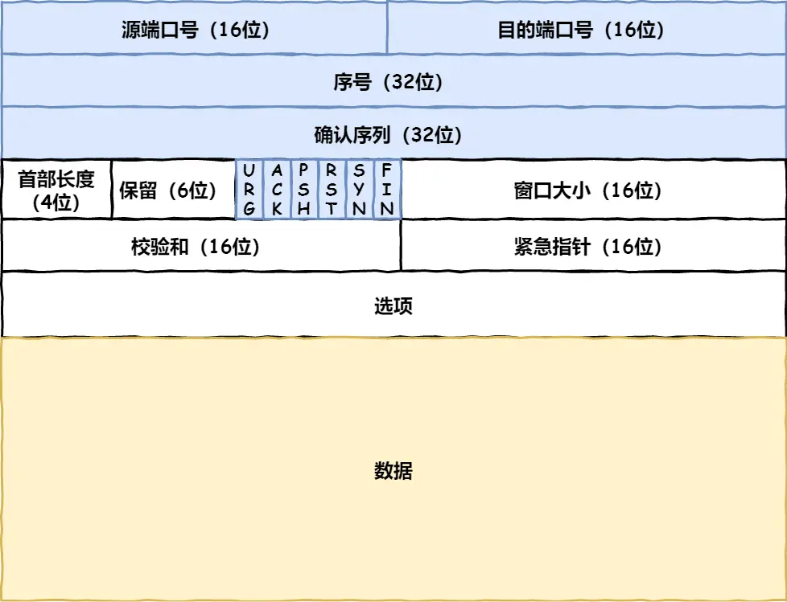
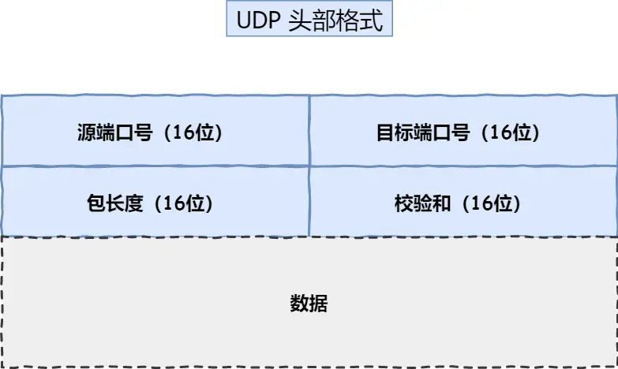
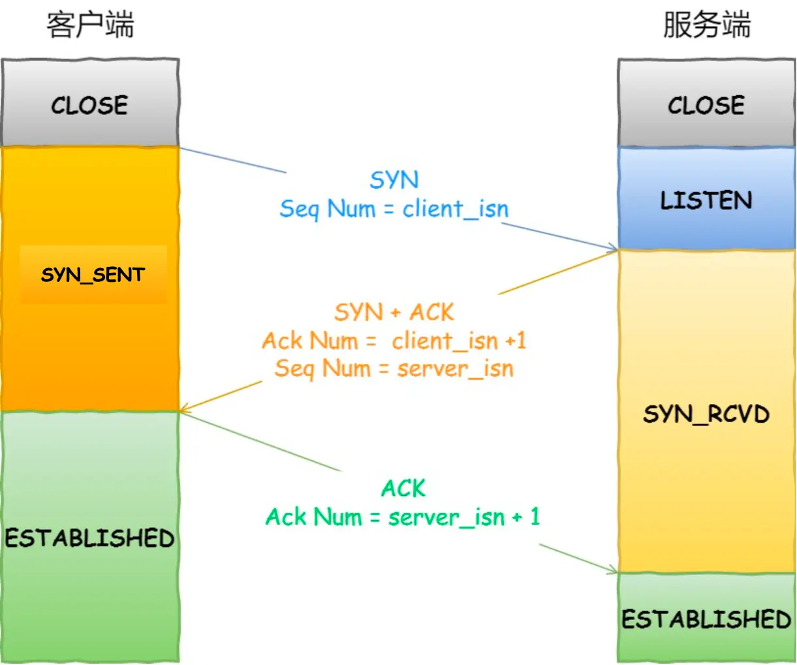
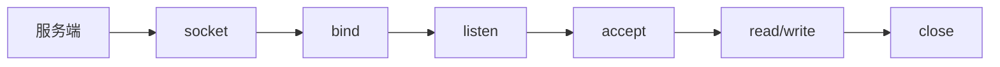

### **TCP 基本认识**
#### **TCP 头部格式**

| 字段         | 作用                                                      |
|-------------|----------------------------------------------------------|
| 序列号       | 解决网络包乱序问题，初始值为随机数，每次发送数据后累加数据字节数    |
| 确认应答号   | 期望收到的下一个数据序列号，解决丢包问题                         |
| 控制位       | - **ACK=1**：确认有效（建立连接后的报文必须为1） - **RST=1**：强制断开连接 - **SYN=1**：请求建立连接并初始化序列号 - **FIN=1**：请求断开连接 |

---

### **TCP vs UDP**
**TCP 是面向连接的、可靠的、基于字节流的传输层通信协议。**
| 特性             | TCP                        | UDP                     |
|-----------------|----------------------------|--------------------------|
| 连接方式         | 面向连接（一对一）             | 无连接（支持一对一、多对多） |
| 可靠性           | 可靠传输（不丢包、不重复、按序） | 尽最大努力交付             |
| 流量控制/拥塞控制  | 有                         | 无                       |
| 头部开销         | 20~60字节（可变长）           | 8字节（固定）              |
| 传输方式         | 字节流（无边界）              | 数据报文（有边界）          |
| 分片时机         | 传输层（MSS控制）            | 网络层（MTU控制）          |
| 分片时机         |           |          |
> **关键补充**：
> - **MSS**（最大报文段长度） = MTU - IP头 - TCP头（通常1460字节）
> - **UDP无重传机制**：需在应用层实现可靠性（如QUIC协议）

为什么 UDP 头部没有「首部长度」字段，而 TCP 头部有「首部长度」字段呢？

原因是 TCP 有可变长的「选项」字段，而 UDP 头部长度则是不会变化的，无需多一个字段去记录 UDP 的首部长度。

---

### **TCP 三次握手**
#### **流程**

1. **SYN**（客户端 → 服务端）  
   - 客户端发送 `SYN=1, seq=x`，进入 `SYN_SENT` 状态
2. **SYN+ACK**（服务端 → 客户端）  
   - 服务端回复 `SYN=1, ACK=1, seq=y, ack=x+1`，进入 `SYN_RCVD` 状态
3. **ACK**（客户端 → 服务端）  
   - 客户端发送 `ACK=1, seq=x+1, ack=y+1`，双方进入 `ESTABLISHED` 状态

#### **关键问题**
1. **为何需三次握手？**  
   - **防止历史连接**：旧SYN报文因网络延迟到达时，客户端通过第三次握手的ACK序列号判断是否终止连接
   - **同步初始序列号**：双方需确认对方的序列号已被正确接收
   - **避免资源浪费**：两次握手时服务端可能因重复SYN建立无效连接

#### 序列号的作用
   - 接收方可以去除重复的数据；
   - 接收方可以根据数据包的序列号按序接收；
   - 可以标识发送出去的数据包中， 哪些是已经被对方收到的（通过 ACK 报文中的序列号知道）；

2. **握手失败处理**  
   | 丢失报文 | 重传机制                              | 重传参数（Linux）             |
   |----------|---------------------------------------|-------------------------------|
   | SYN      | 客户端重传SYN                         | `tcp_syn_retries`（默认5次）  |
   | SYN+ACK  | 客户端重传SYN，服务端重传SYN+ACK      | `tcp_synack_retries`（默认5） |
   | ACK      | 服务端重传SYN+ACK                     | `tcp_synack_retries`          |

3. **SYN攻击防御**  
   - 开启 `tcp_syncookies=1`：绕过半连接队列
   - 调整队列大小：增大 `net.ipv4.tcp_max_syn_backlog` 和 `somaxconn`
   - 减少重传次数：`tcp_synack_retries=2`

---

### **TCP 四次挥手**
#### **流程**

1. **FIN**（主动方 → 被动方）  
   - 主动方发送 `FIN=1, seq=u`，进入 `FIN_WAIT_1`
2. **ACK**（被动方 → 主动方）  
   - 被动方回复 `ACK=1, ack=u+1`，进入 `CLOSE_WAIT`
3. **FIN**（被动方 → 主动方）  
   - 被动方发送 `FIN=1, seq=v`，进入 `LAST_ACK`
4. **ACK**（主动方 → 被动方）  
   - 主动方回复 `ACK=1, ack=v+1`，进入 `TIME_WAIT`（等待2MSL）

#### **关键问题**
1. **TIME_WAIT的作用**  
   - 保证被动方正确关闭（重传FIN时可响应）
   - 防止旧连接数据被新连接错误接收（等待2MSL使报文自然消亡）

2. **TIME_WAIT优化**  
   - 开启端口复用：`net.ipv4.tcp_tw_reuse=1`（需配合 `tcp_timestamps=1`）
   - 限制数量：`net.ipv4.tcp_max_tw_buckets`

3. **异常状态分析**  
   | 状态       | 原因                        | 解决方案                    |
   |------------|--------------------------- |---------------------------|
   | `TIME_WAIT`过多 | HTTP短连接或长连接超时    | 开启Keep-Alive，调整超时参数 |
   | `CLOSE_WAIT`过多 | 服务端未调用 `close()`  | 检查代码逻辑（如未关闭socket）|

---

### **Socket 编程要点**
#### **核心函数**

#### **关键参数**
- **`backlog`**：全连接队列长度（Linux 2.2+），上限为 `somaxconn`
- **`SO_KEEPALIVE`**：开启TCP保活机制（默认7200秒无活动触发探测）

#### **常见问题**
1. **无 `accept()` 能否建立连接？**  
   - 可以。`accept()` 仅从全连接队列取socket，不影响三次握手。

2. **无 `listen()` 能否建立连接？**  
   - 可以。如TCP自连接（客户端同时作为服务端）。

---

> **补充说明**：  
> - **MSL**（Maximum Segment Lifetime）：报文最大生存时间（Linux默认30秒），`TIME_WAIT=2MSL=60秒`  
> - **保活机制**：`tcp_keepalive_time=7200`（2小时无活动触发探测）  
> - **半连接队列**：存放`SYN_RCVD`状态的socket，受 `tcp_max_syn_backlog` 控制