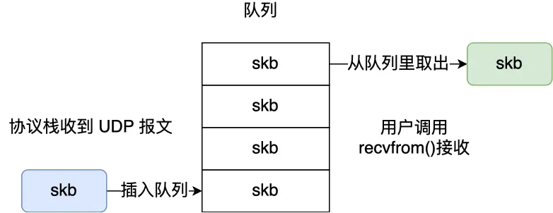

### 如何理解 TCP 是面向字节流协议？

#### **1. 核心概念对比**
- **UDP 面向报文**  

  操作系统直接将完整的用户消息封装为一个 UDP 报文（不拆分），接收方每次读取一个 UDP 报文即获取完整消息。  
  **关键机制**：  
  - 接收方通过队列区分报文，每个队列元素对应一个独立报文。
  - 用户调用 `recvfrom()` 时，内核从队列取出**整条报文**拷贝至用户缓冲区。

- **TCP 面向字节流**  
  操作系统可能将用户消息拆分为多个 TCP 报文传输，接收方无法预知消息边界。  
  **关键机制**：  
  - 数据先拷贝至内核协议栈，发送时机由**发送窗口、拥塞窗口、发送缓冲区**等动态决定。
  - 用户消息可能被任意拆分组合（见下文示例），导致**粘包问题**。


#### **2. TCP 消息拆分示例**
假设发送两条消息：`Hi.` 和 `I am Xiaolin`，实际传输可能出现以下情况：
| **场景**               | **TCP 报文组合方式**                     |
|------------------------|------------------------------------------|
| 完整合并               | `[Hi.I am Xiaolin]`                      |
| 部分跨报文             | `[Hi.I am]` + `[Xiaolin]`                |
| 消息碎片化             | `[H]` + `[i.I am Xi]` + `[aolin]`        |

**根本原因**：TCP 将数据视为**无结构的字节流**，不保留应用层消息边界，需应用层自行解析。

---

#### **3. 粘包问题解决方案**
##### **(1) 固定长度消息**
- **机制**：所有消息统一为固定长度（如 64 字节），不足则补位。  
- **缺点**：灵活性低，浪费带宽（短消息需填充），实际应用少。

##### **(2) 特殊字符边界**
- **机制**：用特殊字符（如 `\r\n`）标记消息结束，HTTP 协议即采用此法。  
- **关键细节**：  
  - 需对消息内的特殊字符转义（如 `\r\n` 转为 `\\r\\n`）。  
  - 接收方通过扫描字符流识别边界。
HTTP 通过设置回车符、换行符作为 HTTP 报文协议的边界。
##### **(3) 自定义消息结构（推荐）**
- **机制**：消息 = **包头（固定大小）** + **包体（可变长度）**。  
- **包头设计示例**：  
  ```c
  struct {
      u_int32_t message_length; // 4字节长度字段（大端序）
      char message_data[];      // 可变长度数据
  } message;
  ```
- **工作流程**：  
  1. 接收方先读固定长度包头（如 4 字节）。  
  2. 解析包头中的 `message_length` 字段。  
  3. 继续读取 `message_length` 长度的数据，组合为完整消息。  
- **优势**：高效灵活，广泛用于 RPC、自定义协议等场景。

---

### 补充说明
1. **UDP 的“面向报文”本质**  
   UDP 报文在 IP 层基础上添加 8 字节头部，每个报文独立传输和接收，天然保留消息边界。

2. **TCP 粘包的根本原因**  
   内核发送缓冲区动态合并/拆分数据，且网络延迟可能导致报文乱序到达，使接收方难以还原原始消息。

3. **方案选择建议**  
   - 简单文本协议 → **特殊字符边界**（如 HTTP）。  
   - 二进制/高性能场景 → **自定义消息结构**（如 gRPC、WebSocket）。  
   - 固定长度仅适用于高度规整的场景（如传感器数据）。