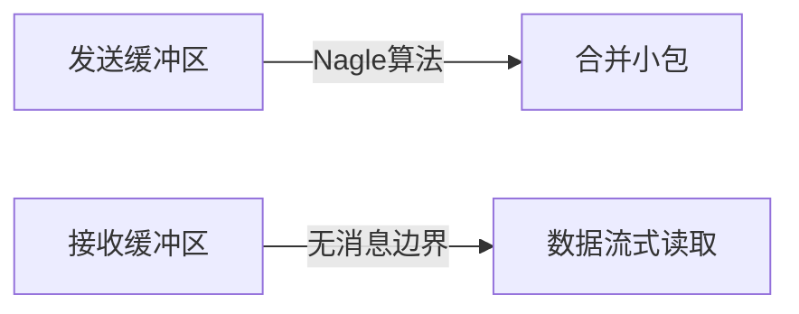

# TCP粘包/拆包问题解析

## 核心概念
**TCP粘包/拆包**是指TCP协议传输过程中，发送方写入的若干数据包在接收方读取时出现：
- **粘包**：多个数据包被"粘"在一起，接收方一次性读取到多个数据包
- **拆包**：一个数据包被拆分成多个部分，接收方需要多次读取才能获取完整数据

## 发生原因（底层机制）

### 1. TCP协议特性

- **流式协议**：TCP是字节流协议，没有消息边界概念
- **缓冲区机制**：内核缓冲区会合并/拆分数据包以提高传输效率
- **Nagle算法**：会延迟发送小数据包以合并发送（可禁用）

### 2. 网络传输因素
- **MTU限制**：超过网络最大传输单元(通常1500字节)会被分片
- **滑动窗口**：流量控制可能导致数据分段到达
- **拥塞控制**：网络状况差时可能拆分包传输

## 解决方案（面试加分点）

### 1. 应用层协议设计
```cpp
// 典型消息头设计
struct MessageHeader {
    uint32_t magic;    // 魔数标识(0x12345678)
    uint32_t length;   // 数据部分长度
    uint32_t checksum; // 校验和
    uint32_t version;  // 协议版本
};
```

### 2. 具体处理方式
| 方法                | 实现要点                          | 适用场景              |
|---------------------|-----------------------------------|-----------------------|
| 固定长度            | 所有包填充至相同长度              | 简单协议              |
| 分隔符              | 用\n等特殊字符分割                | 文本协议              |
| 长度前缀            | 包头包含数据长度字段              | 二进制协议(主流方案)  |
| 自定义协议          | 如HTTP的Content-Length           | 复杂应用协议          |

### 3. 工程实践要点
- **缓冲区管理**：需要实现环形缓冲区处理半包
- **超时机制**：处理不完整包的超时丢弃
- **校验机制**：CRC校验防止错误数据

## 面试深度追问示例
1. **底层原理**："如果禁用Nagle算法，是否还会出现粘包？为什么？"
   - 仍会出现，因接收方缓冲区合并和网络分片仍存在

2. **性能优化**："如何处理海量连接时的拆包问题？"
   - 零拷贝技术 + 内存池管理 + 批量解析

3. **异常处理**："当收到残缺的包头时，系统应该如何设计恢复机制？"
   - 超时重置 + 状态机管理 + 心跳保活

## 典型错误（扣分项）
- 认为UDP也有粘包问题（UDP有消息边界）
- 未考虑字节序转换问题（htonl/ntohl）
- 忽略缓冲区溢出的安全风险