# **TCP 可靠传输机制**
#### **1. 重传机制**
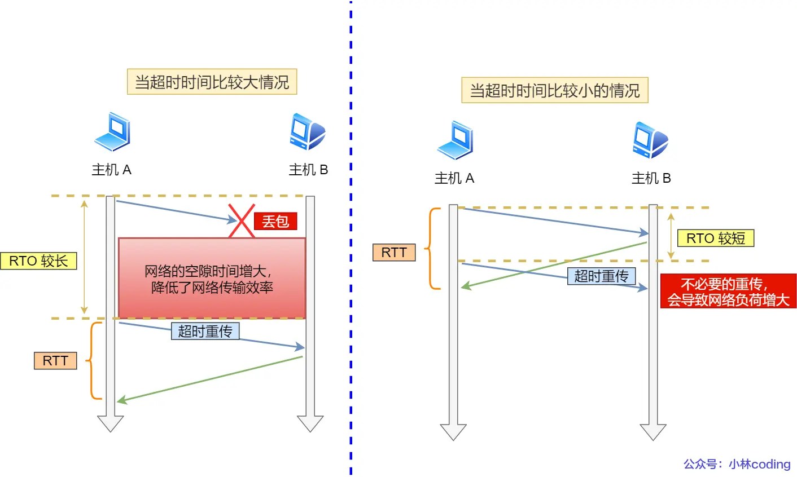
- **超时重传**（Retransmission Timeout 超时重传时间）
  - 触发条件：数据包丢失或确认应答（ACK）丢失。
  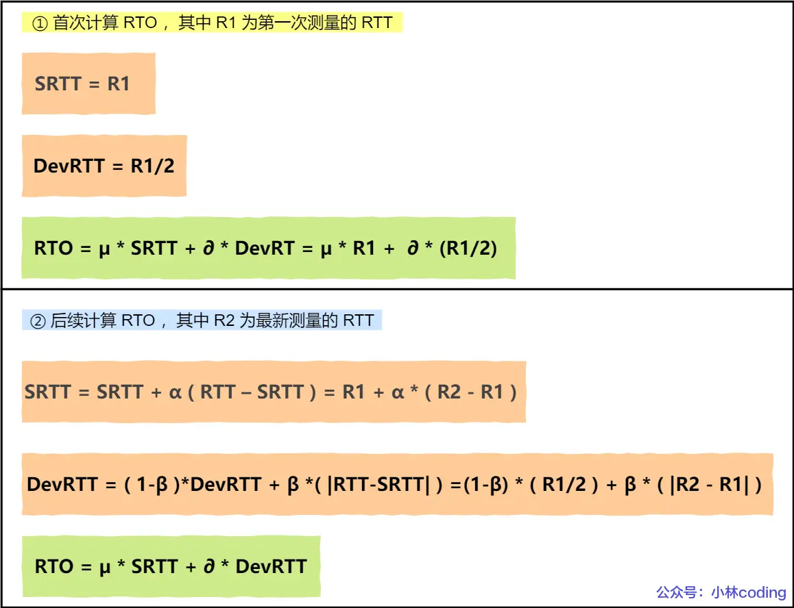
  - **RTO（超时重传时间）计算**：
    - 基于平滑往返时延（SRTT）和波动范围（DevRTT）动态调整：
      ```
      SRTT = (1 - α) * SRTT + α * RTT
      DevRTT = (1 - β) * DevRTT + β * |RTT - SRTT|
      RTO = μ * SRTT + ∂ * DevRTT
      ```
      （Linux默认参数：α=0.125, β=0.25, μ=1, ∂=4）
    - 超时后重传间隔加倍，避免网络拥塞恶化。

- **快速重传**
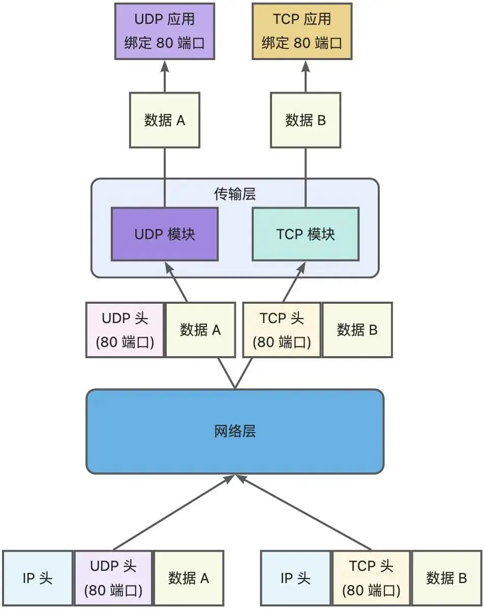
  - 触发条件：收到**3个重复ACK**（如连续ACK=2）。
  - 问题：仅重传一个报文可能效率低；重传所有报文浪费资源。

- **SACK（选择性确认）**
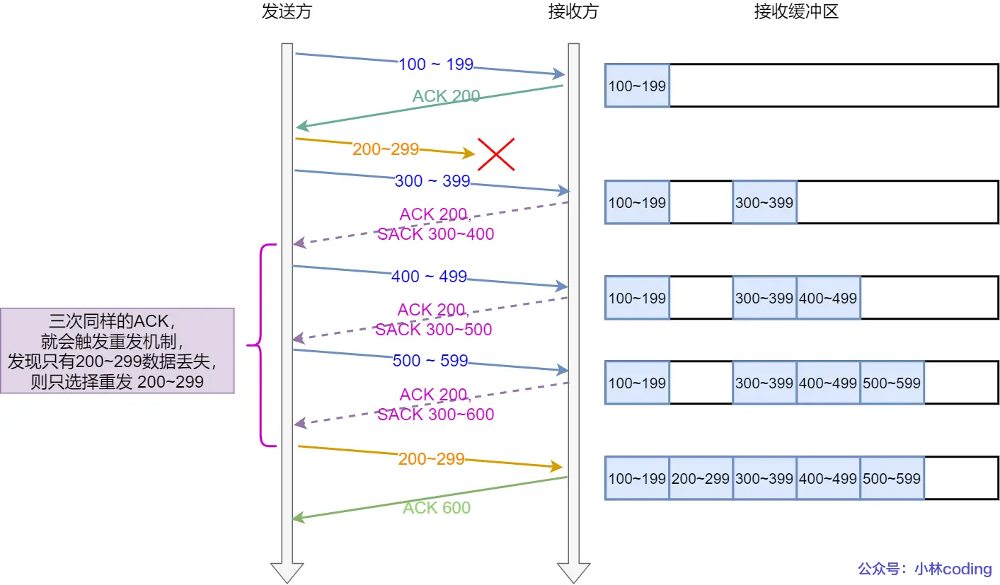
  - 在TCP头部选项字段声明已接收的数据段，使发送方仅重传丢失部分。
  - 需双方支持（Linux默认开启 `net.ipv4.tcp_sack=1`）。

- **D-SACK（重复SACK）**
  - 通过SACK反馈重复接收的数据段，用于区分：
    - ACK丢失 vs. 数据包延迟
    - 数据包重复
  - 优势：精准判断网络问题根源（Linux默认开启 `net.ipv4.tcp_dsack=1`）。

---

#### **2. 滑动窗口**
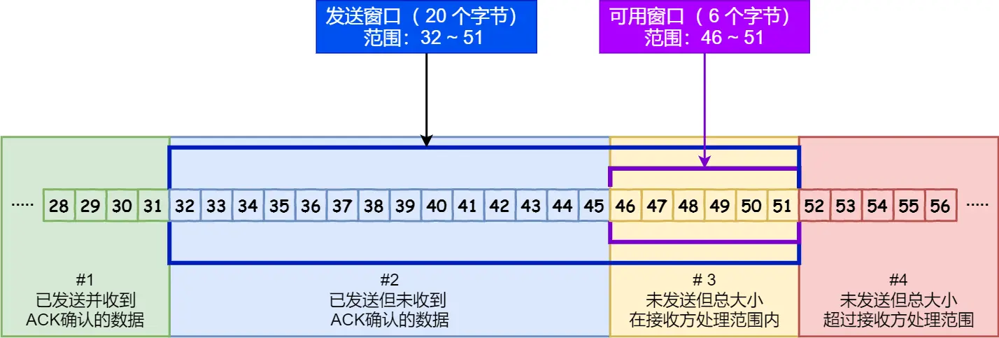
**窗口大小就是指无需等待确认应答，而可以继续发送数据的最大值。**
- **核心作用**：解决按包确认应答的效率问题，允许连续发送多个数据包。
- **窗口组成**：
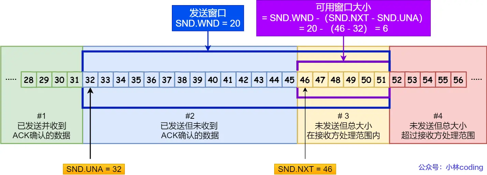
  - **发送窗口**：
    - `SND.UNA`：已发送未确认的首字节序号。
    - `SND.NXT`：可发送未发送的首字节序号。
    - 可用窗口大小 = `SND.WND - (SND.NXT - SND.UNA)`。
  - **接收窗口**：
  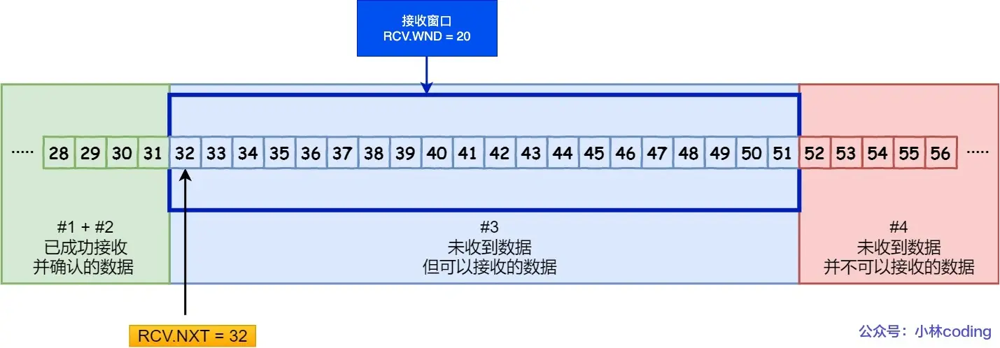
    - `RCV.NXT`：期望接收的下一个数据字节序号。
    - 通告窗口大小（`RCV.WND`）通过ACK报文告知发送方。

- **关键点**：
  - 接收窗口大小 ≈ 发送窗口大小（因通告存在时延）。
  - 累计确认：ACK=N 表示N之前所有数据已接收。

---

#### **3. 流量控制**
- **目的**：避免发送速率超过接收方处理能力。
- **死锁问题**（零窗口通告丢失）：  
为了解决这个问题，TCP 为每个连接设有一个持续定时器，只要 TCP 连接一方收到对方的零窗口通知，就启动持续计时器。
如果持续计时器超时，就会发送窗口探测 ( Window probe ) 报文，而对方在确认这个探测报文时，给出自己现在的接收窗口大小。
  - 解决方案：持续计时器 + **窗口探测报文**（每30-60秒发送，最多3次）。
- **糊涂窗口综合征**
  - **问题**：接收方通告小窗口 → 发送方传小数据 → 传输效率低下。
  - **解决策略**：
    - 接收方：窗口 < min(MSS, 缓存/2) 时通告窗口=0。
    - 发送方：启用 **Nagle算法**（满足任一条件才发送）：
      - 条件1：窗口 ≥ MSS 且 数据 ≥ MSS。
      - 条件2：收到之前数据的ACK。
  - 交互式应用（如SSH）需关闭Nagle：`setsockopt(TCP_NODELAY)`。

---

#### **4. 拥塞控制**
- **拥塞窗口（cwnd）**：根据网络拥塞程度动态调整，发送窗口 = min(cwnd, 接收窗口)。
- **四阶段算法**：
  1. **慢启动**：
  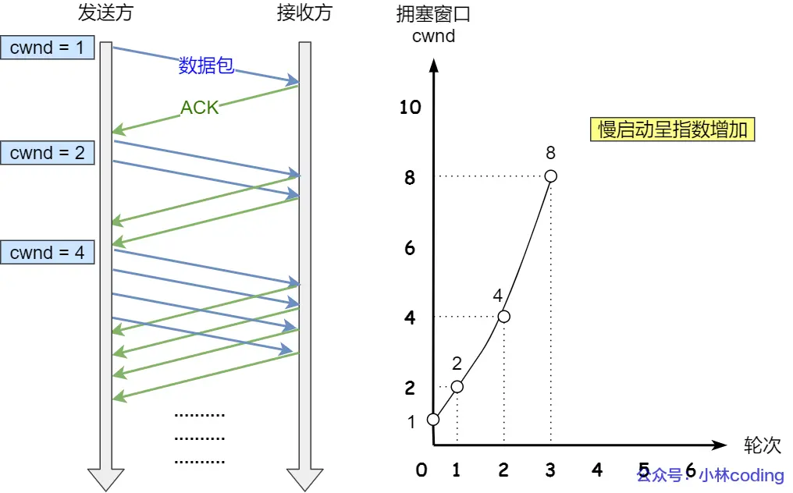
     - cwnd从1 MSS开始，每收到1个ACK增加1（指数增长）。
     - 终止条件：cwnd ≥ 慢启动阈值（ssthresh，默认65535字节）。
  2. **拥塞避免**：
  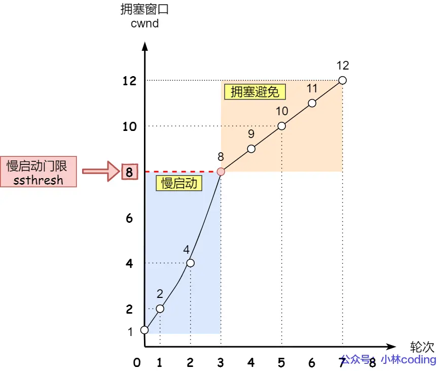
     - 每收到1个ACK，cwnd增加 `1/cwnd`（线性增长）。
  3. **拥塞发生**：
  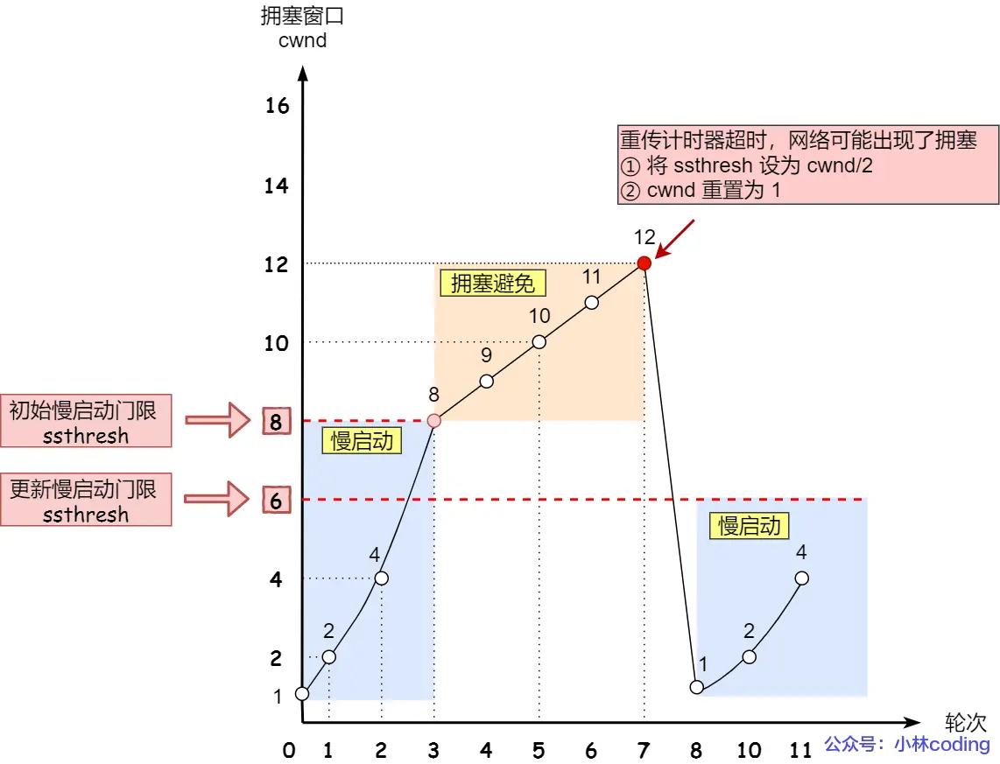
     - **超时重传**：ssthresh = cwnd/2，cwnd重置为初始值（Linux默认为10）。
     - **快速重传**：ssthresh = cwnd/2，cwnd = ssthresh + 3，进入快速恢复。
  4. **快速恢复**：
  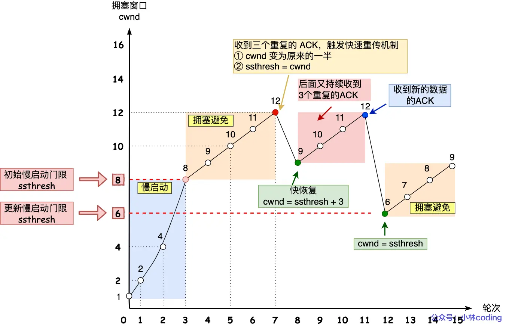
     - 重传丢失包，每收到重复ACK则cwnd+1。
     - 收到新数据ACK后：cwnd = ssthresh，退出恢复阶段。


> **关键细节说明**  
> - **D-SACK示例**：若ACK延迟导致发送方重传，接收方通过SACK=3000-3500（且ACK=4000）告知数据已接收，避免重复传输。  
> - **窗口关闭风险**：零窗口通告丢失可能导致死锁，需依赖窗口探测报文打破僵局。  
> - **Nagle算法意义**：合并小数据包提升传输效率，但对实时性要求高的场景不适用。  
> - **cwnd+3的缘由**：快速恢复时加3表示已确认3个重复ACK对应的数据包离开网络。  
