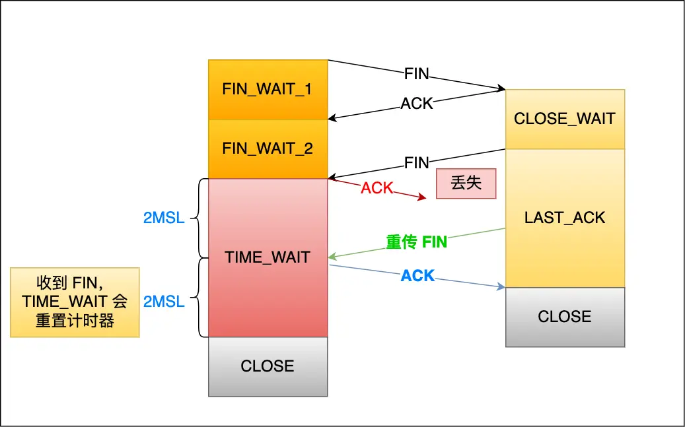

# **TIME_WAIT状态**

*   **触发条件：** 只有**主动发起关闭连接**的一方（通常是客户端，但在特定HTTP场景下也可能是服务端）才会进入 `TIME_WAIT` 状态。
*   **持续时间：** `TIME_WAIT` 状态会持续 **2MSL** (Maximum Segment Lifetime，报文最大生存时间)。在 Linux 系统中，MSL 通常设置为 **30秒** 或 **60秒**，因此 `TIME_WAIT` 通常持续 **60秒** 或 **120秒**。
*   **核心原因：**
    1.  **防止旧连接的数据包被新连接错误接收：**
        *   **背景：** TCP 使用序列号 (`SEQ`) 和初始序列号 (`ISN`) 来保证数据的有序性和可靠性。序列号是一个 32 位计数器，会循环（约 4.55 小时循环一次）。
        *   **风险：** 如果没有 `TIME_WAIT` 或时间过短，一个因网络延迟滞留的、属于旧连接的、序列号恰好落在新连接接收窗口内的数据包，可能被新连接错误接收，导致数据混乱。
        *   **解决：** `TIME_WAIT` 的 2MSL 等待时间，足以确保网络中属于旧连接的数据包都“自然死亡”（超时消失），新连接建立时只会收到属于自身的数据包。
    2.  **保证被动关闭方被正确关闭：**
        *   **风险：** 主动关闭方发送的最终 `ACK` 如果丢失，被动关闭方会重传 `FIN`。如果主动关闭方没有 `TIME_WAIT` 状态（直接进入 `CLOSED`），收到重传的 `FIN` 后会回复 `RST` (Reset)，导致被动关闭方收到一个非正常的连接终止错误 (`Connection reset by peer`)。
        *   **解决：** `TIME_WAIT` 的 2MSL 等待时间，为被动关闭方重传 `FIN` 并让主动关闭方再次回复 `ACK` 提供了足够的时间窗口。如果收到重传的 `FIN`，`TIME_WAIT` 计时器会重置回 2MSL。这确保了连接能够以四次挥手的方式优雅终止。

**TIME_WAIT 过多有什么危害？**

1.  **消耗系统资源：** 占用文件描述符、内存、CPU 和线程资源。
2.  **占用端口资源：** (对**客户端**影响显著)
    *   客户端端口范围通常有限 (默认 `32768～61000`，可通过 `net.ipv4.ip_local_port_range` 调整)。
    *   如果客户端需要频繁向**同一个目标 IP 和端口**(如同一个服务端) 建立新连接，过多的 `TIME_WAIT` 连接会耗尽可用端口，导致无法建立新连接。
    *   *注意：* 客户端向**不同**的目标 IP 和端口 发起连接时，端口可以复用（内核通过四元组区分连接）。
3.  **(对服务端)** 服务端通常监听固定端口，`TIME_WAIT` 过多不会直接导致端口耗尽，但仍会消耗大量系统资源（文件描述符、内存等），影响服务器性能和并发能力。

**如何优化 TIME_WAIT？ (需权衡利弊)**

1.  **`net.ipv4.tcp_tw_reuse` 与 `net.ipv4.tcp_timestamps`：**
    *   **作用：** 允许内核复用处于 `TIME_WAIT` 状态超过 1 秒的 socket 用于**新的出站连接 (仅适用于客户端/连接发起方)**。
    *   **前提：** 必须同时开启 `net.ipv4.tcp_timestamps=1` (默认开启)。
    *   **原理：** TCP 时间戳选项（`TCP Timestamps`）提供了更精确的报文生存期判断，使得旧连接的延迟报文会因时间戳过期而被丢弃，解决了序列号回绕导致的歧义问题，从而安全地复用连接。
    *   **弊端：** 在复杂的 NAT 环境下可能存在问题；依赖于时间戳，需确保系统时间同步。
2.  **`net.ipv4.tcp_max_tw_buckets`：**
    *   **作用：** 设置系统允许存在的 `TIME_WAIT` 连接的最大数量 (默认通常为 `18000`)。超过此数量后，系统会直接销毁新产生的 `TIME_WAIT` 状态连接。
    *   **弊端：** 过于粗暴，可能破坏 TCP 协议设计的可靠性保障，属于“掩耳盗铃”式的方案，不推荐作为首选。
3.  **程序中使用 `SO_LINGER`：**
    *   **作用：** 通过设置 socket 选项 (`l_onoff=1`, `l_linger=0`)，调用 `close()` 时会立即发送 `RST` 复位报文强行关闭连接，**跳过 `TIME_WAIT` 状态**。
    *   **弊端：** 极其危险！破坏了 TCP 的正常关闭流程，可能导致对端收到意外 `RST`，数据丢失，且不利于网络诊断。**强烈不推荐**。
*   **重要观点：** 《UNIX网络编程》指出：“`TIME_WAIT` 是我们的朋友”。它是 TCP 协议设计用来保证可靠性的重要机制。优化应谨慎，理解其必要性优先于盲目消除它。
*   **服务端优化策略：** 尽量避免服务端主动关闭连接（让客户端主动关闭），将 `TIME_WAIT` 状态分散到大量客户端。

**服务器出现大量 TIME_WAIT 状态的原因有哪些？**

> **核心原因：** 服务器作为**主动关闭连接方**断开了大量 TCP 连接。常见场景：

1.  **HTTP 未使用长连接 (Connection: close)：**
    *   **场景：** HTTP 请求或响应的 Header 中包含 `Connection: close`（可能是客户端或服务端设置）。
    *   **结果：** 每次 HTTP 请求/响应完成后，连接会被关闭。**通常由服务端主动关闭连接**（设计考量：服务端单次 `close()` 比等待客户端关闭更高效，减少资源占用时间），导致服务端产生 `TIME_WAIT`。
    *   **解决方案：** 确保客户端和服务端都开启 HTTP Keep-Alive (`Connection: keep-alive` / HTTP/1.1 默认)。
2.  **HTTP 长连接超时：**
    *   **场景：** 服务端（如 Nginx 的 `keepalive_timeout`）设置了 HTTP 长连接的空闲超时时间。
    *   **结果：** 客户端在完成一个请求后，在超时时间内未发起新请求，服务端定时器触发，**主动关闭空闲连接**，产生 `TIME_WAIT`。
    *   **排查：** 观察是否大量客户端建立连接后长时间无数据传输；检查网络是否导致客户端数据未送达服务端。
3.  **HTTP 长连接的请求数达到上限：**
    *   **场景：** 服务端（如 Nginx 的 `keepalive_requests`）限制了单个长连接上可处理的请求数量（默认值如 `100`）。
    *   **结果：** 当一个长连接处理的请求数达到上限后，服务端会**主动关闭该连接**，产生 `TIME_WAIT`。在高 QPS (如 >10000) 场景下，默认值 `100` 会导致连接被非常频繁地关闭，产生大量 `TIME_WAIT`。
    *   **解决方案：** 根据实际 QPS 情况，适当调大 `keepalive_requests` 参数值。
